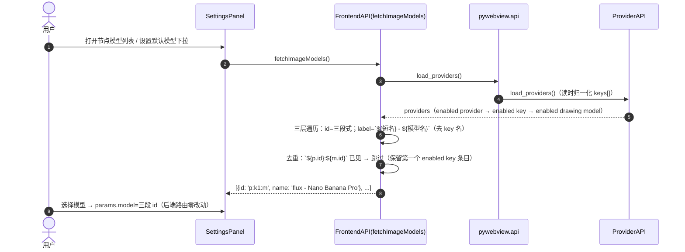
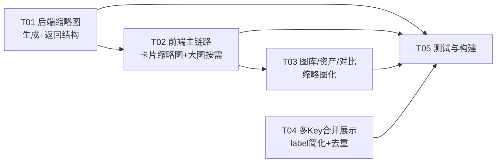

# 系统设计：图片性能优化 + 多 Key 前端合并展示

- **文档版本**：v1.0
- **对应 PRD**：`docs/image-perf-prd.md`
- **技术栈**：pywebview 6.2.1（WinForms/WebView2）+ TypeScript/Vite（沿用现有，非 React/MUI）
- **前置依赖**：multi-key 已落地（`docs/multi-key-system-design.md`），后端 `keys[]` 结构与三段解析**零改动**
- **设计原则**：贴合现有代码落点、双轨兼容（旧数据不阻断）、任务按功能模块分组（硬上限 5 任务）

---

## Part A：系统设计

### 1. 实现方案 + 框架选型

#### 1.1 核心难点

| 难点 | 说明 | 对策 |
|------|------|------|
| 4K 原图 base64 常驻内存 | 单张 30-80MB data URL 渲染进 `<div style="background-image">`，两张即卡，几十张必崩 | 生成链路只回传缩略图（JPEG q85 / 最长边 1024px，几十 KB data URL）；原图落盘后仅回传本地路径引用；「查看大图」按需桥接加载，用完即弃 |
| 原图怎么取 | 页面 origin 是 http（见 §2 验证结论），`` 直读被 Chromium 安全策略禁 | 统一走现有 `load_local_image(file_path)` 桥接（Python 读文件 → base64 → 前端一次性 ``，不常驻） |
| 旧数据兼容 | 旧 history / 资产 / 项目文件存的是原图 base64，无缩略图字段 | 双轨：新数据写缩略图 + 原图引用；旧数据缺字段时回退原 base64（仅打开慢，不阻断） |
| 多 Key 收敛展示 | 节点/默认下拉当前 label 带 key 名，用户不想在前端看到 Key 概念 | 前端 `fetchImageModels`/`fetchChatModels`/设置默认下拉统一 label 简化为「供应商短名 - 模型名」；跨 key 重名只留第一个可用 key；id 仍三段式（后端路由零改动） |
| 资产指纹稳定性 | 资产索引键 = `hashRef(展示图 URL)`，展示图从原图变缩略图 | 缩略图由原图确定性生成（同一原图 → 同一 JPEG 字节）→ 指纹稳定；`originalPath` 作为冗余字段写入记录，P1 可升级为指纹键 |

#### 1.2 框架选型

**无新增第三方依赖**。沿用现有分层，缩略图生成用已依赖的 Pillow：

```
UI 层        src/v1/ui/*（history-drawer / asset-drawer / settings-panel / img-modal）
引擎层       src/v1/engine/run-engine.ts + poller.ts（主链路唯一入口）
API 薄层     src/v1/api.ts → src/utils/api.ts（pywebview 桥接声明）
桥接         main.py（load_local_image 已存在，无需新桥接）
后端生成层    backend/api/unified_api.py（_save_images_to_local 主链路落点）
后端工具      backend/api/image_api.py（缩略图生成函数，Pillow）
类型契约      src/v1/types/flow.d.ts / backend.d.ts
```

架构模式维持现有「UI → API 封装 → pywebview 桥 → Python UnifiedAPIRouter」分层，不引入新框架、不改变事件模型。

#### 1.3 缩略图链路在现有架构上的落点

- **后端唯一后处理闸口**：`generate_image()` 同步/202 轮询两条路径都汇聚到 `_save_images_to_local(parsed)`（unified_api.py 行 351/365）。改这一个函数 = 全部出图路径（含扩图、outpaint 复用 `generate_image`）自动缩略图化。
- **前端主链路两个落点**：`poller.ts.pollTask`（接新字段）+ `run-engine.ts` 的 `_writeBackToSelf` / `createResultCard`（把缩略图 + 原图引用写进 `node.imageUrl` / `node.imageOrigin`）。
- **展示层三处**：`card-view.ts`（主视觉 = node.imageUrl 缩略图；「查看大图」按需加载）、`history-drawer.ts` / `asset-drawer.ts`（缩略图化 + 大图按需）、`compare-panel.ts`（语义切换自动生效，无结构改动）。
- **持久化三处**：`persistence.ts`（.icproj 节点带 imageOrigin）、`history-persist.ts` + `historyDrawer.loadFromHistory`（history.jsonl 新字段）、`asset-store.ts`（资产记录新字段）。

---

### 2. ⚠️ 关键验证项：pywebview `` 直读结论

**验证结论：不可行（当前配置）→ 原图访问统一走 `load_local_image` 桥接按需加载。**

依据（源码 + 官方安全模型，环境 GUI 实测受限于 WebView2 E_ABORT，见下）：

1. **页面 origin 是 http，不是 file://**：`main.py` 传 `url=INDEX_HTML`（本地路径）→ pywebview 6.2.1 `is_local_url()` 命中（`util.py:75`）→ `window._initialize` 把 `self._url_prefix = server.address`（`window.py:204`），`webview.start()` 检测到本地 URL 自动启动内部 Bottle HTTP 服务（`__init__.py:274`）→ 实际加载地址 `http://127.0.0.1:<port>/gui/dist/index.html`。**页面 origin = http**。
2. **Chromium/WebView2 安全模型：http 页面不能加载 file:// 子资源**。微软官方 WebView2Feedback #456 明确：「http: served pages cannot access file: served content」；即使加 `--allow-file-access-from-files` 也最多把错误从 "Not allowed to load local resource" 变为 "net::ERR_UNKNOWN_URL_SCHEME"，不能放行 http→file。
3. **`--allow-file-access-from-files` 只对 file:// origin 生效**：pywebview 6.2.1 默认 `ALLOW_FILE_URLS=True`（`webview/__init__.py:121`）→ edgechromium 后端追加 `--allow-file-access-from-files`（`edgechromium.py:84`）。该开关仅放宽「file:// 页面访问其它 file:// 文件」，与我们的 http origin 场景无关。
4. **实测环境限制**：写的最小 pywebview 验证脚本（`.qa-verify/qa-fileurl-test.py`，场景 A=http origin / B=file:// origin 双窗口，探针 `img.naturalWidth`）在本机沙箱无法完成 —— WebView2 控制器创建失败 `0x80004004 (E_ABORT)`（无交互桌面会话）。故结论以 pywebview 源码 + WebView2/Chromium 官方安全模型为准，置信度高。

**有条件可行的替代路径（本期不采用，P1 观察项）**：若把 `main.py` 改为 `url='file:///' + INDEX_HTML.replace('\\','/')`，页面 origin 变 file://，配合默认 `ALLOW_FILE_URLS=True`，构建产物可直读（`vite.config.ts` 已 `base:'./'` 相对路径 + 去 module 属性，天然兼容 file://；JS 桥经 `ExecuteScriptAsync` 注入，file:// 下仍可用）。但：① dev 模式 `npm run dev`（http://localhost:5173）仍禁 file:// 图，dev/prod 行为分叉；② 改造桌面壳加载路径回归风险高。**P0 统一走 `load_local_image` 桥接**，风险最小、零新增攻击面。

---

### 3. 文件清单

#### 3.1 新增文件

| 文件（相对路径） | 说明 |
|------------------|------|
| `docs/image-perf-system-design.md` | 本文档 |
| `docs/image-perf-class-diagram.mermaid` | 类图（独立提取） |
| `docs/image-perf-sequence-diagram.mermaid` | 时序图（独立提取） |
| `smoke/test_imageperf.py` | 后端 pytest：缩略图生成（尺寸/质量/字节量级）、返回结构（thumbnail/thumbnails/original_path(s)/original_url(s)）、双轨回退（缩略图失败 → 原 base64）、saved_to_disk 语义 |
| `smoke/qa-imageperf.cjs` | 前端 smoke（DOM 桩 + pywebview 桩）：poller 新字段透传、run-engine 写 imageUrl=缩略图+imageOrigin、openImageModal 按需加载（mock loadLocalImage 成功/失败回退）、fetchImageModels label 简化 + 重名去重 |

#### 3.2 修改文件

| 文件（相对路径） | 改什么 |
|------------------|--------|
| `backend/api/image_api.py` | 新增模块级函数 `make_thumbnail_data_url(image_bytes, max_edge=1024, quality=85) -> str\|None`（Pillow：thumbnail LANCZOS + RGB + JPEG q85，返回 base64 data URL）；现有 `_generate_thumbnail`（文件版）保留不动 |
| `backend/api/unified_api.py` | `_save_images_to_local` 重构：逐图「保存原图 → 收集 original_path → 生成缩略图 data URL」；返回结构新增 `thumbnail`/`thumbnails`/`original_path`/`original_paths`/`original_url`/`original_urls`；`image_url`/`images` 语义切换为缩略图；逐图缩略图失败回退原 base64；`process()` 收集保存路径 |
| `src/utils/api.ts` | 修正 `load_local_image` 声明（实际返回 `{status, data_url}`，现声明 `{base64?}` 与实际不符）；`API.loadLocalImage` 不变 |
| `src/v1/types/backend.d.ts` | `BackendTaskResult.result` 新增 `thumbnail/thumbnails/original_path/original_paths/original_url/original_urls` |
| `src/v1/types/flow.d.ts` | `FlowNode` 新增 `imageOrigin?: { path: string; url?: string } \| null`；`HistoryEntry` image 分支新增 `thumbnail?/originalPath?/originalUrl?`；`ImageAssetRecord` 新增 `thumbnail?/originalPath?`；`AssetAsset` 新增 `thumbnailUrl?/originalPath?` |
| `src/v1/engine/poller.ts` | `PollResult` 新增 `thumbnail?/originalPath?/originalUrl?`；从 `r.thumbnail` 与 `r.original_path` 透传 |
| `src/v1/engine/run-engine.ts` | `runOneWorker` 成功分支把 `{imageUrl(缩略图), originalPath}` 传入 `_writeBackToSelf` / `createResultCard`；`_writeBackToSelf` 写 `node.imageOrigin`；`createResultCard` 建节点带 `imageOrigin`；`historyDrawer.addImage` 与 `appendTrace` 带 `thumbnail/originalPath` |
| `src/v1/canvas/card-view.ts` | `openImageModal(src, origin?)` 改异步：先显示缩略图 + loading → 有 `origin.path` 时 `Backend.loadLocalImage` 取原图 → 失败回退缩略图 + toast；`updateCard` 的 `.pcard-act` 点击传 `node.imageOrigin` |
| `src/v1/canvas/interactions.ts` | 双击查看大图 `openImageModal(node.imageUrl)` → 追加 `node.imageOrigin` 参数 |
| `src/v1/ui/history-drawer.ts` | `HistoryItem` 新增 `thumbnail?/originalPath?/originalUrl?`；`addImage` 接收并存储；`loadFromHistory` 读 `e.thumbnail` 优先、`e.imageUrl` 回退；`_toEntry` 透传新字段 |
| `src/v1/ui/asset-drawer.ts` | 「查看」动作 `_viewImage(url)` → `openImageModal(url, { path: item.originalPath })`；卡片渲染用 `item.thumbnailUrl || item.url` |
| `src/v1/ui/compare-panel.ts` | 无结构改动（`node.imageUrl` 语义切换自动生效）；可选：单元格 title 加「缩略图」提示 |
| `src/v1/history-persist.ts` | `buildImageTrace` 不变（trace 不存图）；追加 trace 的调用方（run-engine）在构造 HistoryEntry 时带 `thumbnail/originalPath` |
| `src/v1/persistence.ts` | `migrateNode` 归一 `imageOrigin`（缺省 null）；`collect()` 通过 `...n` 展开自动带出新字段（无需额外代码，仅类型保障） |
| `src/v1/asset-store.ts` | 采纳/锁定时把 `thumbnail`（=展示图 URL）与 `originalPath` 写入 `ImageAssetRecord`；`getAdoptedAssets` 输出 `thumbnailUrl/originalPath` |
| `src/v1/api.ts` | `fetchImageModels`/`fetchChatModels`：label 简化为 `${短名} - ${模型名}`（去 key 名）+ 跨 key 重名去重（`${p.id}:${m.id}` 作去重键，保留第一个 enabled key 条目）；`Backend.loadLocalImage` 薄封装 |
| `src/v1/ui/settings-panel.ts` | `_renderDefaultModelSelect` label 简化 + 去重；key 卡片模型管理区 label 简化（不带 key 名）；文案「密钥组」（标题/添加按钮/key 卡片头） |
| `src/index.html` | `#img-modal` 内新增 loading 元素（`.img-modal-loading`）；设置面板标题「设置 · 供应商 / 多 Key」→「设置 · 供应商 / 密钥组」 |
| `smoke/test_multikey.py` | 追加 label 简化 / 重名去重断言（T04 验收） |
| `smoke/qa-multikey.cjs` | 更新 label 断言（去 key 名 + 去重） |

> 说明：`gui/dist` 为构建产物（`npm run build` 生成），不直接手改；T05 验证构建通过即可。`main.py` 本期**零改动**（`load_local_image` 桥接已存在）。

---

### 4. 数据结构与接口（类图）

```mermaid
classDiagram
    class UnifiedAPIRouter {
        +generate_image_async(prompt, options) dict
        +generate_image(prompt, options) dict
        +_save_images_to_local(parsed, save_dir) dict
        +_resolve_drawing_model(model_str) tuple
        +_resolve_chat_model(model_str) tuple
        +_make_thumbnail_data_url(data_url) str|None
    }
    class ImageAPI {
        +make_thumbnail_data_url(image_bytes, max_edge, quality) str|None
        +load_local_image(file_path) dict
        +_generate_thumbnail(image_path, max_size) str|None
        +save_image_to_local(image_data, filename) dict
    }
    class BackendTaskResult {
        +string status
        +result: ImageGenResult
    }
    class ImageGenResult {
        +boolean success
        +string image_url  「缩略图 data URL（主视觉）」
        +string[] images   「缩略图列表」
        +string thumbnail  「显式缩略图（= image_url）」
        +string[] thumbnails
        +string original_path  「原图本地绝对路径（按需加载用）」
        +string[] original_paths
        +string original_url   「file:// 引用（信息性，不直接渲染）」
        +string[] original_urls
        +boolean saved_to_disk
    }
    class PollResult {
        +boolean success
        +string imageUrl  「展示图（缩略图；旧后端=原图 base64）」
        +string thumbnail
        +string originalPath
        +string originalUrl
        +boolean savedToDisk
        +number code
        +string error
    }
    class RunEngine {
        +run(nodeId) Promise
        +runOneWorker(genId, prompt, options, layout, progress, isTxt2Img, index, refs) Promise
        +_writeBackToSelf(genId, imageUrl, origin) Promise
        +createResultCard(genId, imageUrl, layout, overrides, trace, origin) Promise~FlowNode~
    }
    class FlowNode {
        +string id
        +string imageUrl  「展示图（缩略图）」
        +ImageOrigin imageOrigin  「原图引用 {path, url?}」
        +GenerationTrace trace
        +string[] refImages
    }
    class ImageOrigin {
        +string path  「原图本地绝对路径」
        +string url   「file:// 引用（备用）」
    }
    class HistoryEntry {
        +string kind
        +string imageUrl  「旧行=原图 base64；新行=缩略图」
        +string thumbnail
        +string originalPath
        +string originalUrl
    }
    class ImageAssetRecord {
        +string key  「hashRef(展示图 URL)」
        +string imageUrl  「展示图（缩略图）」
        +string thumbnail
        +string originalPath
        +boolean adopted
        +boolean locked
    }
    class HistoryDrawer {
        +addImage(src, meta) void
        +loadFromHistory(entries) void
        +getEntryByImageUrl(url) HistoryEntry|null
    }
    class AssetStore {
        +adoptByUrl(url, nodeId, meta) void
        +setLockedByUrl(url, nodeId, locked) void
        +getAdoptedAssets() AssetAsset[]
    }
    class FrontendAPI {
        +fetchImageModels() Array~{id,name}~
        +fetchChatModels() Array~{id,name}~
        +resolveDefaultModel() string
        +Backend.loadLocalImage(filePath) Promise
    }
    class SettingsPanel {
        +_renderDefaultModelSelect() HTMLElement
        +_renderKeyCard(p, k, ctx) HTMLElement
    }
    class CardView {
        +updateCard(el, node) void
        +openImageModal(src, origin) Promise
    }

    UnifiedAPIRouter ..> ImageAPI : make_thumbnail_data_url
    UnifiedAPIRouter --> ImageGenResult : _save_images_to_local 构造
    RunEngine --> PollResult : pollTask 返回
    RunEngine --> FlowNode : 写 imageUrl=缩略图 + imageOrigin
    FlowNode --> ImageOrigin : 原图引用
    CardView ..> FrontendAPI : 查看大图 loadLocalImage
    HistoryDrawer --> AssetStore : 角标订阅
    AssetStore --> ImageAssetRecord : 采纳/锁定记录
    SettingsPanel --> FrontendAPI : fetchImageModels（label 简化+去重）
    FrontendAPI ..> HistoryEntry : 读新字段
```

**关键接口签名（Python）**

```python
# ── backend/api/image_api.py ──
def make_thumbnail_data_url(image_bytes: bytes, max_edge: int = 1024, quality: int = 85) -> str | None:
    """bytes → JPEG q85 / 最长边 max_edge 缩略图 base64 data URL；失败返回 None（调用方回退原图）"""

# ── backend/api/unified_api.py ──
def _save_images_to_local(self, parsed: dict, save_dir: str = '') -> dict:
    """主链路后处理：原图落盘 + 缩略图生成 + 路径收集。
    返回结构（新）：image_url/images 语义切换为缩略图；新增
      thumbnail/thumbnails（data URL）、original_path/original_paths（绝对路径，正斜杠）、
      original_url/original_urls（file:// 引用，信息性）；
    逐图缩略图失败 → 该图 image 保留原 base64、无 original_* 对应项（双轨回退）；
    全部落盘失败（tempfile 兜底）→ saved_to_disk=false（沿用现有语义）。"""
```

**关键接口签名（TypeScript）**

```ts
// ── src/v1/engine/poller.ts ──
export interface PollResult {
  success: boolean;
  imageUrl?: string;        // 展示图（缩略图 data URL；旧后端无缩略图时为原图 base64）
  thumbnail?: string;       // 显式缩略图（新后端，= imageUrl）
  originalPath?: string;    // 原图本地绝对路径（查看大图按需加载用）
  originalUrl?: string;     // file:// 引用（备用）
  savedToDisk?: boolean;
  code?: number;
  error?: string;
}

// ── src/v1/canvas/card-view.ts ──
export async function openImageModal(
  src: string,
  origin?: { path?: string; url?: string } | null,
): Promise<void>;
// 先显示缩略图 src + loading；origin?.path 存在 → Backend.loadLocalImage(path) 取原图
// → img.src = data_url（loading 关闭）；失败/无 origin → 保持 src（旧图原 base64 直接显示）+ toast

// ── src/v1/api.ts ──
export async function fetchImageModels(): Promise<Array<{ id: string; name: string }>>;
// label = `${displayName} - ${m.name}`（去 key 名）；去重键 `${p.id}:${m.id}` 只留第一个 enabled key；
// id 仍三段式 `${p.id}:${k.id}:${m.id}`（后端路由零改动）
export async function fetchChatModels(): Promise<Array<{ id: string; name: string }>>;  // 同构

// ── src/v1/types/flow.d.ts ──
interface FlowNode {
  // ...
  imageUrl: string | null;                                   // 语义切换：展示图（缩略图）
  imageOrigin?: { path: string; url?: string } | null;       // 原图引用（查看大图用）
}
```

---

### 5. 程序调用流程（时序）

#### 5.1 出图 → 缩略图 + 原图落盘 → 前端渲染缩略图 → 查看大图按需取原图

```mermaid
sequenceDiagram
    autonumber
    actor U as 用户
    participant RE as RunEngine
    participant PO as Poller
    participant PV as pywebview.api (main.py)
    participant UR as UnifiedAPIRouter
    participant IA as ImageAPI(缩略图工具)
    participant FS as 本地磁盘
    participant CV as CardView/img-modal
    participant BA as Backend(loadLocalImage)

    U->>RE: 运行生成节点
    RE->>PV: Backend.generateImage(prompt, options)
    PV->>UR: generate_image_async(prompt, options)
    UR-->>RE: {success, task_id}
    RE->>PO: pollTask(task_id) 轮询
    PO->>PV: get_task_result(task_id)

    Note over UR: 后台线程 generate_image()
    UR->>UR: 解析模型 → 调上游 → _parse_image_response
    UR->>UR: _save_images_to_local(parsed)
    UR->>FS: 逐图保存原图（原目录/配置目录/tempfile）
    UR->>IA: make_thumbnail_data_url(bytes, 1024, 85)
    IA-->>UR: data:image/jpeg;base64,...（几十 KB）
    UR-->>PV: {success, image_url=缩略图, thumbnail, original_path, saved_to_disk}

    PO-->>RE: {success, imageUrl=缩略图, originalPath, savedToDisk}
    RE->>RE: _writeBackToSelf / createResultCard
    RE->>RE: node.imageUrl=缩略图, node.imageOrigin={path: originalPath}
    RE->>CV: flowState.notify() → card 重建（主视觉=缩略图）

    U->>CV: 点击卡片「查看大图」（缩略图已显示 + loading）
    CV->>BA: Backend.loadLocalImage(node.imageOrigin.path)
    BA->>PV: load_local_image(file_path)
    PV->>FS: 读原图文件
    PV-->>CV: {status:success, data_url: 原图 base64}
    CV->>CV: img.src = 原图 data_url（一次性，用完即弃不常驻）
    Note over CV: 失败 → 回退缩略图放大 + toast「原图加载失败」
    CV-->>U: 大图展示
```

#### 5.2 多 Key 前端合并展示（label 简化 + 重名去重）



---

### 6. 待明确事项

1. **拖入画布参考图质量**：P0 拖拽历史/资产缩略图到画布时传递的是缩略图 data URL（1024px JPEG，构图参考足够）；若要原图级参考（img2img 细节），需「拖入时按需 loadLocalImage 原图」——本期不做，P1 跟进。
2. **资产指纹键**：P0 沿用 `hashRef(展示图 URL)`（缩略图确定性生成 → 同原图同指纹）；若未来出现「同原图缩略图字节不同」的边界（不同保存目录/EXIF 差异），可 P1 升级为 `originalPath` 作指纹键。
3. **file:// 直读的 P1 评估项**：切换 `main.py` 为 `file:///` 加载模式可行但 dev/prod 分叉；本期不采用，作为 P1 独立评估。
4. **设置面板「密钥组」词面**：标题「设置 · 供应商 / 密钥组」、按钮「添加密钥组」、key 卡片头「密钥组 N」——具体词面请 PM/主理人确认后 T04 落地。
5. **重名去重的「第一个可用 key」顺序**：按 `provider.keys[]` 数组序取第一个 enabled key；P2「key 排序」未做前固定该序。
6. **缩略图失败边界**：极少数图（损坏/超内存）缩略图失败 → 该图回退原 base64 直传（无性能收益但可用）；是否需要「失败即报错」替代「静默回退」——本期选回退，不阻断。
7. **settings 增加缩略图参数**：`thumbnail_max_size / quality` 配置项按 P1 后置，本期硬编码 1024/85（hooks 已留：`_configured_image_save_dir` 同款 settings 读取模式可复用）。

---

## Part B：任务分解

### 7. 依赖包

无新增。沿用现有：

```
- typescript@^6.0.3: 类型检查（devDep，已有）
- vite@^8.0.12: 构建（devDep，已有）
- sass@^1.99.0: 样式（devDep，已有）
- Pillow: 缩略图生成（已有）
- requests: 后端 HTTP（已有）
- pywebview 6.2.1: 桌面壳（已有，load_local_image 桥接复用）
- playwright / node 脚本: smoke 测试（已有 smoke/*.cjs 模式）
```

### 8. 任务列表（按依赖排序，共 5 个任务）

#### T01 后端：缩略图生成与返回结构

| 项 | 内容 |
|----|------|
| 涉及文件 | `backend/api/image_api.py`（make_thumbnail_data_url）、`backend/api/unified_api.py`（_save_images_to_local 重构）、`src/v1/types/backend.d.ts`（返回类型）、`smoke/test_imageperf.py`（新增后端用例） |
| 依赖 | 无 |
| 优先级 | P0 |
| 验收点 | ① 生成结果 `image_url`/`images` 为缩略图（JPEG q85、最长边 ≤1024、几十 KB 量级）；② 返回含 `thumbnail/thumbnails/original_path/original_paths/original_url/original_urls`；③ 原图落盘到配置目录（未配置回退 tempfile，saved_to_disk=false 语义不变）；④ 缩略图生成失败 → 该图回退原 base64（双轨）；⑤ 同步/202 轮询/outpaint 三条路径统一生效；⑥ 后端 pytest 全绿（含字节量级断言） |

#### T02 前端主链路：卡片缩略图 + 大图按需加载

| 项 | 内容 |
|----|------|
| 涉及文件 | `src/v1/engine/poller.ts`、`src/v1/engine/run-engine.ts`、`src/v1/canvas/card-view.ts`、`src/v1/canvas/interactions.ts`、`src/v1/types/flow.d.ts`、`src/v1/persistence.ts`、`src/index.html`（img-modal loading）、`src/utils/api.ts`（load_local_image 声明修正） |
| 依赖 | T01 |
| 优先级 | P0 |
| 验收点 | ① `pollTask` 透传 thumbnail/originalPath；② 产出节点 `imageUrl`=缩略图、`imageOrigin`={path}；③ 卡片主视觉为缩略图，几十张不卡；④ 「查看大图」点击才 `loadLocalImage`，有 loading、失败回退缩略图 + toast；⑤ 旧节点无 imageOrigin → 直接显示原 base64（不阻断）；⑥ `.icproj` 存/读 imageOrigin（migrateNode 兼容缺省） |

#### T03 前端图库/资产/对比：缩略图化

| 项 | 内容 |
|----|------|
| 涉及文件 | `src/v1/ui/history-drawer.ts`、`src/v1/asset-store.ts`、`src/v1/ui/asset-drawer.ts`、`src/v1/ui/compare-panel.ts`、`src/v1/history-persist.ts`、`src/v1/reproduce.ts`（可选透传） |
| 依赖 | T02（复用 openImageModal(origin) 与 imageOrigin 类型） |
| 优先级 | P0 |
| 验收点 | ① history.jsonl 新行写 `thumbnail/originalPath`，读侧 `thumbnail` 优先、`imageUrl` 回退（旧行原 base64 仅打开慢）；② 资产记录采纳时写 `thumbnail/originalPath`，资产库渲染缩略图、「查看」按需取原图；③ 对比面板/拖入画布/复现/采纳/锁定沿用现有交互（展示图语义自动切换）；④ 旧 history/资产无新字段不报错 |

#### T04 多 Key 前端合并展示

| 项 | 内容 |
|----|------|
| 涉及文件 | `src/v1/api.ts`（fetchImageModels/fetchChatModels）、`src/v1/ui/settings-panel.ts`（默认下拉 + key 卡片模型区 label + 密钥组文案）、`src/index.html`（标题文案）、`smoke/qa-multikey.cjs`（断言更新）、`smoke/test_multikey.py`（追加） |
| 依赖 | 无（多 key 后端已落地；可并行 T01） |
| 优先级 | P0 |
| 验收点 | ① 节点模型列表/默认下拉 label = 「供应商短名 - 模型名」，无任何 key 名；② 跨 key 重名去重只留第一个可用 key（id 路由到该 key）；③ 设置面板保留多 key 填写能力（添加/密钥/拉取模型/启停/删除），文案弱化为「密钥组」；④ 后端 keys[] 与三段解析零改动（回归断言）；⑤ `npm run typecheck` 通过 |

#### T05 测试与构建

| 项 | 内容 |
|----|------|
| 涉及文件 | `smoke/test_imageperf.py`（补齐）、`smoke/qa-imageperf.cjs`（新增）、`smoke/qa-multikey.cjs`（更新）、`gui/dist`（构建产物验证） |
| 依赖 | T01、T02、T03、T04 |
| 优先级 | P0 |
| 验收点 | ① `npm run build`（tsc --noEmit + vite build）通过；② 后端 pytest：缩略图结构/双轨回退/saved_to_disk/多 key label 去重全绿；③ 前端 smoke：poller 新字段、卡片缩略图、大图按需加载成功/失败回退、fetchImageModels 去重与 label；④ 手工清单：新出图缩略图+大图按需、旧项目/旧 history 双轨打开、多 key 节点选模型无 key 名、设置面板密钥组管理、拖入画布沿用交互 |

### 9. 共享知识（跨文件约定）

- **缩略图字段**：后端 `thumbnail`/`thumbnails`（base64 data URL，JPEG q85 / 最长边 1024px）；前端 `thumbnail` 同义字段透传。
- **原图引用**：后端 `original_path`/`original_paths`（本地绝对路径，正斜杠 `C:/...`）、`original_url`/`original_urls`（`file:///C:/...`，仅信息性，**禁止直接用于渲染**）；前端节点 `node.imageOrigin = { path, url? }`，历史/资产记录 `originalPath`。
- **展示图语义**：`imageUrl`/`image_url`/`images` 一律 = 展示图（缩略图）。旧数据无缩略图时回退原 base64（仅打开慢，不阻断）。
- **查看大图**：优先 `origin.path` → `Backend.loadLocalImage(path)`；无 origin → 直接 src。
- **label 格式**：`${供应商短名} - ${模型名}`（节点选模型 / 默认下拉 / 设置模型管理区统一，去 key 名）；三段 id `${providerId}:${keyId}:${modelId}` 不变。
- **重名去重**：去重键 `${p.id}:${m.id}`，保留第一个 enabled key 条目；id 路由到该 key。
- **资产指纹键**：`hashRef(展示图 URL)`（缩略图确定性 → 同原图同指纹）；`originalPath` 冗余写入记录。
- **拖入画布**：历史/资产拖拽传递展示图 data URL（缩略图，P0；原图级 P1）。
- **API 响应约定**：沿用 `{success/status, message}` / `{status, data_url}`，错误人话提示。
- **双轨兼容语义**：新数据缩略图 + 原图引用；旧数据 base64 直显；任何读取路径「有缩略图用缩略图，无缩略图用 imageUrl」。
- **后端 keys[] 与三段解析零改动**（硬约束）：本设计所有改动在前端展示层与 `_save_images_to_local` 后处理，`_resolve_drawing_model/_resolve_chat_model` 与 `provider.keys[]` 结构不动。

### 10. 任务依赖图


