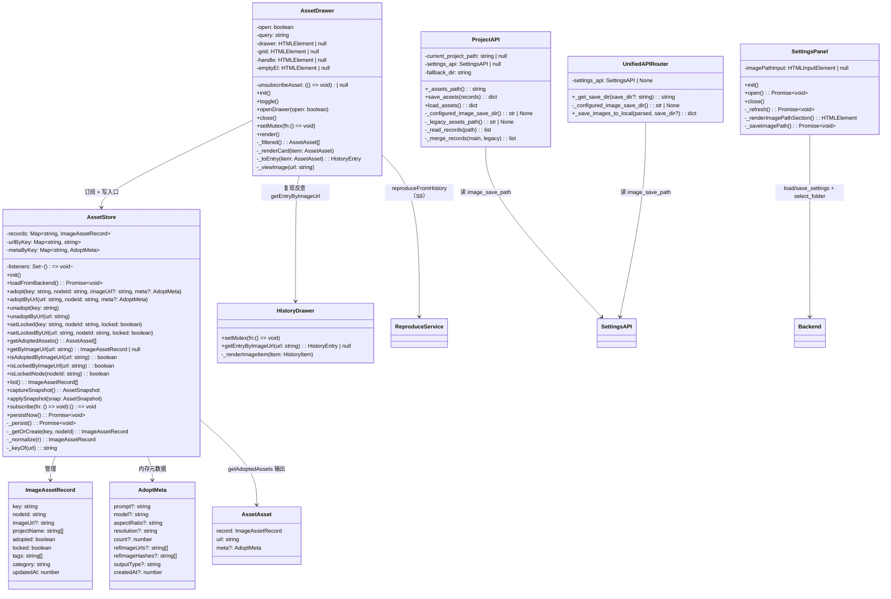
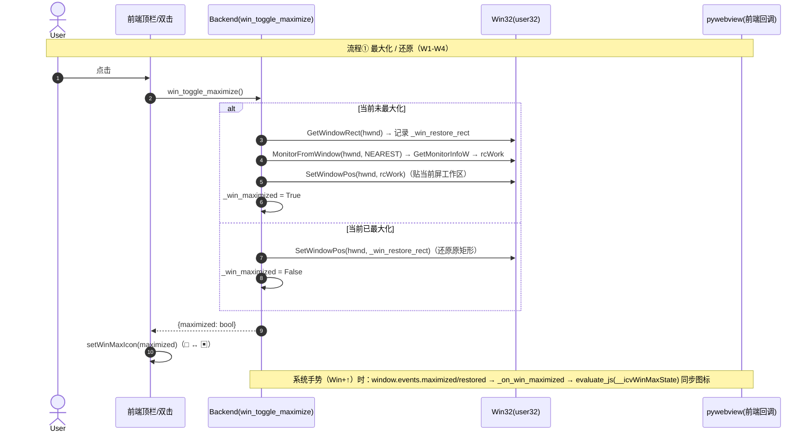
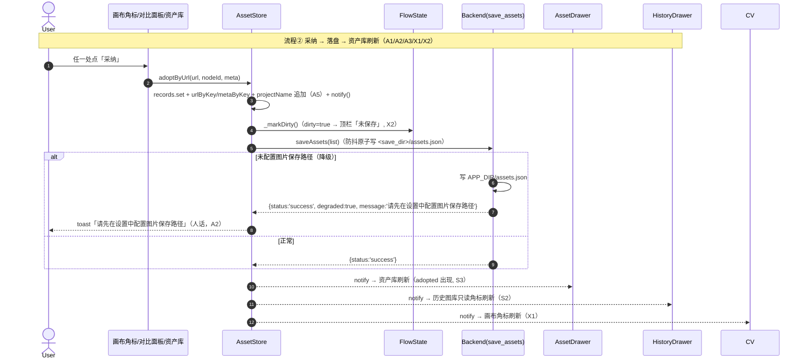
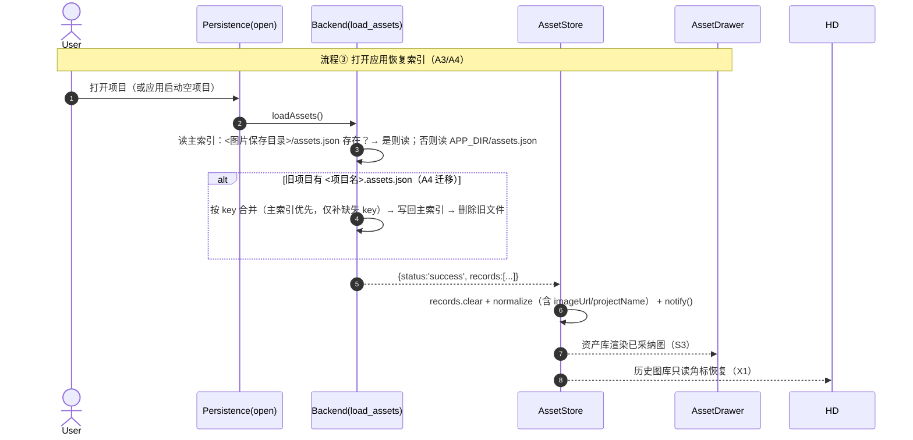
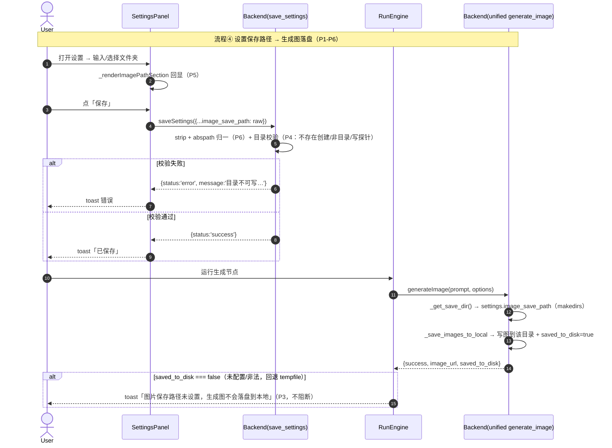
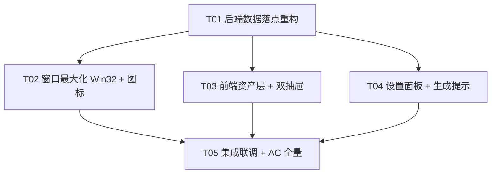

# 增量系统设计（窗口最大化修复 + 资产索引落点 + 历史图库/资产库拆分 + 图片保存路径）

> 版本：incremental-3（Bug 修复 + 资产库拆分 + 设置项补齐）
> 日期：2026-08-16
> 依据：`docs/incremental-asset-split-prd.md`（incremental-3 PRD，W/A/S/P/X 需求池 + 验收 AC-1~8）+ `docs/incremental-assets-system-design.md`（incremental-2 既有设计）+ 源码现状核实（main.py / project_api / settings_api / unified_api / image_api / asset-store / history-drawer / settings-panel / main.ts / api.ts / backend.d.ts / index.html / app.css）
> 撰写：高见远（架构师）
> 状态：供工程师据此实现，供 QA 据此测验收
> 前序：incremental-2（资产与档案层）已交付

---

## A. 系统设计

### 1. 实现方案总览

本次增量共四大块 + 一条横切。主理人已拍板的关键约束全部纳入：

| 拍板项 | 决策 | 落点 |
|---|---|---|
| **Q1 最大化实现** | 不用 pywebview 原生 `maximize()/restore()`；改用 Win32 `MonitorFromWindow` + `GetMonitorInfoW` 取当前显示器工作区 `rcWork` → `SetWindowPos` 贴工作区；最大化前 `GetWindowRect` 记录原矩形；还原时 `SetWindowPos` 恢复 | §1.1 W |
| **Q3 资产索引落点** | 全局单一索引 `<图片保存目录>/assets.json`（多项目共用）；键 = 图指纹 `hashRef(imageUrl)` 全局唯一天然去重；`projectName` 改**数组字段**；`nodeId` 保留最近值 | §1.2 A |
| **Q5 资产库入口** | 并列把手（历史图库 / 资产库 上下两个把手，互斥开抽屉），不用抽屉内 tab | §1.4 S |
| **Q6 未配置降级** | 资产索引降级写 `APP_DIR/assets.json`（与 settings.json 同处），toast 人话提示「请先在设置中配置图片保存路径」；生成图未配置时保持 base64 回前端 + toast 提示（不阻断）；读盘顺序：图片保存目录 → APP_DIR；顺带合并旧位置 `<项目名>.assets.json`（A4 迁移） | §1.2/§1.5 |

#### 1.1 W · 无边框窗口最大化（Bug 1）

**核心难点**：frameless（WinForms 无边框）窗口的系统最大化会盖住任务栏；且最大化矩形必须按「窗口当前所在显示器」的工作区计算，DPI 缩放不能错位。

**技术方案（ctypes + Win32，stdlib 零新依赖）**：

1. **最大化**：`MonitorFromWindow(hwnd, MONITOR_DEFAULTTONEAREST)` 取当前显示器句柄 → `GetMonitorInfoW` 取 `rcWork`（工作区，已不含任务栏）→ `SetWindowPos(hwnd, 0, rcWork.left, rcWork.top, w, h, SWP_NOZORDER|SWP_NOACTIVATE)` 贴边。
2. **记录原矩形**：最大化前 `GetWindowRect(hwnd)` 存 `_win_restore_rect`（left/top/width/height）。
3. **还原**：`_win_maximized` 为 True 时 `SetWindowPos` 恢复 `_win_restore_rect`；若 `_win_restore_rect` 为空（如被 Win+↑ 系统级最大化抢先），兜底 `ShowWindow(hwnd, SW_RESTORE)`。
4. **状态同步（W2/W4）**：
   - `win_toggle_maximize()` 返回 `{"maximized": bool}`，前端据此切换 `#win-max` 图标（□ → ▣）；启动时前端调新增 `win_is_maximized()` 初始化。
   - 后端 `evaluate_js('window.__icvWinMaxState(true/false)')` 同步前端图标（覆盖 Win+↑ 等系统手势）。
   - 注册 `window.events.maximized / restored` 事件同步 `_win_maximized`（与真实状态脱节兜底，见 §5 待明确 1）。
5. **DPI/多屏（W3）**：pywebview/WinForms 进程已是 DPI aware，`GetMonitorInfoW`/`GetWindowRect`/`SetWindowPos` 全程物理像素，**不混用 pywebview 逻辑像素 API**，故无需换算；若实测出现偏移，以 `webview.windows[0].native.Handle` 校准（`_get_window_hwnd` 已有该通道）。
6. **不破坏 W5**：`win_minimize` / `win_close` / `_on_closing` 关闭保护原样保留，仅替换 `win_toggle_maximize` 内部实现。

#### 1.2 A · 资产索引落点（Bug 2）

**根因**：`_assets_path()` 依赖 `current_project_path`，未保存项目返回 None → `no_path` 报错；生成图落 `tempfile` 临时目录无持久落点。

**技术方案**：

1. **落点解耦（A1）**：`ProjectAPI` 注入 `settings_api`（main.py 传入）+ `fallback_dir`（= `APP_DIR`）：
   - `_assets_path()`：读 `settings.image_save_path` → `<save_dir>/assets.json`；未配置 → `<fallback_dir>/assets.json`（降级可写，**永不返回 None**）。
   - `save_assets()`：目录不存在时 `os.makedirs`，原子写 `{"version": 2, "records": [...]}`；降级路径时返回 `{"status":"success", "degraded": true, "message":"请先在设置中配置图片保存路径"}`，前端 toast 人话（A2）。
2. **读盘顺序 + 迁移（A3/A4）**：`load_assets()`：
   - 主索引：图片保存目录 → `APP_DIR`（按序找第一个存在的文件；都不存在 → 空索引）。
   - 旧项目迁移：`current_project_path` 存在且旧位置 `<项目名>.assets.json` 有数据 → **合并**（按 key 去重，主索引优先，仅补主索引缺失的 key）→ 合并结果**写回主索引**（防「取消采纳」被旧文件复活）→ best-effort 删除旧文件 → 返回合并结果。
3. **全局键 + 冗余字段（Q3/A5）**：`ImageAssetRecord` 扩展 `projectName: string[]`（采纳过的项目名列表）+ `imageUrl?: string`（资产库独立显示用，见 §1.4）。键仍是 `hashRef(imageUrl)`，同图多项目采纳天然合并为一条记录，projectName 追加去重，nodeId 保留最近值。
4. **不变式（最小变更）**：`AssetStore` 仍是唯一写入口（X1 数据同源机制不重构）；`save_assets/load_assets` 的 API 形状不变（`{status, records}`），仅落点与内容变化，前端 `asset-store.ts` 只扩展字段归一逻辑。

#### 1.3 P · 设置面板「图片保存路径」（功能 4）

1. **UI（P1）**：`settings-panel.ts` 在供应商列表顶部动态渲染「图片保存路径」配置区（输入框 + 「选择文件夹」按钮 + 「保存」按钮 + hint），沿用 `_ensureAddFields`/`_renderEditor` 的动态创建模式，index.html 无需新增容器。
2. **回显（P5）**：`open()` 时 `Backend.loadSettings()` 读 `image_save_path` 填输入框（未配置显示占位「未设置」）。
3. **保存（P1/P4/P6）**：点「保存」→ `Backend.saveSettings({...current, image_save_path: raw})`；后端 `save_settings` 做路径归一（strip + `os.path.abspath`）+ 校验（不存在则尝试创建、非目录报错、写探针验证可写），失败返回人话 error 前端 toast。
4. **主生成链路（P2）**：`UnifiedAPIRouter` 注入 `settings_api`；`_get_save_dir()` 读取 `settings.image_save_path`（`makedirs(exist_ok=True)`），不再默认回退 tempfile（仅配置缺失/非法时兜底 tempfile，保证 base64 仍可用）。
5. **未配置提示（P3）**：`_save_images_to_local` 返回结果增加 `saved_to_disk: boolean`（是否落盘到用户配置目录）；前端 `run-engine.ts` 在 `result.saved_to_disk === false` 时 toast「图片保存路径未设置，生成图不会落盘到本地」，**不阻断**。

#### 1.4 S · 历史图库 / 资产库拆分（功能 3）

1. **入口互斥（S5/Q5）**：index.html 新增第二个抽屉（`#asset-drawer`，结构复用 `.left-drawer`：把手 + `.sidebar-left`）；两个把手上下并列；main.ts 注入互斥回调（`historyDrawer.setMutex(() => assetDrawer.close())` 与反向），打开一个自动收起另一个。
2. **历史图库瘦身（S1/S2）**：`history-drawer.ts` 移除卡片 hover 的「采纳/锁定」按钮与对应点击逻辑（保留复现、拖入画布、搜索、image/text 分区）；已采纳/已锁定**只读角标**保留（`.ht-badges` 已有 `pointer-events:none`，天然不可点）。
3. **资产库抽屉（S3/S4/S6/S8/S9）**：新建 `src/v1/ui/asset-drawer.ts`：
   - 数据源 = `AssetStore.getAdoptedAssets()`（adopted=true，按 `updatedAt` 倒序）；订阅 `assetStore` 即时刷新（X1）。
   - 卡片动作：取消采纳（先 `flowHistory.record()`，X3）、锁定/解锁、查看大图（复用 `#img-modal`）、拖入画布（复用 `application/history-image` 拖拽语义）、复现（S9 P1，meta 内存缓存优先，缺失时经 `historyDrawer.getEntryByImageUrl` 反查 HistoryEntry 构造）。
   - 搜索（S8 P1）：按 prompt/model/tags 过滤；空态文案见共享知识 3；无匹配「无匹配资产」。
4. **资产库独立显示所需的图源**：既有 `ImageAssetRecord` 只有 `key`（hashRef）无 URL，资产库无法渲染缩略图。扩展：记录增加 `imageUrl?: string`（采纳时写入）+ AssetStore 内存 `urlByKey`/`metaByKey` 双缓存。旧记录（incremental-2 写入、无 imageUrl）显示「图源缺失」占位（见 §5 待明确 2）。

#### 1.5 X · 横切（三处同步 → 四处 + dirty）

- **X1 四处同步**：画布角标 / 历史图库角标 / 对比面板 / **资产库**全部订阅同一 `AssetStore`，任一变更 notify 全刷。
- **X2 dirty**：资产库取消采纳、锁定/解锁仍走 `AssetStore` 写入口 → `_markDirty()`（沿用，不改）。
- **X3 撤销**：资产库取消采纳/锁定变更前 `flowHistory.record()`（沿用 X3 既有接入点）。

---

### 2. 文件列表（相对路径，标注 新建/修改）

**后端 — 修改（5）**

| 文件 | 改动 |
|------|------|
| `backend/api/project_api.py` | `__init__` 注入 `settings_api` + `fallback_dir`；`_assets_path()` 改为「图片保存目录/assets.json → fallback_dir/assets.json」双级解析；`save_assets()` 目录 makedirs + 降级 `degraded` 标记；`load_assets()` 按读盘顺序读取 + 旧位置合并迁移（写回 + 删旧文件）；新增 `_configured_image_save_dir/_read_records/_merge_records/_legacy_assets_path` 内部方法 |
| `backend/api/settings_api.py` | `save_settings()` 增加 `image_save_path` 归一（strip + abspath）+ 目录校验（不存在创建 / 非目录报错 / 写探针可写校验）（P4/P6） |
| `backend/api/unified_api.py` | `__init__` 注入 `settings_api=None`；`_get_save_dir()` 读 `settings.image_save_path`（makedirs），仅配置缺失/非法回退 tempfile；新增 `_configured_image_save_dir()`；`_save_images_to_local()` 返回增加 `saved_to_disk`（P2/P3） |
| `main.py` | `InfiniteCanvasAPI.__init__` 注入：`ProjectAPI(settings_api=self.settings, fallback_dir=APP_DIR)`、`UnifiedAPIRouter(self.provider, settings_api=self.settings)`；窗口 Win32 实现（新增 `_get_monitor_work_area/_get_window_rect/_set_window_pos` 模块级工具 + `win_toggle_maximize` 重写 + 新增 `win_is_maximized` + `_on_win_maximized/_on_win_restored` 事件同步）；注册 `window.events.maximized/restored` |
| `backend/api/image_api.py` | （可选，P2 一致性）`save_image_to_local` 路径不存在时已 `makedirs`，无需改；如需与主链路统一提示可微调 —— **本期不改** |

**前端 — 新建（1）**

| 文件 | 职责 |
|------|------|
| `src/v1/ui/asset-drawer.ts` | 资产库抽屉：`AssetDrawer` 类（init/toggle/openDrawer/close/setMutex/render/_filtered/_renderCard/_toEntry/_viewImage），数据源 `assetStore.getAdoptedAssets()`，动作：取消采纳/锁定/查看/拖入/复现，搜索，空态 |

**前端 — 修改（8）**

| 文件 | 改动 |
|------|------|
| `src/v1/types/flow.d.ts` | `ImageAssetRecord` 增加 `imageUrl?: string` + `projectName: string[]`；新增 `AdoptMeta` 类型（资产库复现内存元数据） |
| `src/v1/types/backend.d.ts` | `BackendSettings` 已有 `image_save_path`（不改）；`BackendAssetsResult` 增加 `degraded?: boolean` + `message?` 说明（降级提示透传） |
| `src/v1/asset-store.ts` | 扩展 `adopt/adoptByUrl(key, nodeId, imageUrl?, meta?)`；`_getOrCreate/_normalize` 支持 `imageUrl/projectName`；新增 `urlByKey/metaByKey` 缓存 + `getAdoptedAssets()`；`_persist()` 消费 `res.degraded` → 人话 toast |
| `src/v1/ui/history-drawer.ts` | 移除采纳/锁定 hover 按钮与点击逻辑（S1）；保留只读角标（S2）；保留复现/拖入/搜索/tab；新增 `getEntryByImageUrl(url)`（供资产库复现反查）；新增 `setMutex(fn)`（互斥回调） |
| `src/v1/ui/settings-panel.ts` | 新增 `_renderImagePathSection()`（图片保存路径配置区：输入框 + 选择文件夹 + 保存按钮 + hint），`_refresh` 时 `loadSettings()` 回显，保存调 `saveSettings`（P1/P4/P5/P6） |
| `src/v1/engine/run-engine.ts` | 任务结果消费处检查 `result.saved_to_disk === false` → toast「图片保存路径未设置，生成图不会落盘到本地」（P3，不阻断） |
| `src/v1/main.ts` | `bindWindowControls`：win-max 点击改异步取返回值切换图标；新增 `setWinMaxIcon(maximized)` + `window.__icvWinMaxState` 回调；启动查询 `win_is_maximized()`；init：`assetDrawer.init()` + 双抽屉互斥绑定；Escape 关闭资产库（可选） |
| `src/index.html` | 新增 `#asset-drawer`（第二个抽屉：把手 + sidebar + 标题 + 搜索框 + 网格 + 空态）；`#win-max` 按钮内放两个 SVG（最大化/还原，CSS 切换显隐） |
| `src/v1/styles/app.css` | 资产库抽屉样式（复用 `.left-drawer/.drawer-handle/.sidebar-left/.history-*` 基类 + `.asset-*` 微调：第二把手位置、资产卡角标、空态）；设置路径区样式（`.settings-image-path/.settings-path-row/.settings-hint`）；`#win-max` 图标切换样式 |

> 注：`src/v1/api.ts` 已暴露 `load_settings / save_settings / select_folder / save_assets / load_assets`，**无需改**。

---

### 3. 数据结构与接口



**接口契约要点**

- `ImageAssetRecord` 字段扩展：`imageUrl?: string`（图 URL，采纳时写入，资产库显示用；旧记录缺失 → 占位）；`projectName: string[]`（A5：采纳过的项目名列表，去重追加；旧记录缺失 → `[]`）。
- `AssetStore.getAdoptedAssets(): AssetAsset[]`：过滤 `adopted=true`，按 `updatedAt` 倒序；`url` 优先级 = `record.imageUrl` → `urlByKey` 缓存；`meta` = `metaByKey` 缓存（**不持久化**，复现用；缺失时 asset-drawer 经 historyDrawer 反查）。
- `save_assets` 返回：`{status:'success'}`（正常）/ `{status:'success', degraded:true, message:'请先在设置中配置图片保存路径'}`（降级 APP_DIR）/ `{status:'error', message}`（IO 失败，人话）。
- `load_assets` 返回：`{status:'success', records:[...]}`（含迁移合并）/ `{status:'empty'}` / `{status:'error'}`。
- `win_toggle_maximize()` 返回 `{"maximized": bool}`；`win_is_maximized()` 返回 `{"maximized": bool}`。
- `_save_images_to_local` 返回增加 `saved_to_disk: boolean`（是否写入用户配置目录；tempfile 兜底为 false）。
- `assets.json` 文件格式（version 2）：
  ```json
  {
    "version": 2,
    "records": [
      {
        "key": "1a2b3c4d",
        "nodeId": "node_xxx",
        "imageUrl": "data:image/png;base64,...",
        "projectName": ["未命名项目", "花园项目"],
        "adopted": true,
        "locked": true,
        "tags": [],
        "category": "成图",
        "updatedAt": 1755300000000
      }
    ]
  }
  ```

---

### 4. 程序调用流程









> 完整时序图独立落盘：`docs/incremental-asset-split-sequence-diagram.mermaid`；类图：`docs/incremental-asset-split-class-diagram.mermaid`。

---

### 5. 未明确事项与假设

1. **pywebview 6.x 窗口事件**：设计依赖 `window.events.maximized / restored`（W2 脱节兜底）。若运行版本不支持（需实测），降级方案：仅 `win_toggle_maximize / win_is_maximized` 时同步状态与图标，系统级最大化（Win+↑）的脱节可接受（本期不拦截系统手势）。
2. **旧记录无 imageUrl**：incremental-2 写入的资产记录没有 `imageUrl`，资产库渲染时显示「图源缺失」占位卡（可拖入/可取消采纳，但无缩略图）。若 A4 迁移的旧记录较多且都无图源，可后续做「按 key 从 history.jsonl 反查补全」（本期不做，留口子）。
3. **降级 toast 频率**：未配置图片保存路径时，每次采纳都 toast「请先在设置中配置图片保存路径」（可能较频繁）。产品语义是引导用户去设置，接受；若嫌烦可改为「首次提示 + 后续静默」（本期按每次提示实现，待主理人确认）。
4. **base64 大图撑大 assets.json**：`imageUrl` 存采纳时刻的图 URL（未落盘时为 data URL，几十~几百 KB），assets.json 会偏大（采纳图通常不多，可接受）。A6（图片文件沉淀 `assets/adopted/`）落地后自然变为 file 路径，此问题自愈。
5. **`win_toggle_maximize` 返回值**：pywebview js_api 返回 dict 自动转 JS 对象；前端 `await window.pywebview.api.win_toggle_maximize()` 取 `.maximized`。若某版本返回被包一层 `result`，前端 `(r && (r as any).maximized) ?? (r as any).result?.maximized` 兼容（写进共享知识 5）。
6. **不重构红线**：AssetStore 唯一写入口、撤销并行快照、锁定保护点、history.jsonl append-only 语义全部保持（沿用 incremental-2 共享知识）。
7. **不做（沿用 PRD 红线）**：资产云同步、标签管理 UI、分类 tabs、历史图库清理/批量删除、像素级复现（seed 留空）、自动评分、目录内组织 UI、A6 已采纳图片沉淀（本期仅 imageUrl 字段留口子）、S11 批量操作。

---

## B. 任务分解

### 6. 依赖包列表

**无新增依赖。** Win32 窗口控制用 `ctypes`（Python 标准库）；PIL 已用（`unified_api` 图片魔数推断）；前端仍原生 TS/DOM。无需改 `package.json` / `requirements`。

---

### 7. 任务列表（有序，按依赖）

> 分组原则：T01 后端数据落点（跨切面基础）→ T02 窗口最大化（独立 W）→ T03 前端资产层 + 双抽屉（S 主闭环）→ T04 设置面板 + 生成提示（P 主闭环）→ T05 集成联调（X + AC 全量）。
> 每任务 ≥3 文件；无单文件任务；T02/T03/T04 均仅依赖 T01，**可并行**（串行实现时按任务顺序，避免 main.ts/index.html 段落冲突，T05 统一收口）。

| Task | 任务名 | 涉及源文件 | 依赖 | 优先级 | 验收点 |
|------|--------|-----------|------|--------|--------|
| T01 | 后端数据落点重构（资产索引全局化 + 降级 + 迁移；设置校验；生成落盘） | 修改 `backend/api/project_api.py`、`backend/api/settings_api.py`、`backend/api/unified_api.py`、`main.py`（注入 settings_api/fallback_dir） | — | P0 | AC-3 后端：未保存项目 save_assets 不再 no_path；assets.json 出现在图片保存目录/APP_DIR；load_assets 读盘顺序正确、旧位置合并迁移；save_settings 路径归一+校验（P4/P6）；unified 生成落盘到配置目录且返回 saved_to_disk（P2/P3 后端） |
| T02 | 窗口最大化 Win32 实现 + 图标同步（W1-W5） | 修改 `main.py`（Win32 工具 + win_toggle_maximize 重写 + win_is_maximized + 事件同步）、`src/v1/main.ts`（bindWindowControls 异步返回 + setWinMaxIcon + __icvWinMaxState）、`src/index.html`（#win-max 双 SVG） | T01（避免 main.py 段落冲突） | P0 | AC-1/AC-2：最大化贴工作区不遮任务栏、还原原矩形、多屏/DPI 正确、最小化/关闭保护不变；W4 图标切换 |
| T03 | 前端资产层 + 双抽屉（S1-S9 + X1） | 修改 `src/v1/types/flow.d.ts`、`src/v1/types/backend.d.ts`、`src/v1/asset-store.ts`、`src/v1/ui/history-drawer.ts`、`src/v1/main.ts`、`src/index.html`、`src/v1/styles/app.css`；新建 `src/v1/ui/asset-drawer.ts` | T01 | P0 | AC-5/AC-6/AC-7：历史图库无采纳/锁定按钮（复现/拖入/搜索/tab 正常）；资产库只显示 adopted 图、四动作可用、空态可见、入口互斥；四处同步（X1） |
| T04 | 设置面板「图片保存路径」+ 生成未落盘提示（P1-P6） | 修改 `src/v1/ui/settings-panel.ts`、`src/v1/engine/run-engine.ts`、`src/v1/styles/app.css`（可并入 T03 段落）、`src/index.html`（如需容器） | T01 | P0 | AC-4：设置面板可见配置项、保存写入 settings.json、回显；生成图落盘配置目录（不再进 temp）；未配置 toast 提示（P3）不阻断；目录校验失败人话提示（P4） |
| T05 | 集成联调：互斥/图标/同步/dirty/撤销 + AC 全量验收 | 修改 `src/v1/main.ts`、`src/v1/persistence.ts`（如有打开项目刷新点）、`src/v1/styles/app.css`；可选新增 `smoke/test-incremental3.cjs` | T02、T03、T04 | P0 | AC-1~AC-8 全量；X2 dirty 计入、落盘成功不再报「资产索引保存失败」；X3 资产库取消采纳可撤销 |

> 说明：T02/T03/T04 均触碰 `main.ts`（不同段落：窗口控制 / init + 互斥 / init + 图标已有）+ `index.html`（不同区域：win-max 按钮 / 第二抽屉 / 设置区），工程师**按任务顺序串行实现**（或并行时按「文件段落分工」），由 T05 统一收口合并。

---

### 8. 共享知识（跨切面约定）

1. **资产索引唯一落点**：主索引 = `<图片保存目录>/assets.json`，未配置降级 `APP_DIR/assets.json`；读盘顺序 = 图片保存目录 → APP_DIR；`load_assets` 幂等合并旧位置 `<项目名>.assets.json`（主索引优先、按 key 去重、合并即写回 + best-effort 删旧文件）。**禁止**再依赖 `current_project_path` 推导索引路径。
2. **数据同源不变式**：采纳/锁定唯一写入口仍是 `AssetStore`；画布角标、历史图库角标、对比面板、资产库四处只读订阅；任一 UI 变更 → AssetStore 方法 → notify + 持久化。**禁止**各写一份状态。
3. **toast 文案常量**（前端统一字符串，禁止改字面量）：未配置路径采纳降级 → `请先在设置中配置图片保存路径`；生成未落盘 → `图片保存路径未设置，生成图不会落盘到本地`；资产库空态 → `还没有采纳的图。在画布或对比面板采纳满意的成图后，会出现在这里。`；资产库搜索无结果 → `无匹配资产`；保存成功 → `已保存`。
4. **抽屉互斥规则**：`historyDrawer` / `assetDrawer` 通过 `setMutex(fn)` 注入互斥回调（main.ts 绑定：开一个关另一个）；**不得**在抽屉内部互相 import 对方单例做关闭（避免循环依赖），统一由 main.ts 编排。
5. **窗口状态契约**：`win_toggle_maximize()` / `win_is_maximized()` 返回 `{maximized: boolean}`；前端图标状态以返回值/`__icvWinMaxState` 回调为准；Win32 坐标**全程物理像素**，不与 pywebview 逻辑像素 API 混用；若返回被包一层 `result`，前端兼容取值（`r?.maximized ?? r?.result?.maximized`）。
6. **ImageAssetRecord 扩展纪律**：`imageUrl` 只在采纳时写入（不随锁定更新）；`projectName` 数组只追加去重（不删除）；`nodeId` 保留最近值；`_normalize` 必须兼容旧记录（缺 imageUrl → 空串、缺 projectName → []）。
7. **saved_to_disk 语义**：后端 `_save_images_to_local` 返回 `saved_to_disk` 仅表示「是否写入用户配置目录」；tempfile 兜底为 false；前端只在 false 时 toast（P3），**不阻断**结果展示。
8. **撤销接入**：资产库取消采纳/锁定 = 用户手势，变更前 `flowHistory.record()`（X3）；沿用 HistoryStack 并行 assets 快照机制，不改快照结构。
9. **UI 红线沿用**：功能图标一律 SVG 描边（禁止 emoji 功能图标）；禁止紫粉渐变；深色主题沿用 `[data-theme]` CSS 变量；toast 沿用 `showToast`；画布不出现文字日志。
10. **assets.json 体积权衡**：`imageUrl` 可能为大 data URL（几十~几百 KB），接受；A6 落盘后自愈为 file 路径。

---

### 9. 任务依赖图



---

## C. 验收对照（供 QA）

| 验收点 | 实现落点 |
|---|---|
| AC-1 最大化贴工作区、还原原矩形 | T02（Win32 SetWindowPos + _win_restore_rect） |
| AC-2 多屏/DPI 贴合当前屏工作区；最小化/关闭保护不变 | T02（MonitorFromWindow/GetMonitorInfoW + 原 win_minimize/win_close/_on_closing 保留） |
| AC-3 未保存项目采纳不报错；重开采纳状态仍在 | T01（落点解耦 + 降级写）+ T03（AssetStore normalize/load）+ T05（重开验证） |
| AC-4 设置面板配置路径并写入 settings.json；生成落盘；未配置有提示 | T04（settings-panel + run-engine）+ T01（save_settings 校验 / unified 落盘 + saved_to_disk） |
| AC-5 历史图库无采纳/锁定动作，其余正常 | T03（history-drawer 移除按钮，保留复现/拖入/搜索/tab） |
| AC-6 资产库只显示已采纳；取消采纳/锁定/查看/拖入可用；空态可见 | T03（asset-drawer + AssetStore.getAdoptedAssets） |
| AC-7 画布/历史/对比/资产库四处同步 | T03（AssetStore 订阅 + asset-drawer 订阅） |
| AC-8 采纳计入 dirty；落盘成功不再报「资产索引保存失败」 | T01（降级 degraded 人话提示替换失败文案）+ T03（_persist 消费 degraded） |
| X2 dirty/持久化 | T03（沿用 _markDirty + persistNow） |
| X3 资产库取消采纳可撤销 | T03（变更前 flowHistory.record()） |
