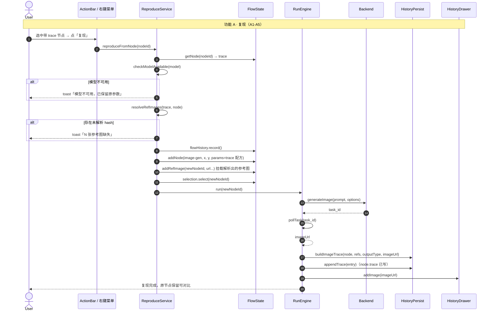
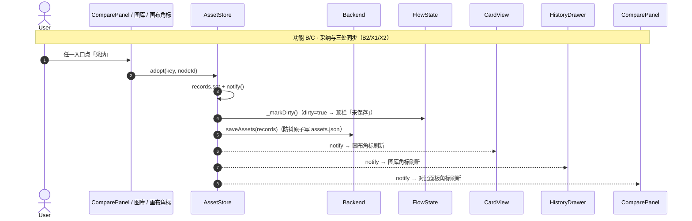
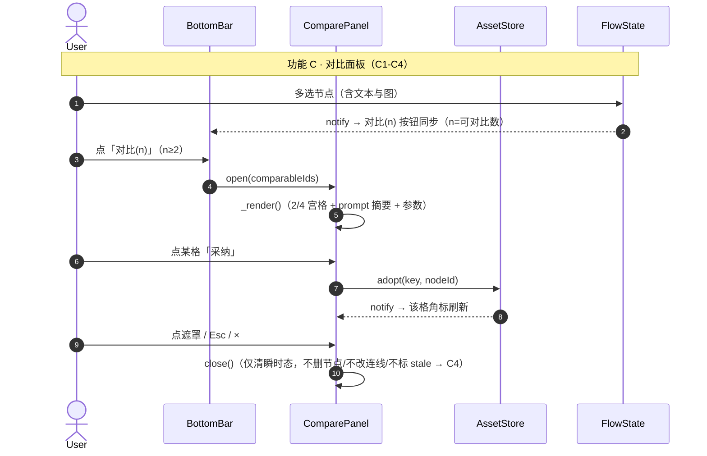
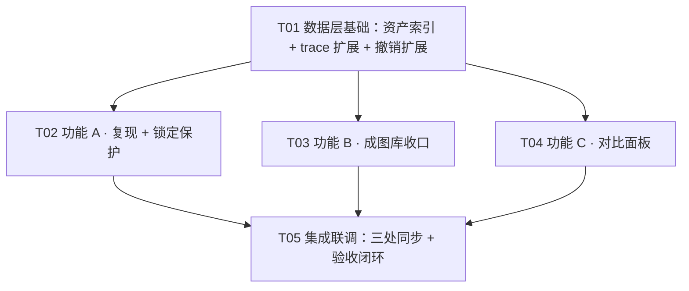

# 资产与档案层 · 增量系统设计（复现按钮 + 成图库收口 + 对比面板）

> 版本：incremental-2（第 2 步入口：资产与档案层 + 第 3 步入口：实验评估层）
> 日期：2026-08-16
> 依据：`docs/incremental-assets-prd.md`（PM 增量 PRD，18 条需求 + 3 条横切 + 8 个待确认问题）+ `docs/视觉实验台-产品方案v3.md`（§4.4 Trace、§5 界面结构、§8 存储布局）+ `docs/trust-layer-system-design.md`（既有约定）
> 撰写：高见远（架构师）
> 状态：供工程师据此实现，供 QA 据此测验收
> 前序：信任层（incremental-1）已交付

---

## A. 系统设计

### 1. 实现方案（难点 + 现有代码如何扩展 + 架构模式）

#### 1.1 核心难点

| # | 难点 | 现状 | 关键动作 |
|---|------|------|---------|
| D1 | 采纳/锁定必须「唯一定位一张图」而非「一个节点」 | 信任层 `history.jsonl` 的 image 行只存 `nodeId`（`loadFromHistory` 按 nodeId 解析当前 imageUrl，**同 nodeId 被重跑覆盖后旧行会错位到新图**） | 新索引键 = 图指纹 `hashRef(imageUrl)` + 冗余 `nodeId`；`HistoryEntry` 新行补 `imageUrl` 字段（旧行回退 nodeId 解析） |
| D2 | 可变元数据与 append-only 流水分离 | 项目是单文件 `.icproj`，history.jsonl 是兄弟文件；采纳/锁定无处可写 | 新增独立可变索引 `<项目名>.assets.json`（与 `.history.jsonl` 同目录兄弟），后端 `save_assets/load_assets` 原子读写 |
| D3 | 锁定保护要精确插入既有删除/覆盖路径 | `flow-state.removeChildren`（重跑顶掉）与 `run-engine._writeBackToSelf`（txt2img 写回自身）均已上线 | 两处各加一个「锁定判定」分支：锁定产出节点保留 + 标 stale；锁定源节点旧图不写回、改走新建产出节点 |
| D4 | 复现要还原 trace 配方（含参考图） | trace 只存 `refImageHashes`（hash 不可逆，跨会话无法反查图） | trace 新行补可选 `refImageUrls`；解析优先级 = trace.refImageUrls → 同 hash 反查项目内图池 → 缺失计数 toast（PRD A3 明确接受缺失提示） |
| D5 | 复现入口无承载位置 | **无「档案」UI（已核实，Q8 修正）**：trace 只落数据层，无任何展示入口 | 复现入口落位 = ① 画布卡片右键菜单（P0 主入口，仅 trace 非空显示）② action-bar 新增「复现」按钮（P0 次入口）③ 图库卡片 hover「复现」（P1 A6）；**不新造档案视图** |
| D6 | 三处角标同步（画布/图库/对比面板） | 无采纳/锁定概念 | 新增 `AssetStore` 单一数据源（订阅通知），card-view / history-drawer / compare-panel 三处订阅同一 store |
| D7 | 采纳/锁定入撤销栈 | 信任层 `FlowSnapshot` 只含 nodes/edges/projectName/dirty | `HistoryStack` 扩展**并行 assets 快照**（record/undo/redo 同步存取），不动 flow-state 核心 |

#### 1.2 架构模式（最小变更原则，延续信任层）

1. **前端原生 DOM，不引新框架**：三块功能全部用现有 TS + DOM 模式实现（类单例 + `flowState.subscribe` 订阅 + 原生事件），**零新增依赖**。
2. **采纳/锁定收敛到单一数据源 `AssetStore`**（新建 `src/v1/asset-store.ts`）：内存 `Map<key, ImageAssetRecord>` + 订阅通知 + `saveAssets/loadAssets`（后端原子写）+ `captureSnapshot/applySnapshot`（撤销接入）。任何 UI（画布角标/图库/对比面板）只读写这一个 store，X1 天然满足。
3. **持久化三文件职责分离**：
   - `.icproj`（单文件，原子写）＝ 画布结构 + 节点参数 + `node.trace`（source of truth）
   - `<项目名>.history.jsonl`（append-only）＝ 生成流水账（跨会话图库展示）
   - `<项目名>.assets.json`（**可变索引**，原子写）＝ 采纳/锁定/tags/category 状态（B4/X2）
4. **复现收敛到 `ReproduceService`**（新建 `src/v1/reproduce.ts`）：`reproduceFromNode`（画布节点）/`reproduceFromHistory`（图库，A6 P1）两条入口共用同一套「trace → 参数回填 → 参考图解析 → 新建独立节点 → runEngine.run」流水线；重跑必须走 `runEngine.run()` 唯一入口（共享约定）。
5. **锁定保护点在数据层**：`flow-state.removeChildren` 判锁定跳过删除（数据层内查询 `AssetStore`，不依赖 UI）；`run-engine.runOneWorker` 的 txt2img 第 1 张分支判锁定改走新建产出节点。

#### 1.3 关键设计决策（PRD 8 个待确认问题的拍板）

| # | 问题 | 拍板 |
|---|------|------|
| **Q1 复现落点** | 回填原节点 vs 新建独立节点 | **新建独立节点**（PRD 推荐 + A5 验收）。理由：① 不破坏原图，复现结果可与原图并排对比（A-US2）；② 不需要「旧图先入历史」的覆盖补救，原图仍在画布可找回；③ 多次复现堆积节点是可接受的实验语义（画布是实验桌面，每个复现是一次分支）。新节点位置 = 源节点右下方（复用批次产出避让算法），选中并自动运行。 |
| **Q2 采纳/锁定索引文件与键** | assets.json 独立 vs manifest 段；键 = 图指纹 vs nodeId | **独立文件 `<项目名>.assets.json` + 键 = 图指纹 `hashRef(imageUrl)`，冗余存 `nodeId`**。理由：① `.icproj` 是含 base64 大图的单文件，整体原子重写成本高，采纳是高频小变更，独立小文件读写快且不互相放大；② 与 append-only `history.jsonl` 职责分离（PRD 五.1 硬要求）；③ 图指纹唯一标识「一张图」——同一 nodeId 被重跑覆盖后旧图指纹不变，采纳/锁定仍作用于旧图；`nodeId` 冗余用于保护逻辑回溯（锁定图所在产出节点被 removeChildren 时跳过）。旧项目无 assets.json → 默认全未采纳/未锁定（迁移策略）。 |
| **Q3 锁定与重跑语义** | 完全跳过 vs 保留 + 标 stale | **保留 + 标 stale**（PRD 产品倾向）。`removeChildren` 对锁定产出节点：不删除、标 stale（含其下游）、toast「有锁定的结果节点，已保留并标待重跑」；`_writeBackToSelf` 对源节点旧图被锁定：不覆盖（旧图保留），新图改走 `createResultCard` 新建产出节点。精确保护点见 §1.4。 |
| **Q4 对比对象范围** | 本期仅画布选中节点；C7（历史图进对比）是否 P1 | **C7 明确 P2**（本期不做）。对比对象 = 画布选中节点中 `image-gen && imageUrl 非空`。 |
| **Q5 对比入口交互** | 底部新增「对比(n)」并排 + 混选禁用规则 | **底部新增「对比(n)」按钮与「运行选中(n)」并排**；n = 选中节点中可对比数（image-gen 且 imageUrl 非空），**文本节点不计入 n，n < 2 时整钮禁用**（不因混选文本而隐藏）。 |
| **Q6 分类口径** | 本期不做分类 tabs 是否认可 | **认可**：不做分类 tabs（B8 P2），索引记录仅预留 `category: string`（默认 `'成图'`），不渲染任何分类 UI。 |
| **Q7 撤销范围** | 采纳/锁定是否入撤销栈（X3） | **入栈（P1 随 P0 交付）**：`HistoryStack` 扩展并行 assets 快照；`record()` 同时捕获 flow + assets，`undo/redo` 同步恢复两者。采纳/锁定变更计 dirty（X2 P0）。 |
| **Q8 档案入口现状** | 复现按钮承载位置 | **已核实无「档案」入口**。复现承载：① 画布卡片右键菜单（`interactions._showCardMenu` 新增「复现」项，仅 `node.type==='image-gen' && node.trace` 非空显示）—— P0 主入口；② action-bar 新增「复现」按钮（仅单选 + trace 非空显示）—— P0 次入口；③ 图库卡片 hover「复现」（A6，P1）。**不新造档案视图**（trace 详情展示非本次需求，避免重复造轮子）。 |

#### 1.4 锁定保护点（精确位置）

```
保护点 1：flow-state.removeChildren(parentId)
  └─ children.forEach(child => {
       ├─ 若 assetStore.isLockedByImageUrl(child.imageUrl)
       │   （或 isLockedNode(child.id) 冗余命中）：
       │   → 不删除；[child, ...downstreams] 标 stale；keptLocked=true
       ├─ 否则原逻辑：纯引擎产出 → removeNode；手动改造 → 保留 + 标 stale
     })
  └─ if (keptLocked) toast「有锁定的结果节点，已保留并标待重跑」

保护点 2：run-engine.runOneWorker 的 isTxt2Img && index === 0 分支
  └─ 写回前检查：源节点当前 imageUrl（旧图）→ hashRef → assetStore.isLockedByImageUrl？
       ├─ 是 → 不调 _writeBackToSelf，改走 createResultCard(genId, imageUrl, layout, {}, {outputType:'txt2img', refs})
       │        （旧图保留在源节点，新图成为独立产出节点）
       └─ 否 → 原逻辑 _writeBackToSelf（旧图先入历史再覆盖）

保护点 3（P1 细节）：runBatch step 6 图生图分支清空源节点旧 imageUrl 前
  └─ 若 assetStore.isLockedByImageUrl(after.imageUrl) → 跳过清空（参考图锁定，保留主视觉）+ toast「参考图已锁定，保留显示」
```

#### 1.5 复现参考图还原（A3 拍板）

trace 只存 hash 不可逆，跨会话无法反查图。取舍方案（**采纳「trace 新行补 URL + hash 反查兜底」双通道**）：

1. **新写入的 trace 补可选字段**：`GenerationTrace.refImageUrls?: string[]`（本次实际使用的参考图 URL）+ `HistoryEntry.imageUrl?: string`（该产出图 URL）。`buildImageTrace(node, refs, outputType, imageUrl?)` 签名扩展。旧 trace/旧行无这些字段，向前兼容。
2. **复现解析优先级**：
   - ① `trace.refImageUrls`（新 trace，直接可用，跨会话可靠）
   - ② 按 `refImageHashes` 反查项目内图池（遍历 `flowState.nodes` 的 `imageUrl ∪ refImages`，`hashRef(url)===hash` 命中；优先复现源节点自身的 refImages）
   - ③ 仍未解析的 hash → 计数，toast「N 张参考图缺失」**不阻断运行**（PRD A3 验收）。
3. **体积取舍**：参考图通常 1-3 张，`refImageUrls` 引用的 dataURL 已在 `.icproj` 节点字段中存有一份，trace 重复编码会增大 `.icproj`/`history.jsonl`。接受此代价换取 A6 图库跨会话复现的可靠性（明确取舍，记入共享知识）。

---

### 2. 文件列表（相对路径，标注 新建/修改）

**前端 — 新建（4）**

| 文件 | 职责 |
|------|------|
| `src/v1/asset-store.ts` | 采纳/锁定单一数据源：`AssetStore` 类 + `ImageAssetRecord` 管理、订阅通知、`saveAssets/loadAssets`（经 Backend）、`captureSnapshot/applySnapshot`（撤销接入）、`isLockedByImageUrl/isAdoptedByImageUrl/isLockedNode` 查询、变更即写（防抖）+ 置 dirty |
| `src/v1/reproduce.ts` | 复现编排：`ReproduceService`（`reproduceFromNode` / `reproduceFromHistory` / `resolveRefImages` / `checkModelAvailable` / 新建独立节点 + 避让定位） |
| `src/v1/ui/compare-panel.ts` | 对比面板：模态浮层 + 2/4/8 宫格 + 每格大图/prompt 摘要/模型/比例/分辨率 + 面板内采纳/锁定（同一 AssetStore）+ 关闭清理（不污染主链） |
| `src/v1/state/assets-snapshot.ts` | （可选小文件）`AssetSnapshot` 捕获/恢复纯函数；亦可并入 asset-store.ts —— **建议并入 asset-store.ts**，不单列 |

**前端 — 修改（13）**

| 文件 | 改动 |
|------|------|
| `src/v1/types/flow.d.ts` | `GenerationTrace` 加 `refImageUrls?: string[]`；`HistoryEntry` image 行加 `imageUrl?: string` + `refImageUrls?: string[]`；新增 `ImageAssetRecord`/`AssetSnapshot`/`ComparePanelState` 类型 |
| `src/v1/types/backend.d.ts` | 新增 `BackendAssetsResult`（save_assets/load_assets 返回） |
| `src/v1/api.ts` | `Backend.saveAssets(records)` / `Backend.loadAssets()` |
| `src/v1/history-persist.ts` | `buildImageTrace(node, refs, outputType, imageUrl?)` 签名扩展：写 `refImageUrls` + `imageUrl` 到 trace/entry；`loadHistory` 不变 |
| `src/v1/engine/run-engine.ts` | `runOneWorker` txt2img 第 1 张分支加锁定判定（保护点 2）；`runBatch` step 6 图生图清空 imageUrl 前加锁定判定（保护点 3，P1）；`createResultCard`/`_writeBackToSelf` 调 `buildImageTrace` 传 imageUrl |
| `src/v1/state/flow-state.ts` | `removeChildren` 加锁定跳过分支（保护点 1）；`_isLockedChild(child)` 内部查询 AssetStore |
| `src/v1/state/history.ts` | `HistoryStack` 扩展并行 assets 快照（`assetUndo/assetRedo`，record/undo/redo/suspend/resume/clear 同步） |
| `src/v1/ui/history-drawer.ts` | 成图/文本分区 tab（默认成图）+ 搜索框（prompt/model/tags 过滤，B5/B7）+ 卡片采纳/锁定角标 + hover 动作（采纳/锁定/复现/拖入画布）+ `loadFromHistory` 优先 `e.imageUrl` 解析 |
| `src/v1/ui/action-bar.ts` | 新增「复现」按钮（仅单选 + trace 非空显示），点击调 `reproduce.reproduceFromNode` |
| `src/v1/ui/bottom-bar.ts` | 新增「对比(n)」按钮：n = 选中可对比数，n<2 禁用；点击调 `comparePanel.open(ids)` |
| `src/v1/canvas/card-view.ts` | 卡片右上角采纳/锁定角标（订阅 AssetStore，X1 三处同步之一）；内容指纹纳入角标态 |
| `src/v1/canvas/interactions.ts` | 卡片右键菜单新增「复现」项（仅 trace 非空显示）；新菜单项分发 `_handleMenuAction` |
| `src/v1/persistence.ts` | `open()` 成功后 `loadAssets`（顺序：restore → clear → loadHistory → loadAssets → notify）；`save()` 成功路径 `persistNow`（幂等兜底） |
| `src/v1/main.ts` | init：`assetStore.init()` / `comparePanel.init()` / `reproduce` 绑定；`flowState.subscribe` 联动对比按钮状态 |
| `src/index.html` | 底部栏「对比」按钮 HTML；左侧抽屉搜索框 + 分区 tab 容器；对比面板 overlay 容器 |
| `src/v1/styles/app.css` | 角标（已采纳/已锁定 SVG 角标）、搜索框、分区 tab、hover 动作条、对比面板宫格样式（沿用深色主题 CSS 变量） |

**后端 — 修改（2）**

| 文件 | 改动 |
|------|------|
| `backend/api/project_api.py` | 新增 `_assets_path()`（复用 `_history_path` 模式）+ `save_assets(data)`（原子写 `atomic_write_json`）+ `load_assets()`（文件缺失 → `{status:'empty'}`；损坏 → 容错回退空索引） |
| `main.py` | 注册 `save_assets` / `load_assets` 到 js_api |

---

### 3. 数据结构与接口

```mermaid
classDiagram
    class AssetStore {
        -records: Map~string, ImageAssetRecord~
        -listeners: Set~() => void~
        -persistTimer: number | null
        +init()
        +loadFromBackend(): Promise~void~
        +adopt(key: string, nodeId: string)
        +unadopt(key: string)
        +setLocked(key: string, nodeId: string, locked: boolean)
        +addTags(key: string, tags: string[])
        +isAdoptedByImageUrl(url: string): boolean
        +isLockedByImageUrl(url: string): boolean
        +isLockedNode(nodeId: string): boolean
        +getByImageUrl(url: string): ImageAssetRecord | null
        +list(): ImageAssetRecord[]
        +captureSnapshot(): AssetSnapshot
        +applySnapshot(snap: AssetSnapshot)
        +subscribe(fn: () => void): () => void
        +notify()
        +persistNow(): Promise~void~
        -_persist(): void
        -_markDirty(): void
        -_keyOf(url: string): string
    }

    class ImageAssetRecord {
        key: string
        nodeId: string
        adopted: boolean
        locked: boolean
        tags: string[]
        category: string
        updatedAt: number
    }

    class AssetSnapshot {
        records: ImageAssetRecord[]
    }

    class ReproduceService {
        +reproduceFromNode(nodeId: string): Promise~void~
        +reproduceFromHistory(entry: HistoryEntry): Promise~void~
        +resolveRefImages(trace: GenerationTrace, hintNode?: FlowNode): ResolvedRefs
        +checkModelAvailable(model: string): Promise~boolean~
        -_createNodeFromTrace(trace: GenerationTrace): FlowNode
        -_placeNodeNear(source: FlowNode): { x: number; y: number }
        -_rejectIfBusy(): boolean
    }

    class ResolvedRefs {
        urls: string[]
        missing: number
    }

    class RunEngine {
        +isBusy(): boolean
        +run(nodeId: string): Promise~void~
        +runBatch(nodeId: string): Promise~void~
        +runOneWorker(genId, prompt, options, layout, progress, isTxt2Img, index, refs): Promise~void~
        +createResultCard(genId, imageUrl, layout, paramOverrides, trace): Promise~FlowNode~
        -_writeBackToSelf(genId, imageUrl): Promise~void~
    }

    class HistoryPersist {
        +buildImageTrace(node, refs, outputType, imageUrl?): GenerationTrace
        +appendTrace(entry): Promise~void~
        +loadHistory(): Promise~HistoryEntry[]~
    }

    class ComparePanel {
        -state: ComparePanelState
        -el: HTMLElement | null
        +init()
        +open(nodeIds: string[])
        +close()
        +setGrid(mode: 2 | 4 | 8)
        -_render()
        -_cellAdopt(recordKey: string, nodeId: string)
        -_cellLock(recordKey: string, nodeId: string)
        -_comparableNodes(ids: string[]): FlowNode[]
    }

    class ComparePanelState {
        open: boolean
        nodeIds: string[]
        grid: 2 | 4 | 8
    }

    class HistoryDrawer {
        -items: HistoryItem[]
        -tab: 'image' | 'text'
        -query: string
        +init()
        +addImage(src, meta)
        +loadFromHistory(entries)
        +setTab(tab)
        +setQuery(q)
        -_render()
        -_filtered(): HistoryItem[]
    }

    class FlowState {
        +removeChildren(parentId): void
        -_isLockedChild(child: FlowNode): boolean
    }

    class HistoryStack {
        -undoStack: FlowSnapshot[]
        -redoStack: FlowSnapshot[]
        -assetUndoStack: AssetSnapshot[]
        -assetRedoStack: AssetSnapshot[]
        +record()
        +undo()
        +redo()
        +suspend()
        +resume()
        +clear()
    }

    AssetStore --> ImageAssetRecord : 管理
    AssetStore --> AssetSnapshot : 快照
    HistoryStack --> AssetStore : 并行快照（撤销）
    ReproduceService --> RunEngine : 调用 run（唯一入口）
    ReproduceService --> HistoryPersist : 读 trace
    ReproduceService --> AssetStore : 查询锁定（保护）
    ComparePanel --> AssetStore : 采纳/锁定同一数据源
    HistoryDrawer --> AssetStore : 角标/过滤
    HistoryDrawer --> ReproduceService : 图库复现（A6）
    RunEngine --> AssetStore : 锁定保护查询
    FlowState --> AssetStore : removeChildren 保护
```

**接口契约要点**

- `ImageAssetRecord` 字段：`key` = `hashRef(imageUrl)`（图指纹，主键）；`nodeId` = 图当前所在节点（冗余，供保护回溯）；`adopted`；`locked`（采纳自动置 true）；`tags`（P1）；`category`（P2 预留，默认 `'成图'`）；`updatedAt`。
- `AssetStore` 写路径：`adopt/unadopt/setLocked/addTags` → `_markDirty()`（`flowState.dirty=true` + `updatedAt` + `notify()`，X2）+ `_persist()`（防抖 300ms → `Backend.saveAssets(records)`，失败 toast「资产索引保存失败」）。项目保存成功路径由 `persistence.save()` 调 `assetStore.persistNow()` 幂等兜底。
- `save_assets` 返回：`{status:'success'}` / `{status:'error', message}`（无路径 `message='no_path'`）；`load_assets` 返回：`{status:'success', records:[...]}` / `{status:'empty'}` / `{status:'error'}`。
- `HistoryEntry` image 行扩展（新行）：`{ kind:'image', nodeId, imageUrl?, prompt, model, aspectRatio, resolution, count, refImageHashes, refImageUrls?, seed, createdAt, parentId, outputType }`——**只加可选字段，旧行不迁移**。
- `GenerationTrace` 扩展：`refImageUrls?: string[]`（可选，新 trace 写入）。
- `ReproduceService.reproduceFromNode` 步骤：busy 检查（A7）→ 读 `node.trace`（无 trace 直接 return）→ `checkModelAvailable`（不可用 toast「模型不可用，已保留原参数」，不阻断）→ `resolveRefImages`（缺失 toast「N 张参考图缺失」）→ `flowHistory.record()` → `_createNodeFromTrace`（新建 image-gen 独立节点，参数 = trace，refImages = 解析结果，位置 = 源节点右下避让）→ `selection.select(newNodeId)` → `runEngine.run(newNodeId)`（A4 自动重跑）。

---

### 4. 程序调用流程







> 完整时序图独立落盘：`docs/incremental-assets-sequence-diagram.mermaid`；类图：`docs/incremental-assets-class-diagram.mermaid`。

---

### 5. 未明确事项与假设

**Q1-Q8 拍板见 §1.3**，其余假设/歧义：

1. **assets.json 落点**：`<项目名>.assets.json`，与 `.history.jsonl` 同目录兄弟（复用 `_history_path` 模式新增 `_assets_path`）；未来迁移「项目目录/」布局时两处一起调整。
2. **迁移策略**：旧项目无 assets.json → `load_assets` 返回 `empty`，前端初始化为空索引（全未采纳/未锁定）；已存在的 `.icproj` 不需要重写。
3. **图指纹冲突**：`hashRef`（djb2，8 hex）为现有轻量哈希（信任层共享约定第 5 条），项目内几百张图冲突概率极低（可接受）；`nodeId` 冗余提供二次定位。
4. **图生图分支锁定图清空语义（新增歧义）**：源节点旧 imageUrl 被锁定时，`runBatch` step 6 不再清空（保留参考图主视觉）——P1 细节，若工程师认为影响图生图回参考图占位语义，可改为「锁定仅保护 assets 记录 + 图库显示，主视觉仍清空」，**需主理人/用户确认**（本设计默认前者：锁定即保留显示）。
5. **对比面板交互**：模态 overlay（`.overlay` 类 → 画布交互天然排除），点遮罩 / Esc / × 关闭；打开时画布操作仍可用（半透明遮罩不阻塞，符合 PRD「架构师定」）。
6. **复现 modelType**：trace 只记录绘图参数，复现节点 `modelType` 强制 `'draw'`（产出节点语义，与 createResultCard 一致）；text 反推模式的 image-gen 节点 trace 为 null（不显示复现入口）。
7. **outpaint trace 复现**：扩图产出节点有 trace（outputType='outpaint'），复现时按普通 img2img 配方回填（seed 留空、参考图=合成底图解析）——**扩图底图是运行时合成、未持久化，复现时参考图可能缺失**，走「N 张参考图缺失」提示，属可接受降级（本期不做扩图专属复现）。
8. **busy 语义**：复现全程复用 `runEngine` 全局 busy 锁（A7）：运行中再点复现 → toast「已有任务在运行，请稍候」。
9. **撤销与 assets 即时写盘**：采纳变更即写 assets.json；撤销采纳时 `applySnapshot(assets)` 后再 `_persist()` 回退文件（X3 验收「撤销采纳后索引文件回退」）。
10. **不做**：分类 tabs、自动评分、像素级复现（seed 留空）、花材/场景库本体、提示词模板 UI、云同步（沿用红线）。

---

## B. 任务分解

### 6. 依赖包列表

**无新增依赖。** 前端仅用原生 TS/DOM；后端仅用标准库。无需改 `package.json` / `requirements`。

### 7. 任务列表（有序，按依赖）

> 分组：T01 数据层基础（跨切面）→ A 复现 / B 成图库 / C 对比 三组 → T05 集成联调。
> 每组内 P0 先行：T02/T03/T04 均以 P0 主闭环为先，P1 项随同组交付（已在任务描述标注需求 ID）。

| Task | 任务名 | 涉及源文件 | 依赖 | 优先级 |
|------|--------|-----------|------|--------|
| T01 | 数据层基础：资产索引 + trace 字段扩展 + 撤销扩展 | 新建 `src/v1/asset-store.ts`；修改 `backend/api/project_api.py`、`main.py`、`src/v1/api.ts`、`src/v1/types/backend.d.ts`、`src/v1/types/flow.d.ts`、`src/v1/history-persist.ts`、`src/v1/state/history.ts`、`src/v1/persistence.ts` | — | P0 |
| T02 | 功能 A · 复现按钮 + 锁定保护（A1-A7） | 新建 `src/v1/reproduce.ts`；修改 `src/v1/engine/run-engine.ts`、`src/v1/state/flow-state.ts`、`src/v1/ui/action-bar.ts`、`src/v1/canvas/interactions.ts`、`src/v1/main.ts`、`src/index.html` | T01 | P0 |
| T03 | 功能 B · 成图库收口（B1-B7） | 修改 `src/v1/ui/history-drawer.ts`、`src/v1/canvas/card-view.ts`、`src/v1/styles/app.css`、`src/index.html` | T01 | P0 |
| T04 | 功能 C · 对比面板（C1-C6） | 新建 `src/v1/ui/compare-panel.ts`；修改 `src/v1/ui/bottom-bar.ts`、`src/v1/styles/app.css`、`src/index.html`、`src/v1/main.ts` | T01 | P0 |
| T05 | 集成联调：三处同步 + dirty + 撤销 + 验收闭环（X1-X3 + AC-1~8） | 修改 `src/v1/main.ts`、`src/v1/styles/app.css`、`src/index.html`、`src/v1/persistence.ts`；新增 smoke 测试（可选 `smoke/test-assets-layer.cjs`） | T02、T03、T04 | P0 |

> 说明：T02/T03/T04 均依赖 T01（AssetStore + trace 字段扩展），三者**可并行**；但 T02/T03/T04 都触碰 `index.html`/`app.css`/`main.ts` 的不同段落，工程师**按任务顺序串行实现**（或并行时按「文件段落分工」避免冲突，由 T05 统一收口合并）。每任务 ≥3 文件，无单文件任务。

### 8. 共享知识（跨切面约定）

1. **索引键命名**：图指纹 `key = hashRef(imageUrl)`（复用 `history-persist.hashRef`，djb2 轻量哈希）；`ImageAssetRecord.nodeId` 为冗余回溯字段，**任何 UI 判定采纳/锁定一律走 `AssetStore` 查询方法**（`isAdoptedByImageUrl/isLockedByImageUrl/isLockedNode`），禁止在 UI 层手算 hash 或直接遍历 records。
2. **单一数据源**：采纳/锁定只有 `AssetStore` 一个写入口（adopt/unadopt/setLocked/addTags）；画布角标、图库角标、对比面板角标三处只读订阅（X1）。任何 UI 变更采纳/锁定 → 调 AssetStore 方法 → 自动 notify + 持久化，**不得各写一份状态**。
3. **持久化三文件职责**：`.icproj`（节点 + node.trace，source of truth）/ `<项目名>.history.jsonl`（append-only 流水，跨会话图库）/ `<项目名>.assets.json`（**可变索引**，采纳/锁定/tags/category）。**禁止**把采纳/锁定写进 history.jsonl（append-only 不可改写）或塞进 .icproj（大文件高频重写成本高）。
4. **dirty 联动**：采纳/锁定变更 → `flowState.dirty = true` + `updatedAt = Date.now()` + `notify()`（X2）；dirty 复位仅发生在保存成功（`_clearDirtyIfUnchanged`）或 `replaceAll`（打开/新建）——沿用信任层约定。
5. **撤销接入点**：`HistoryStack.record()` 现在同时捕获 flow + assets 快照；**用户手势入口**（右键复现、图库采纳/锁定、面板采纳/锁定、画布角标点击）在变更前 `record()`；引擎内部变更用 `suspend()/resume()` 包裹不入栈（沿用信任层纪律）。
6. **锁定保护纪律**：保护判定全部在数据层（`flow-state.removeChildren` / `run-engine.runOneWorker`），不依赖 UI；锁定节点**保留 + 标 stale**（不静默跳过、不删除）；锁定图被 `_writeBackToSelf` 覆盖时**改走新建产出节点**（Q3）。
7. **复现纪律**：任何复现最终必须走 `runEngine.run()`（唯一生成入口，共享约定第 3 条），禁止复现旁路直连 backend；复现只读 `node.trace`/`HistoryEntry`，**不改写 history**（PRD 五.4）。
8. **trace 字段规范**：新写入的 trace 必须带 `imageUrl` + `refImageUrls`（可选字段，缺失时旧行兼容）；字段名与 v3 §4.4 严格一致；`seed` 恒 null（像素级复现不做）。
9. **UI 红线**：功能图标一律统一 SVG 描边图标（禁止 emoji 作功能图标）；禁止紫粉渐变；画布无文字日志（仅 toast 提示）；深色主题沿用 `[data-theme="dark"]` CSS 变量；toast 沿用 `showToast`。
10. **对比面板瞬时态**：面板状态（open/nodeIds/grid）**不持久化**；关闭仅清瞬时态，不删节点、不改连线、不标 stale、不自动入库（C4）；面板内采纳/锁定走 AssetStore 后持久化（PRD 五.5）。
11. **历史解析修正**：`history-drawer.loadFromHistory` 优先用 `entry.imageUrl`（新行），缺失时回退按 `nodeId` 解析当前节点 imageUrl（旧行兼容）——**修掉信任层「同 nodeId 旧行错位到新图」的隐患**。

### 9. 任务依赖图



---

## C. 验收对照（供 QA）

| 验收点 | 实现落点 |
|---|---|
| AC-1 有 trace 节点一键复现、参数一致、自动重跑、原图可找回 | T02（reproduceFromNode + 新建独立节点） |
| AC-2 参考图按 refImageHashes 还原、缺失提示 | T01（trace.refImageUrls）+ T02（resolveRefImages） |
| AC-3 成图/文本分区 + 搜索 | T03（history-drawer tab + 搜索） |
| AC-4 采纳自动锁定；锁定不被 removeChildren/_writeBackToSelf 删/覆盖 | T02（保护点 1/2/3） |
| AC-5 关闭重开后采纳/锁定一致 | T01（assets.json 持久化 + persistence.open 恢复） |
| AC-6 多选 2-4 张 → 对比(n) → 并排 → 面板内采纳 | T04（compare-panel + bottom-bar） |
| AC-7 对比关闭后主链无结构变化 | T04（瞬时态，close 仅清面板） |
| AC-8 画布/图库/面板三处角标同步 | T01（AssetStore 订阅）+ T03/T04 |
| X2 采纳计入 dirty、保存落盘 | T01（_markDirty + persistNow） |
| X3 撤销采纳后角标消失且索引回退 | T01（HistoryStack 并行 assets 快照） |
