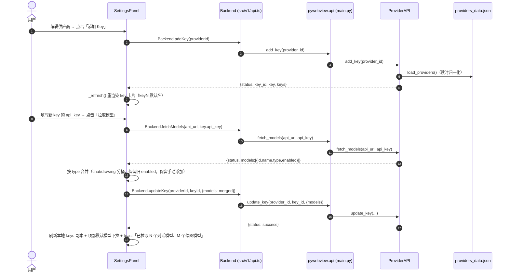
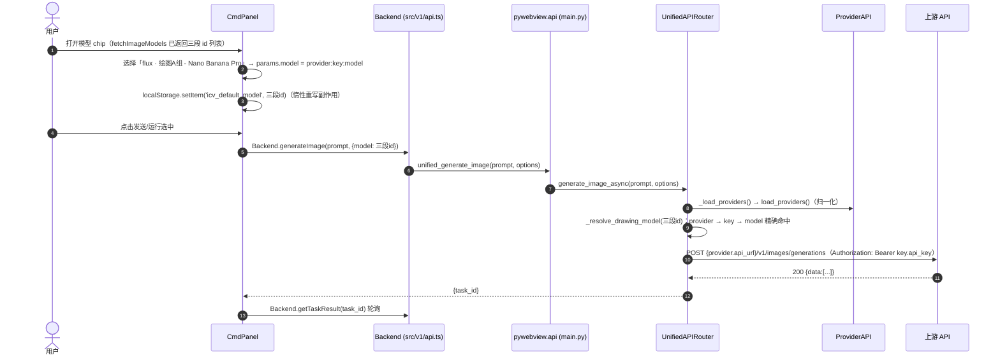
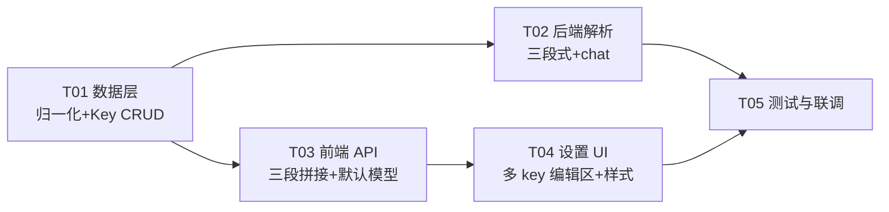

# 系统设计：供应商多 Key 支持（Multi-Key）

- **文档版本**：v1.0
- **对应 PRD**：`docs/multi-key-prd.md`
- **技术栈**：pywebview + TypeScript/Vite（沿用现有，无新增依赖）
- **设计原则**：贴合现有代码落点、两段式 id 向后兼容到位、任务按功能模块分组（硬上限 5 任务）

---

## Part A：系统设计

### 1. 实现方案 + 框架选型

#### 1.1 核心难点

| 难点 | 说明 | 对策 |
|------|------|------|
| 旧数据无损迁移 | `providers_data.json` 顶层 `api_key`/`models`、localStorage 两段默认模型、旧 `.icproj` 节点两段 model id 三处历史数据 | 读时归一化（内存始终新结构）+ 宽容解析 + 惰性重写，无需升级脚本 |
| 模型 id 从两段变三段 | 节点/默认模型/项目文件均存模型 id，前后端必须同构 | 前端三段拼接、后端三段解析，两段 id 走回退分支 |
| 设置 UI 单 key → 多 key | 现有编辑区是「一个 key 字段 + 一个模型列表」 | settings-panel.ts 编辑区重构为 key 卡片列表，每 key 独立模型管理 |
| 出图按 key 路由 | 一个供应商下多 key，节点选模型必须用所属 key 的 api_key 调上游 | `_resolve_drawing_model/_resolve_chat_model` 返回 `(provider, key, ModelEntry)`，调用点改用 `key.api_key` |

#### 1.2 框架选型

**无新增第三方依赖**，沿用现有分层：

```
UI 层      src/v1/ui/settings-panel.ts（多 key 编辑区）
API 薄层   src/v1/api.ts → src/utils/api.ts（pywebview 桥接声明）
桥接       main.py（pywebview expose 的新方法）
后端数据层  backend/api/provider_api.py（归一化 + Key CRUD）
后端解析层  backend/api/unified_api.py（三段解析 + 按 key 出图）
类型契约    src/v1/types/backend.d.ts（BackendProviderKey）
样式        src/v1/styles/app.css（key 卡片类）
```

架构模式维持现有「UI → API 封装 → pywebview 桥 → Python ProviderAPI/UnifiedAPIRouter」分层，不引入新框架、不改变事件模型。

#### 1.3 多 key 在现有架构上的落点

- **数据层唯一闸口**：`ProviderAPI.load_providers()` 是后端唯一读取 providers 的入口（`unified_api._load_providers` 与 `main.py` 都走它）。归一化放这里 = 全链路自动拿到新结构，`unified_api` 的 30s 缓存无需改动。
- **解析层两个函数**：`_resolve_drawing_model` / `_resolve_chat_model` 是绘图/对话两条链路的模型路由中心，改成三段解析并返回 key 实体即可覆盖全部出图/对话路径。
- **前端两个拼接函数**：`fetchImageModels` / `fetchChatModels` 是节点下拉与默认模型的数据源，改为三层遍历。
- **UI 一个编辑区**：settings-panel.ts 的 `_renderEditor` 从「单 key 字段 + 模型列表」重构为「provider 字段 + key 卡片列表」。

---

### 2. 文件清单

#### 2.1 新增文件

| 文件（相对路径） | 说明 |
|------------------|------|
| `docs/multi-key-system-design.md` | 本文档 |
| `docs/multi-key-class-diagram.mermaid` | 类图（独立提取） |
| `docs/multi-key-sequence-diagram.mermaid` | 时序图（独立提取） |
| `smoke/test_multikey.py` | 后端 pytest：归一化 + Key CRUD + 三段/两段解析 + 按 key 出图参数断言 |
| `smoke/qa-multikey.cjs` | 前端 smoke（DOM 桩 + pywebview 桩）：三段拼接 / 默认模型宽容解析 / 设置面板 key 交互 |

#### 2.2 修改文件

| 文件（相对路径） | 改什么 |
|------------------|--------|
| `backend/api/provider_api.py` | `load_providers()` 读时归一化（旧 `api_key`/`models` → `keys[0]`，补全 key 字段）；`save_providers()` 落盘剥离顶层 `api_key`/`models`；新增 `add_key` / `delete_key` / `update_key`；`add_provider()` 初始 `keys: [空 key1]`；`update_provider()` 兼容顶层 `api_key`/`models` 落到 `keys[0]`；`remove_model(provider_id, key_id, model_id)` 按 key 维度；`add_chat_model` 兼容 key_id 缺省 |
| `backend/api/unified_api.py` | `_resolve_drawing_model` / `_resolve_chat_model` 三段解析 + 两段回退 + 返回 `(provider, key, ModelEntry)`；`chat()` 与 `generate_image()` 两个调用点改读 `key['api_key']`（行 196-201、317-325） |
| `main.py` | expose 新方法 `add_key` / `delete_key` / `update_key`；`remove_model` 签名加 `key_id` |
| `src/utils/api.ts` | `pywebview.api` 声明新增 `add_key` / `delete_key` / `update_key`；`remove_model` 签名加 `key_id`；对应 `API` 封装方法 |
| `src/v1/api.ts` | `fetchImageModels` / `fetchChatModels` 三层遍历拼接三段 id + label 带 key 名；`resolveDefaultModel` / `resolveDefaultChatModel` 宽容解析 + 惰性重写；`Backend` 新增 `addKey` / `deleteKey` / `updateKey`，`removeModel` 签名加 keyId |
| `src/v1/types/backend.d.ts` | 新增 `BackendProviderKey`；`BackendProvider` 增加 `keys?`，旧 `api_key?`/`models?` 保留为可空（读时兼容） |
| `src/v1/ui/settings-panel.ts` | `_renderEditor` 重构为 provider 字段 + key 卡片列表（每 key：名称/密钥/启停/拉取模型/测试连接/模型管理/删除 + 添加 Key）；`_renderCard` 模型计数跨 key 汇总；`_renderDefaultModelSelect` 按 key 列出三段 id 并宽容回显当前值 |
| `src/v1/styles/app.css` | 新增 `.key-card`、`.key-card-head`、`.key-name-input`、`.key-section` 等样式（复用 `.settings-field`/`.model-section` 现有类） |
| `src/index.html` | **无必须改动**（设置面板内容全部由 settings-panel.ts 动态渲染）；可选：设置面板标题「设置 · 供应商」→「设置 · 供应商 / 多 Key」 |

> 说明：`gui/dist` 为构建产物（`npm run build` 生成），不直接手改；T05 验证构建通过即可。

---

### 3. 数据结构与接口签名

#### 3.1 新结构（内存/落盘统一）

```jsonc
{
  "id": "provider_xxx",
  "name": "FluxPort",
  "short_name": "flux",
  "type": "openai",
  "enabled": true,
  "api_url": "https://api.ai-media.vip",
  "use_proxy": true,
  "keys": [
    {
      "id": "key_1a2b3c4d",          // key_${uuid4().hex[:8]}
      "name": "key1",                 // 默认 key1/key2…，用户可改
      "api_key": "sk-...",
      "enabled": true,                // key 级启停，停用后模型不进节点下拉
      "models": [
        { "id": "gemini-3-pro-image-preview", "name": "Nano Banana Pro", "type": "drawing", "enabled": true }
      ]
    }
  ]
}
// 迁移后落盘【不保留】顶层 api_key / models（写时剥离，避免双写不一致）
```

#### 3.2 新旧兼容：load/save 归一化语义

- **读时归一化（`load_providers`）**：逐 provider——
  1. 若 `keys` 不存在或为空，且存在顶层 `api_key` 或 `models` → 生成 `keys[0] = { id: key_${uuid}, name: 供应商 short_name || '默认', api_key: 顶层 api_key||'', enabled: provider.enabled, models: 顶层 models||[] }`；
  2. 对每个 key 补全字段：缺 `id` 生成、缺 `name` 默认 `keyN`（provider 内序号去重）、缺 `api_key` 空串、缺 `enabled` True、缺 `models` 空数组；
  3. 内存中始终以新结构返回。
- **写时新结构（`save_providers`）**：`json.dump` 前剥离每个 provider 的顶层 `api_key`/`models`（旧文件一次保存即完成物理迁移）。
- **兼容写入口（`update_provider`）**：若 `updates` 含顶层 `api_key` 且不含 `keys` → 落到 `keys[0].api_key`；含 `models` 且不含 `keys` → 落到 `keys[0].models`；含 `keys` → 整组替换。兼容旧前端/旧脚本。

#### 3.3 模型 id 与 label 约定

- **完整 id**：`${providerId}:${keyId}:${modelId}`（三段式）。
- **label**：`${供应商短名} · ${key名} - ${模型名}`（跨 key 重名模型靠 key 名区分）。
- **两段 id**：`${providerId}:${modelId}` 仅读兼容（旧项目文件、旧 localStorage、旧 .icproj），解析时回退到该 provider 第一个可用 key 下的同名模型。

#### 3.4 类图

```mermaid
classDiagram
    class BackendProvider {
        +string id
        +string name
        +string type
        +string short_name
        +boolean enabled
        +string api_url
        +boolean use_proxy
        +BackendProviderKey[] keys
        +string api_key  「legacy 读兼容」
        +BackendModel[] models  「legacy 读兼容」
    }
    class BackendProviderKey {
        +string id
        +string name
        +string api_key
        +boolean enabled
        +BackendModel[] models
    }
    class BackendModel {
        +string id
        +string name
        +string type
        +boolean enabled
    }
    class ProviderAPI {
        +load_providers() dict
        +save_providers(providers_data) dict
        +add_provider(name, provider_type, short_name) dict
        +update_provider(provider_id, updates) dict
        +delete_provider(provider_id) dict
        +add_key(provider_id, key_name) dict
        +delete_key(provider_id, key_id) dict
        +update_key(provider_id, key_id, updates) dict
        +fetch_models(api_url, api_key) dict
        +test_api_connection(api_url, api_key) dict
        +add_chat_model(provider_id, key_id, model_id, model_name) dict
        +remove_model(provider_id, key_id, model_id) dict
    }
    class UnifiedAPIRouter {
        +_load_providers(force) list
        +_resolve_drawing_model(model_str) tuple
        +_resolve_chat_model(model_str) tuple
        +chat(messages, options) dict
        +chat_v2(user_input, options) dict
        +generate_image_async(prompt, options) dict
    }
    class FrontendAPI {
        +fetchImageModels() Array~{id,name}~
        +fetchChatModels() Array~{id,name}~
        +resolveDefaultModel() string
        +resolveDefaultChatModel() string
        +Backend.addKey(providerId, keyName) Promise
        +Backend.deleteKey(providerId, keyId) Promise
        +Backend.updateKey(providerId, keyId, updates) Promise
        +Backend.removeModel(providerId, keyId, modelId) Promise
    }
    class SettingsPanel {
        +providers: BackendProvider[]
        +_renderEditor(p) HTMLElement
        +_renderKeyCard(p, k) HTMLElement
        +_renderDefaultModelSelect() HTMLElement
    }
    BackendProvider "1" *-- "1..n" BackendProviderKey : keys
    BackendProviderKey "1" *-- "1..n" BackendModel : models
    ProviderAPI --> BackendProvider : 归一化/CRUD
    UnifiedAPIRouter --> ProviderAPI : _load_providers 读取
    UnifiedAPIRouter ..> BackendProviderKey : 解析出 key.api_key 出图
    FrontendAPI --> BackendProvider : 三层遍历拼三段 id
    SettingsPanel --> FrontendAPI : 调用
```

#### 3.5 关键接口签名（Python）

```python
# ── ProviderAPI（backend/api/provider_api.py）──
def load_providers(self) -> dict:
    """读文件 → 归一化（旧 api_key/models → keys[0]，补全 key 字段）→ {"providers": [...]}"""
def save_providers(self, providers_data) -> dict:
    """写盘前剥离顶层 api_key/models；返回 {status, message}"""
def add_provider(self, name, provider_type, short_name='') -> dict:
    """新结构：keys: [空 key1]；返回 {status, provider_id, provider}"""
def update_provider(self, provider_id, updates) -> dict:
    """兼容：updates.api_key/models（无 keys 时）→ keys[0]；updates.keys → 整组替换"""
def add_key(self, provider_id, key_name='') -> dict:
    """生成 key_${uuid4().hex[:8]}，name 默认 keyN；返回 {status, key_id, key, keys}"""
def delete_key(self, provider_id, key_id) -> dict:
    """删除 key（含其 models）；返回 {status, keys} / {status, error}"""
def update_key(self, provider_id, key_id, updates) -> dict:
    """updates: name/api_key/enabled/models；返回 {status, key, keys}"""
def fetch_models(self, api_url, api_key) -> dict:
    """不变：url+key 拉取 {status, models}（绘图按显示名去重 / 对话按 id 去重）"""
def test_api_connection(self, api_url, api_key) -> dict:
    """不变"""
def add_chat_model(self, provider_id, key_id=None, model_id=None, model_name=None) -> dict:
    """兼容旧签名：key_id 缺省 → keys[0]；手动添加 chat 模型归属指定 key"""
def remove_model(self, provider_id, key_id, model_id) -> dict:
    """按 key 维度删除模型；返回 {status, message}"""

# ── UnifiedAPIRouter（backend/api/unified_api.py）──
def _resolve_drawing_model(self, model_str=None) -> tuple:
    """三段解析；返回 (provider_dict, key_dict, ModelEntry|None)
       回退顺序：三段精确 → 两段回退(provider 第一个可用 key 下同名模型)
               → 全量第一个可用 drawing 模型 → (None, None, None)"""
def _resolve_chat_model(self, model_str=None) -> tuple:
    """同构；chat 模型"""
# 调用点（chat / generate_image）：
#   provider, key, model_entry = self._resolve_xxx_model(options.get('model'))
#   api_key = key['api_key']            # 不再读 provider['api_key']
#   api_url = provider['api_url']
```

#### 3.6 关键接口签名（TypeScript）

```ts
// ── src/utils/api.ts（pywebview.api 声明 + API 封装）──
add_key(provider_id: string, key_name?: string): Promise<{ status: string; key_id?: string; key?: BackendProviderKey; keys?: BackendProviderKey[] }>;
delete_key(provider_id: string, key_id: string): Promise<{ status: string; keys?: BackendProviderKey[] }>;
update_key(provider_id: string, key_id: string, updates: Record<string, unknown>): Promise<{ status: string; key?: BackendProviderKey; keys?: BackendProviderKey[] }>;
remove_model(provider_id: string, key_id: string, model_id: string): Promise<{ status: string; message?: string }>;

// ── src/v1/api.ts ──
export async function fetchImageModels(): Promise<Array<{ id: string; name: string }>>;
// 三层遍历：enabled provider → enabled key → enabled drawing model
// id = `${p.id}:${k.id}:${m.id}`，name = `${p.short_name||p.name} · ${k.name} - ${m.name}`
export async function fetchChatModels(): Promise<Array<{ id: string; name: string }>>;   // type==='chat' 同构
export async function resolveDefaultModel(): Promise<string>;
// 宽容解析 + 惰性重写：
//   saved 三段 → 校验命中则返回；saved 两段 → provider 匹配 + 在各 enabled key 中找同名模型，
//   命中则写回三段并返回；未命中 → 回退第一个可用模型并写回；空 → 同回退
export async function resolveDefaultChatModel(): Promise<string>;                          // 同构
export const Backend = {
  addKey(providerId: string, keyName = ''): Promise<...>,
  deleteKey(providerId: string, keyId: string): Promise<...>,
  updateKey(providerId: string, keyId: string, updates: Record<string, unknown>): Promise<...>,
  removeModel(providerId: string, keyId: string, modelId: string): Promise<...>,
  // fetchImageModels/fetchChatModels/resolveDefaultModel/resolveDefaultChatModel 同文件导出
};

// ── src/v1/types/backend.d.ts ──
interface BackendProviderKey {
  id: string;
  name: string;
  api_key: string;
  enabled: boolean;
  models: BackendModel[];
}
interface BackendProvider {
  id: string; name: string; type: string; short_name: string; enabled: boolean;
  api_url?: string; use_proxy?: boolean;
  keys?: BackendProviderKey[];     // 新结构（load_providers 归一化后必有）
  api_key?: string; models?: BackendModel[];  // legacy：读兼容，新代码不写
}
```

---

### 4. 程序调用流程（时序）

#### 4.1 设置面板：添加 key → 拉取模型 → 保存



#### 4.2 节点选模型 → 出图路由到所属 key



#### 4.3 旧两段 id 出图（向后兼容分支）

```
模型 id = provider:model（旧项目/旧 localStorage）
→ _resolve_drawing_model 三段拆分失败（仅 2 段）
→ 按 provider 定位 → 依次找该 provider enabled 的 key → 命中同名 model
→ 用该 key.api_key 出图；全部未命中 → 回退第一个可用模型
```

---

### 5. 待明确事项（实现前需用户/主理人拍板）

1. **add_provider 是否自动创建空 key1**：设计默认**是**（保持「添加供应商 → 直接填 key」旧 UX，且兼容旧 `update_provider({api_key})` 脚本）；若希望「先无 key、用户手动添加」，改动仅一行。
2. **key 编辑持久化时机**：设计默认**即时持久化**（增删/改名/启停/拉模型/模型操作每次调用 update_key/updateProvider({keys})，与现有 models 行为一致）；「保存」按钮只管 provider 级字段（简称/URL/代理）。
3. **两段 id 匹配范围**：PRD 写「第一个可用 key」，设计建议**放宽为该 provider 全部 enabled key 依次匹配**（避免旧模型恰在第二个 key 时失效），是否接受？
4. **key 名默认规则**：`key1/key2…` 按 provider 内序号（删除后复用最小空号），用户可改任意文本；重名 key 不强制去重（label 靠 key 名区分模型）。
5. **删除 key 时旧节点提示**：出图时若三段 id 的 key 不存在/停用，错误文案建议「模型所属 Key 已删除或停用，请重新选择模型」，是否 OK？

---

## Part B：任务分解

### 6. 依赖包

无新增。沿用现有：
```
- typescript@^6.0.3: 类型检查（devDep，已有）
- vite@^8.0.12: 构建（devDep，已有）
- sass@^1.99.0: 样式（devDep，已有）
- requests: 后端 HTTP（已有）
- pywebview: 桌面壳（已有）
- playwright / node 脚本: smoke 测试（已有 smoke/*.cjs 模式）
```

### 7. 任务列表（按依赖排序，共 5 个任务）

> 说明：主理人要求的 6 项（T01 数据层 / T02 后端解析 / T03 前端 API / T04 设置 UI / T05 样式结构 / T06 测试）按架构任务硬上限 **≤5** 合并为 5 个：**样式/结构并入 T04（UI 任务自带其 CSS 与 HTML 微调）**。如需拆回 6 项可再调整。

#### T01 数据层：归一化 + Key CRUD

| 项 | 内容 |
|----|------|
| 涉及文件 | `backend/api/provider_api.py`（核心）、`main.py`、`src/v1/types/backend.d.ts`、`smoke/test_multikey.py`（归一化/CRUD 用例） |
| 依赖 | 无 |
| 优先级 | P0 |
| 验收点 | ① 旧结构文件 load 后内存为 keys 结构；② save 后落盘无顶层 `api_key`/`models`；③ `add_key` 生成 `key_${uuid}` 且默认名 keyN；④ `delete_key`/`update_key` 生效；⑤ `remove_model(provider_id, key_id, model_id)` 只删指定 key 的模型；⑥ `update_provider({api_key})` 落到 keys[0]；⑦ 后端 pytest 全绿 |

#### T02 后端解析：三段式 + chat 链路

| 项 | 内容 |
|----|------|
| 涉及文件 | `backend/api/unified_api.py`、`smoke/test_multikey.py`（解析用例追加） |
| 依赖 | T01 |
| 优先级 | P0 |
| 验收点 | ① 三段 id 精确命中 key 并用其 api_key 出图/对话；② 两段 id 回退 provider 第一个可用 key 的同名模型；③ 未命中回退第一个可用模型；④ chat 与 drawing 同构；⑤ `chat()`/`generate_image()` 不再读 `provider['api_key']`；⑥ 停用 key 的模型不可达 |

#### T03 前端 API 层：三段拼接 + 默认模型

| 项 | 内容 |
|----|------|
| 涉及文件 | `src/utils/api.ts`、`src/v1/api.ts` |
| 依赖 | T01（类型契约） |
| 优先级 | P0 |
| 验收点 | ① `fetchImageModels`/`fetchChatModels` 三层遍历输出三段 id，label 含 key 名；② 停用 key/停用模型被过滤；③ `resolveDefaultModel`/`resolveDefaultChatModel` 对两段 id 宽容匹配并惰性重写为三段；④ `Backend.addKey/deleteKey/updateKey/removeModel` 封装与 pywebview 声明一致；⑤ `npm run typecheck` 通过 |

#### T04 设置 UI：多 key 编辑区 + 样式结构

| 项 | 内容 |
|----|------|
| 涉及文件 | `src/v1/ui/settings-panel.ts`（核心）、`src/v1/styles/app.css`、`src/index.html`（可选微调标题） |
| 依赖 | T01、T03 |
| 优先级 | P0 |
| 验收点 | ① 同一供应商可添加/删除多个 key；② 每 key 独立「名称/密钥/启停/拉取模型/测试连接/显示隐藏/模型管理（手动添加、启停、删除）」；③ 删除 key 弹确认 + 影响提示（该 key 模型失效、节点需重选）；④ 默认模型下拉按 key 列出三段 id，label 区分重名；⑤ 卡片视图模型计数跨 key 汇总；⑥ 旧两段默认模型在默认下拉中宽容回显；⑦ `.key-card` 等新样式完整，无样式回归 |

#### T05 测试与联调

| 项 | 内容 |
|----|------|
| 涉及文件 | `smoke/qa-multikey.cjs`（新增）、`smoke/test_multikey.py`（补齐）、`gui/dist`（构建产物验证） |
| 依赖 | T02、T04 |
| 优先级 | P0 |
| 验收点 | ① `npm run build`（tsc --noEmit + vite build）通过；② 前端 smoke 覆盖：三段拼接、默认模型宽容解析+惰性重写、设置面板 key 增删/拉模型交互（DOM 桩模式）；③ 后端 pytest 覆盖：归一化、CRUD、三段/两段解析、按 key 出图参数；④ 手工清单：旧 `providers_data.json` 升级、旧 localStorage 两段默认模型、旧 `.icproj` 节点两段 model 出图均正常 |

### 8. 共享知识（跨文件约定）

- **三段式 id**：`${providerId}:${keyId}:${modelId}`；两段 `${providerId}:${modelId}` 仅读兼容，任何写回一律三段。
- **label 格式**：`供应商短名 · key名 - 模型名`（重名模型靠 key 名区分）。
- **key id**：`key_${uuid4().hex[:8]}`，不可读、不展示（UI 展示 name）。
- **key 默认命名**：`key1/key2…`（provider 内最小空号），用户可改。
- **迁移语义**：读时归一化（load 即迁移，内存新结构）、写时新结构（save 剥离顶层冗余）、默认模型宽容解析 + 惰性重写（localStorage 逐步自愈）。
- **解析优先级**：三段精确 > 两段回退（provider 各 enabled key 依次匹配同名模型）> 第一个可用模型 > 报错「没有可用的…模型，请先在设置中配置」。
- **key 删除/停用影响**：其模型不进节点下拉；已引用节点出图报错「模型所属 Key 已删除或停用，请重新选择模型」。
- **API 响应约定**：沿用 `{status: success|error, message}` / `{success: bool, message}`，错误人话提示。
- **持久化通道**：settings UI 对 key 的所有变更走 `update_key` 或 `updateProvider({keys})`；`remove_model` 必须带 key 维度。

### 9. 任务依赖图


