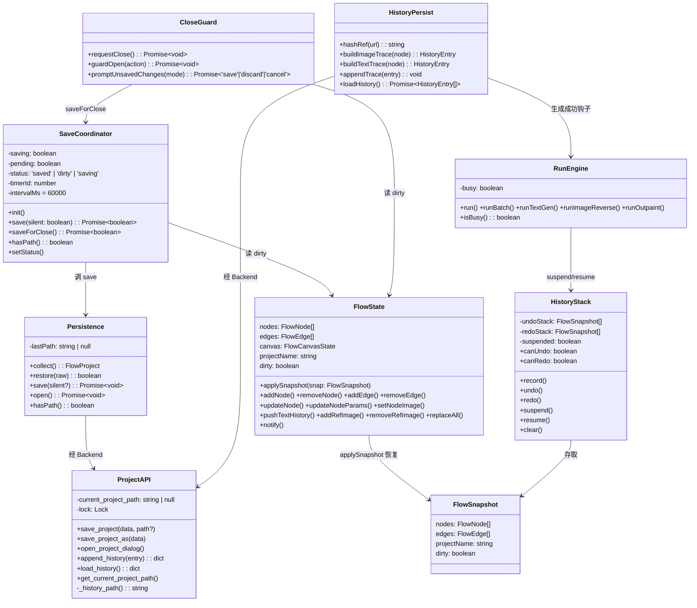
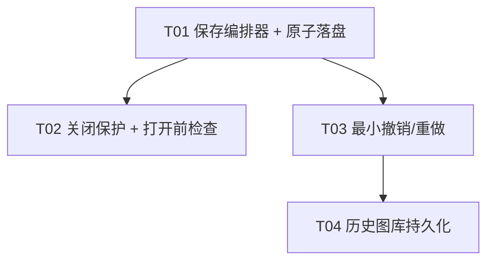

# 信任层 · 增量系统设计

> 版本：incremental-1（第 1 步：信任层）
> 日期：2026-08-16
> 依据：`docs/trust-layer-prd.md`（PM 增量 PRD）+ `docs/视觉实验台-产品方案v3.md`
> 撰写：高见远（架构师）
> 状态：供工程师据此实现，供 QA 据此测验收

---

## A. 系统设计

### 1. 实现方案（难点 + 现有代码如何扩展 + 架构模式）

#### 1.1 核心难点

| # | 难点 | 现状 | 关键动作 |
|---|------|------|---------|
| D1 | 落盘非原子 | `backend/api/project_api.py` 用 `open(path,'w')+json.dump` 直接覆盖，崩溃/磁盘满会写坏 | 后端加 `atomic_write_json`（`.tmp` + `os.replace`），三条保存路径全部改走它 |
| D2 | 保存并发互斥 | 无互斥；手动/自动/关闭三路可能同时写 | 前端 `SaveCoordinator` 单飞串行 + 后端 `threading.Lock` 兜底 |
| D3 | 关闭保护跨进程边界 | pywebview `closing` 事件在 Python 侧，确认弹窗在前端（异步 Promise） | `closing` 事件用 `evaluate_js` **同步**查 dirty → 阻止关闭 → `evaluate_js` 触发前端异步三选一弹窗 → 用户确认后调 `win_close()`（强制 `destroy`，不再触发 closing） |
| D4 | 撤销与 dirty/自动保存/运行中任务共存 | dirty 是单布尔值，无撤销 | 快照回滚模型：快照**携带 dirty 值**，回滚即恢复当时 dirty；引擎运行期间 `suspend` 不入栈 |
| D5 | history.jsonl 无落点 | 项目是**单文件** `.icproj`，不存在方案 v3 里的「项目目录/」 | 落点 = 与 `.icproj` 同目录的兄弟文件 `<项目名>.history.jsonl`（见 §5 假设） |

#### 1.2 架构模式（最小变更原则）

1. **原子写收敛到后端**：新增 `backend/api/utils.py:atomic_write_json(path, data)` 作为唯一落盘通道；`project_api.save_project` / `save_project_as` 全部改走它，删除任何 `open(...,'w')` 直写旁路（R1.3）。
2. **保存编排收敛到前端单例** `SaveCoordinator`：手动保存、自动保存、关闭前保存三条路径都调 `coordinator.save(...)`，由其内部做「单飞 + 串行排队 + 合并」，并驱动顶栏三态（`已保存 ✓ / 未保存 ● / 保存中…`）。
3. **撤销采用「快照回滚」而非「命令栈」**：新增 `HistoryStack`，在**用户手势入口**前 `record()` 一次全量快照（nodes/edges/projectName/dirty，**不含** canvas 视口）；引擎运行期 `suspend()` 隔离。理由详见 §5 Q2。
4. **关闭保护与打开前检查共用一套三选一弹窗**：新增 `CloseGuard`，`requestClose()`（关闭）与 `guardOpen(action)`（打开/新建/切换）复用同一 `promptUnsavedChanges(mode)`。
5. **history.jsonl 后端 append、前端算 trace**：`RunEngine` 生成成功时构造 `GenerationTrace`（写入 `node.trace` 作 source of truth）→ `Backend.appendHistory(entry)` → 后端单行 append 到 `.history.jsonl`。打开项目时 `Backend.loadHistory()` 读取展示。

---

### 2. 文件列表（相对路径，标注 新建/修改）

**前端 — 新建（4）**

| 文件 | 职责 |
|------|------|
| `src/v1/save-coordinator.ts` | 保存编排器：单飞互斥、串行队列、顶栏三态、60s 定时器 + 失焦触发、`hasPath()`、`saveForClose()` |
| `src/v1/close-guard.ts` | 关闭保护 + 打开前 dirty 检查 + 三选一弹窗（`requestClose` / `guardOpen` / `promptUnsavedChanges`） |
| `src/v1/state/history.ts` | 撤销/重做快照栈（`HistoryStack` + `FlowSnapshot`）：`record/undo/redo/suspend/resume/clear` |
| `src/v1/history-persist.ts` | history.jsonl 客户端：`buildImageTrace` / `buildTextTrace` / `hashRef` / `appendTrace` / `loadHistory` |

**前端 — 修改（12）**

| 文件 | 改动 |
|------|------|
| `src/v1/persistence.ts` | `save()` 走 `SaveCoordinator` + 原子路径；暴露 `hasPath()`；`open()` 入口包 `guardOpen`；去掉直写 toast 的静默开关 |
| `src/v1/state/flow-state.ts` | 新增 `applySnapshot(snap)`（恢复 nodes/edges/projectName/dirty，清空选中，notify）；可选 `hasRunningNodes()` |
| `src/v1/engine/run-engine.ts` | 公开 `isBusy()`；`run()` 全程 `history.suspend()/resume()`；生成成功处构造 trace → 写 `node.trace` + `appendTrace` |
| `src/v1/main.ts` | `win-close` 按钮改走 `closeGuard.requestClose()`；加 `Ctrl+Z / Ctrl+Shift+Z / Ctrl+Y`；`init()` 里启动 `SaveCoordinator`/`CloseGuard`/`HistoryStack` |
| `src/v1/ui/confirm.ts` | 复用弹窗 DOM 样式，新增三选一 `threeWayDialog`（保存/放弃/取消，返回 'save'\|'discard'\|'cancel'） |
| `src/v1/ui/bottom-bar.ts` | 「打开」按钮改走 `guardOpen`；保存状态三态同步 |
| `src/v1/ui/history-drawer.ts` | 打开项目时载入 `history.jsonl` 展示（空库显示引导文案）；保留本会话生成图 |
| `src/v1/canvas/interactions.ts` | 增/删节点、连线、插步骤、拖图加参考图、节点拖动结束等用户手势入口加 `history.record()` |
| `src/v1/canvas/card-view.ts` | 标题就地编辑、输出文本就地改等入口加 `history.record()` |
| `src/v1/ui/cmd-panel.ts` | 参数修改（prompt/模型/比例/分辨率/张数）入口加 `history.record()` |
| `src/v1/types/flow.d.ts` | 新增 `FlowSnapshot`、`HistoryEntry`（kind 判别 image/text）、`GenerationTrace` 保留 |
| `src/v1/types/backend.d.ts` | 新增 `append_history` / `load_history` 返回类型 `BackendHistoryResult` |
| `src/index.html` | 顶栏加保存状态文本 `#save-status`、撤销/重做按钮 `#btn-undo` `#btn-redo` |
| `src/v1/styles/app.css` | 三态样式、撤销/重做按钮灰显态、三选一弹窗样式 |

**后端 — 修改（3）**

| 文件 | 改动 |
|------|------|
| `backend/api/utils.py` | 新增 `atomic_write_json(path, data)`（`.tmp` + flush + `os.replace` + 失败清理）与 `append_json_line(path, obj)` |
| `backend/api/project_api.py` | `save_project`/`save_project_as` 改走 `atomic_write_json`；加 `threading.Lock`；新增 `append_history`/`load_history`/`_history_path()`/`.tmp` 启动清理 |
| `main.py` | 注册 `window.events.closing` 拦截；暴露 `append_history`/`load_history` js_api；`win_close` 加 `_closing_forced` 强制标志 |

---

### 3. 数据结构与接口

**接口契约要点**

- `atomic_write_json(path, data)`：`tmp = path + '.tmp'` → `open(tmp,'w')` 写 + `flush()` + `os.fsync()` → `os.replace(tmp, path)`；异常时 `os.unlink(tmp)`（若存在）后抛回。返回值 `None`，异常向上抛。
- `append_json_line(path, obj)`：`open(path,'a')` → `json.dumps(obj, ensure_ascii=False) + '\n'` → `flush()`。单行 append，多行互不破坏（R6.3）。
- `history.jsonl` 行格式（`HistoryEntry` 判别）：
  - 图片：`{ kind:'image', nodeId, prompt, model, aspectRatio, resolution, count, refImageHashes, seed, createdAt, parentId, outputType }`（即 `GenerationTrace` + `nodeId`）
  - 文本：`{ kind:'text', nodeId, instruction, model, outputText, createdAt, parentId }`
- `append_history` 返回：`{status:'success'}` 或 `{status:'error', message}`（无路径时 `message='no_path'`）。
- `load_history` 返回：`{status:'success', entries:[...]}`；文件不存在 → `{status:'empty'}`；逐行容错（坏行跳过）。
- `BackendProjectResult` 不变；保存成功后目录内**无残留 `.tmp`**（AC-A2）。

---

### 4. 程序调用流程

> 关键序列图独立落盘于 `docs/trust-layer-sequence-diagram.mermaid`。本章给出文字版调用序列。

**4.1 原子保存**：`SaveCoordinator.save()` → `persistence.collect()` → `Backend.saveProject(data)` → `ProjectAPI.save_project` → `atomic_write_json(.icproj)` → 成功则 `dirty=false` + `status='saved'`。

**4.2 自动保存触发**：60s 定时器 / `window blur` → 仅 `dirty===true` 且 `hasPath()` 才 `save(silent=true)`；无路径静默跳过保持 dirty。

**4.3 关闭保护拦截**：OS 点 X → pywebview `closing` → `evaluate_js('__icvIsDirty()')` 同步取 dirty → dirty 则 `return False`（阻止）并 `evaluate_js('__icvRequestClose()')` → 前端三选一弹窗 → 「保存并关闭」则 `saveForClose()` 成功后 `win_close()`（强制 destroy）；「不保存」直接 `win_close()`；「取消」不关。

**4.4 撤销/重做**：用户手势入口 `history.record()`（快照入 undo 栈，清 redo 栈，超 50 丢最旧）→ 变更 → `Ctrl+Z` 调 `history.undo()` → `applySnapshot`（恢复 nodes/edges/projectName/dirty）→ 顶栏状态按 dirty 复位。`redo()` 对称。

**4.5 history 持久化**：生成成功 → `history-persist.buildImageTrace(node)` → `node.trace = trace`（source of truth）→ `Backend.appendHistory(entry)` → 后端 `append_json_line(<project>.history.jsonl)`。打开项目 → `load_history()` → `history-drawer` 展示。

---

### 5. 未明确事项与假设（8 条 Open Questions 拍板）

**Q1 撤销/重做精确边界与深度上限**
> 边界 = PRD R5.1 三类（节点增删、连线增删、节点属性/参数修改）+ 标题/项目名文本修改（属「属性修改」）。**节点位置拖动、视口平移/缩放不单独入撤销栈**：拖动位置随下一次可撤销动作的快照自然「折入」；视口（canvas.panX/panY/scale）**不进快照**，避免撤销导致视口跳变。深度上限 = **50**（常量 `HISTORY_LIMIT=50`，超出 shift 丢最旧）。

**Q2 撤销实现模型（枢纽决策）＝ 快照回滚（snapshots），非命令栈**
> 理由：① 最小变更——无需为十几个变更点各写 do/undo 命令对，只在用户手势入口 `record()` 一次；② dirty 精确复位**天然成立**：`FlowSnapshot` 携带捕获时刻的 `dirty` 值，`applySnapshot` 原样恢复，撤销回到与磁盘一致时 `dirty` 自动变 `false`（AC-A13/R5.3 直接满足，无需额外脏栈联动）；③ 与自动保存共存：保存只改当前 `dirty=false`，不动栈内快照的历史 dirty 值，撤销仍能正确穿越「保存点」；④ 内存安全：V8 字符串不可变且深拷贝时共享同一底层字节，base64 图不会因 50 层快照成倍膨胀；⑤ 引擎隔离：`RunEngine` 运行期 `suspend()`，运行中状态/产出节点不入栈（R5.5）。**与 `snapshots/` 目录的关系**：本内存栈与磁盘 `snapshots/` 完全无关（见 Q8）。

**Q3 自动保存与原子路径 / 并发互斥**
> **是**，自动保存复用同一后端 `atomic_write_json`（无旁路）。互斥双保险：前端 `SaveCoordinator` 单飞锁（同一时刻仅一个在途保存；在途期间新请求标记 `pending`，完成后串行补一次「最新状态」保存，等价合并）；后端 `ProjectAPI` 加 `threading.Lock`（pywebview js_api 本就在 GUI 线程串行，锁是防御性兜底）。满足 R2.4。

**Q4 history.jsonl 写入方 + source of truth**
> **后端写文件，前端算 trace**。理由：① 文件 I/O 与原子语义统一归后端（与项目文件一致）；② 后端持有 `current_project_path`，能可靠推导 `.history.jsonl` 落点，前端不知道项目目录；③ 单行 append 由后端 `append_json_line` 保证多行不互相破坏。
> **source of truth = 节点 `trace` 字段**（随 `.icproj` 持久化、可复现）；`history.jsonl` 是 **append-only 流水账**（跨会话图库展示用）。二者**单向**：前端构造 trace → 写 `node.trace` → 调 `Backend.appendHistory` 追加；**不双向同步**、不回溯改写。text-gen 节点 `trace` 恒为 `null`（类型定义如此），其历史由节点 `textHistory` 承担，同时仍向 `history.jsonl` 追加一条 `kind:'text'` 流水。

**Q5 新项目无路径的落盘策略**
> 自动保存触发但无路径 → **静默跳过、保持 dirty、不弹窗**（自动保存必须静默；用户首次 Ctrl+S 会自然走另存为）。关闭保护「保存并关闭」无路径 → **强制弹另存为对话框**（复用 `need_save_as` 路径），成功后关闭。history.jsonl 无路径 → **跳过并 toast「历史记录未写入」**（无稳定落点；与未保存项目的图片一同，首次保存后才真正落盘）。

**Q6 运行中（生成中）的相互作用**
> 撤销/重做在 `runEngine.isBusy()===true` 期间**禁用**（按钮灰显 + 快捷键忽略），避免撤销到引擎正在写回/引用的状态。自动保存在运行中**允许**（序列化当前状态，崩溃最多丢 60s；`status='run'` 原样落盘为既有行为，重开显示 running 的小瑕疵留待后续，本步不改语义）。关闭运行中 → 弹窗追加警示「有任务在运行，关闭会中断」，保存并关闭 / 不保存 均中断后关闭，取消保留（R3.4 P1）。

**Q7 `.tmp` 命名与崩溃遗留清理**
> 命名 = `<目标绝对路径>.tmp`（确定性）。写入：`open(tmp,'w')` 截断 → `flush()+fsync` → `os.replace(tmp,target)`；异常 `finally` 删 tmp。崩溃遗留：下次保存同一目标时 `open('w')` 自动覆盖（**自愈**）；启动时 `ProjectAPI` 对「当前项目目录 + 系统临时目录」做一次最佳努力清扫（仅删 `*.tmp` 后缀孤儿，绝不误删 `.icproj`，R1.4 P1）。

**Q8 `snapshots/` 是否属本步范围**
> **本步不做磁盘快照目录**。撤销/重做是内存快照栈；R1.5「历史版本备份（`*.bak`/`snapshots/`）」属 P2，留给后续「时间机器」步骤。本步仅靠原子写保证「项目文件永不半写损坏」，已足够支撑验收 #2「崩溃最多丢一分钟」。

**其余假设**
- 项目当前为**单文件** `.icproj` 格式，无方案 v3 的「项目目录/」，故 `history.jsonl` 采用兄弟文件 `<项目名>.history.jsonl`；未来迁移到「项目目录」布局时再调整落点。
- 「打开/新建/切换」目前仅「打开」有入口；`guardOpen` 封装为通用守卫，未来新建/切换直接复用（R4.2）。
- 自动保存间隔 60s 硬编码常量（R2.6 可配置属 P2，暂不做设置项）。
- `seed` 本步恒 `null`：后端 `pollTask` 当前不返回 seed，待官方/中转站支持时后端透传、前端写回（方案 v3 §4.4 已预留字段）。

---

## B. 任务分解

### 6. 依赖包列表

**无新增依赖。** 前端仅用原生 TS/DOM；后端仅用标准库（`os`/`json`/`tempfile`/`threading`/`tkinter`）。无需改 `package.json` / `requirements`。

### 7. 任务列表（增量版）

| Task | 任务名 | 涉及源文件 | 依赖 | 优先级 |
|------|--------|-----------|------|--------|
| T01 | 保存编排器 + 原子落盘（基础） | 新建 `src/v1/save-coordinator.ts`；修改 `src/v1/persistence.ts`、`backend/api/utils.py`、`backend/api/project_api.py`、`src/v1/types/backend.d.ts`、`src/index.html`、`src/v1/styles/app.css`、`src/v1/ui/bottom-bar.ts` | — | P0 |
| T02 | 关闭保护 + 打开前 dirty 检查 | 新建 `src/v1/close-guard.ts`；修改 `main.py`、`src/v1/main.ts`、`src/v1/ui/confirm.ts`、`src/v1/ui/bottom-bar.ts` | T01 | P0 |
| T03 | 最小撤销/重做（快照栈） | 新建 `src/v1/state/history.ts`；修改 `src/v1/state/flow-state.ts`、`src/v1/engine/run-engine.ts`、`src/v1/canvas/interactions.ts`、`src/v1/canvas/card-view.ts`、`src/v1/ui/cmd-panel.ts`、`src/v1/main.ts`、`src/index.html`、`src/v1/styles/app.css`、`src/v1/types/flow.d.ts` | T01 | P0 |
| T04 | 历史图库持久化（history.jsonl） | 新建 `src/v1/history-persist.ts`；修改 `backend/api/project_api.py`、`main.py`、`src/v1/engine/run-engine.ts`、`src/v1/ui/history-drawer.ts`、`src/v1/types/flow.d.ts`、`src/v1/types/backend.d.ts` | T01、T03 | P0 |

> 每任务 ≥3 文件；按功能模块分组；无「项目基础设施」任务（增量开发）；T01 为跨切面共享基础（统一保存编排器 + 原子落盘），其余依赖它。T03/T04 均改 `run-engine.ts`，故 T04 依赖 T03 以串行化同一文件的编辑。

### 8. 共享知识（跨切面约定）

1. **原子写路径规则**：任何落盘项目文件必须 `atomic_write_json`（`.tmp`+`fsync`+`os.replace`），禁止 `open(path,'w')` 直写（R1.3）。`.tmp` 名 = `目标路径 + '.tmp'`。
2. **dirty 复位时机**：`dirty=false` 仅发生在 ① 保存成功、② `replaceAll`（打开/新建）。快照回滚通过恢复快照内 dirty 值达成，不改此约定。
3. **保存三路唯一入口**：手动（Ctrl+S/按钮）、自动（60s/blur）、关闭前——一律走 `SaveCoordinator`，禁止绕过直接调 `Backend.saveProject`。
4. **history 记录纪律**：用户手势（增删节点/连线、改参数/标题/项目名、拖动）入口处 `history.record()`；引擎内部变更用 `history.suspend()/resume()` 包裹，不入栈。
5. **trace 字段规范**：`GenerationTrace` 字段名与 §4.4 严格一致（`prompt/model/aspectRatio/resolution/count/refImageHashes/seed/createdAt/parentId/outputType`）；`refImageHashes` 用 `hashRef()`（djb2 轻量哈希，非密码学）；`node.trace` 是 source of truth。
6. **运行中检测**：统一用 `runEngine.isBusy()`；撤销/重做 busy 时禁用，关闭弹窗 busy 时附加中断警示。
7. **错误提示**：沿用 `showToast`；自动保存静默（不弹 toast），历史写失败 toast「历史记录未写入」。
8. **测试惯例**：QA 沿用 `smoke/test-textgen.cjs` 的 Node+CommonJS DOM 桩风格（新增 `smoke/test-trust-layer.cjs`），后端沿用 `test_api.py` 风格（新增原子写单测）。

### 9. 任务依赖图

