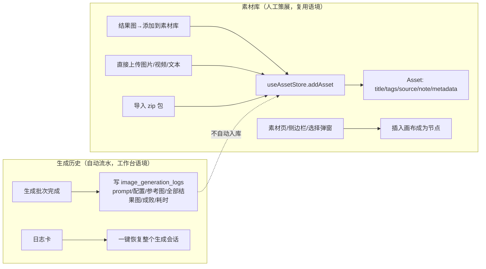
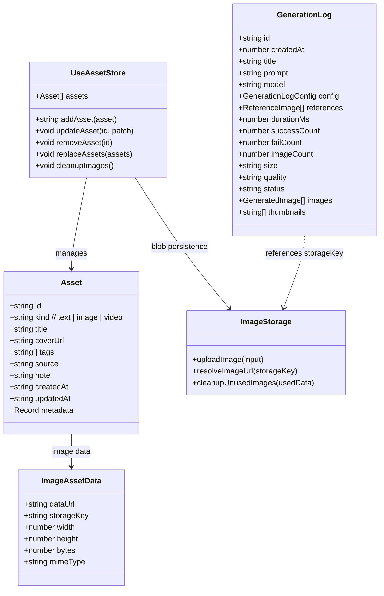
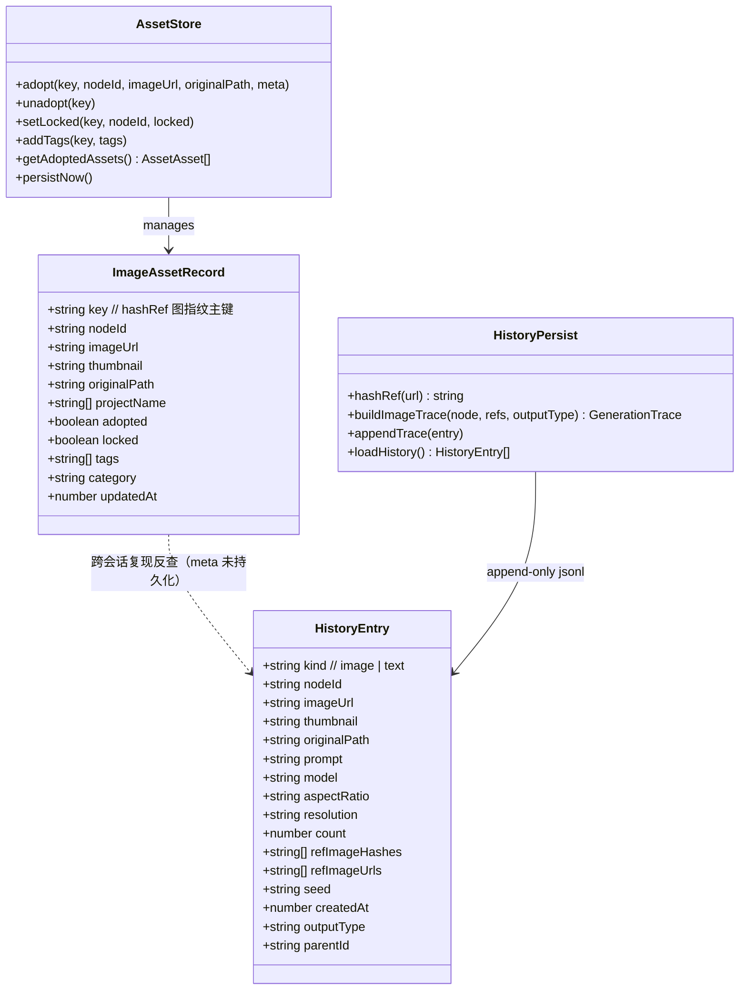
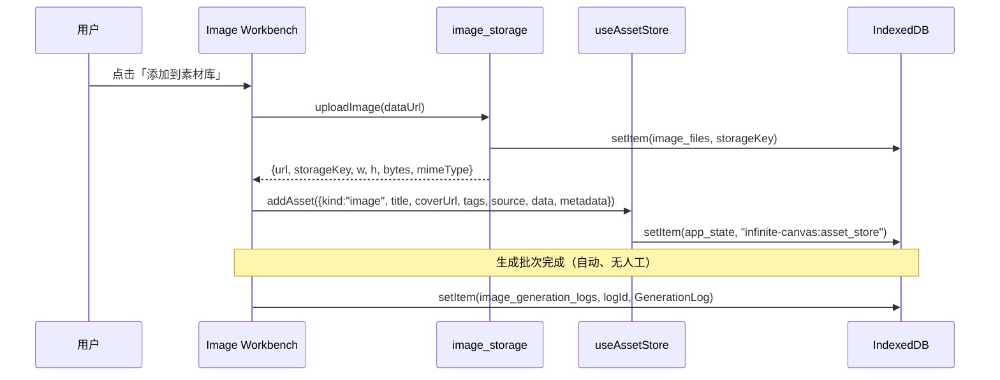
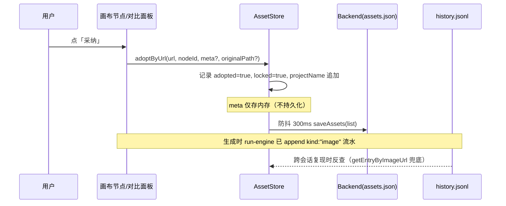

# 参考项目「图库 / 资产库 / 历史图库」对比分析

> 调研人：软件架构师 高见远
> 日期：2026-08-18
> 目的：为「图操分家」节点模型改造 + 资产层设计提供决策依据
> 参考项目：https://github.com/basketikun/infinite-canvas （MIT，纯前端，Vite 7 + React Router 7 + Zustand + localforage/IndexedDB，主应用 `web/`）
> 本地项目：Infinite Canvas 2.0（pywebview + TypeScript/Vite，`src/v1/`）

---

## 〇、调研范围与事实来源（可追溯性声明）

**已读参考项目代码（raw.githubusercontent.com/basketikun/infinite-canvas/main/）：**

| 文件 | 覆盖内容 |
|---|---|
| `web/src/stores/use-asset-store.ts` | 素材库数据模型 + zustand persist + IndexedDB 存储 key |
| `web/src/services/image-storage.ts` / `file-storage.ts` | 图片/媒体 Blob 存储、生成日志 store 名、GC |
| `web/src/lib/localforage-storage.ts` | IndexedDB 数据库 `infinite-canvas`、store `app_state` |
| `web/src/pages/assets/index.tsx` + `asset-transfer.ts` | 素材库管理页 UI（搜索/筛选/分页/增删改/导出导入） |
| `web/src/components/canvas/asset-picker-modal.tsx` | 画布内素材选择弹窗（点击插入） |
| `web/src/components/canvas/canvas-side-panel.tsx` | 画布侧边栏（Canvas/Assets/Prompts 三 tab） |
| `web/src/pages/image/index.tsx` | 图片工作台 + 生成日志 LogPanel（历史入口） |
| `web/src/services/app-sync.ts` | WebDAV 同步 4 个域（canvas/assets/image-workbench/video-workbench） |
| `web/src/router.tsx` | 路由结构（/ /image /video /assets /prompts /canvas /config） |
| `web/src/types/media.ts`、`web/src/pages/home/index.tsx` | 媒体类型、首页结构 |

**已读本地代码：** `src/v1/types/flow.d.ts`、`asset-store.ts`、`history-persist.ts`、`persistence.ts`、`engine/run-engine.ts`、`engine/poller.ts`、`state/flow-state.ts`（核心段）、`ui/asset-drawer.ts`、`ui/history-drawer.ts`、`ui/left-capsule.ts`、`docs/工作流现状分析-2026-08-18.md`、`docs/工作流改造方案-审查意见-2026-08-18.md`。

**未确认项（读不到/未细读，已如实标注）：**
- 参考项目 `web/src/pages/video/index.tsx`、`web/src/pages/canvas/project.tsx`（167KB）、`web/src/pages/config/index.tsx` 未逐行细读；视频工作台结构按代码清单与 `video_generation_logs` 推断，与图片工作台对称（**未确认细节**）。
- 参考项目画布节点内部「生成结果 → 是否可一键存素材」的具体入口未在 project.tsx 中确认（素材入库路径已由工作台「添加到素材库」按钮与素材页上传确认）。
- 参考项目无「收藏/采纳/锁定」概念，此结论基于 `use-asset-store.ts` 全量字段核对（**已确认**）。
- 本地项目 `src/v1/api.ts`、后端实现未读（不影响本报告结论；持久化位置以代码注释 + 现状分析文档为准）。

---

## 一、参考项目「素材库 / 生成历史」完整设计拆解

### 1.1 总体架构与功能入口

参考项目是**多页面应用**，不是单一画布页：

```
/            首页（引导 + 提示词展示）
/image       图片生成工作台（含生成历史 LogPanel 侧栏）
/video       视频工作台（对称结构，video_generation_logs）
/assets      素材库管理页（独立整页）
/prompts     提示词库页
/canvas      画布项目列表 + 画布编辑器（/canvas/:id）
/config      配置页
```

关键设计判断：**「生成历史」挂在工作台页面（/image、/video），「素材库」是独立页面 + 画布侧边栏 + 选择弹窗**——历史是"某个工具的工作痕迹"，素材是"跨工具可复用的资产"。这就是用户观察到的「资产库和历史图库是分开的」的实质：两者不仅存储分离，**入口、语境、用途都分离**。

### 1.2 数据模型

#### 1.2.1 素材（Asset）——用户策展的通用资产

`use-asset-store.ts` 定义（已逐字段核对）：

```ts
type AssetKind = "text" | "image" | "video";
type AssetBase<T> = {
  id: string;            // nanoid
  kind: T;
  title: string;         // 必填标题（人工命名）
  coverUrl: string;      // 封面（卡片主视觉）
  tags: string[];        // 标签
  source?: string;       // 来源（如 t("imageWorkbench.source")）
  note?: string;         // 备注
  createdAt: string;     // ISO
  updatedAt: string;
  metadata?: Record<string, unknown>;  // 自由元数据（如 { source: "image-page", prompt }）
};
type ImageAsset = AssetBase<"image"> & { data: { dataUrl; storageKey?; width; height; bytes; mimeType } };
type TextAsset  = AssetBase<"text">  & { data: { content } };
type VideoAsset = AssetBase<"video"> & { data: { url; storageKey?; width; height; bytes; mimeType } };
```

要点：
- **字段面向「可复用资产」设计**：title / tags / source / note / metadata 齐全，强调**人工命名与归类**。
- 一张图存两次引用：`coverUrl`（卡片缩略）+ `data.dataUrl`（正文），并冗余 `width/height/bytes/mimeType` 元信息。
- **无「采纳/锁定/收藏」布尔**——素材库里只有「有没有」；删除即移除。评估动作 = 显式添加（入库）/ 不添加（留在日志）。
- 素材入库方式：① 工作台结果图「添加到素材库」；② 素材页/侧边栏直接上传（`accept="image/*,video/*"`）；③ 导入 zip 包。**不依赖生成动作，任何图都能进库**。

#### 1.2.2 生成日志（GenerationLog）——批量粒度的运行痕迹

图片工作台 `pages/image/index.tsx` 定义（已确认）：

```ts
type GenerationLog = {
  id: string;            // nanoid，作为 IndexedDB key
  createdAt: number;
  title: string;         // prompt 前 12 字符
  prompt: string;
  time: string;          // 本地化时间字符串
  model: string;
  config: GenerationLogConfig;   // Pick<AiConfig, model|imageModel|quality|size|count>
  references: ReferenceImage[];
  durationMs: number;
  successCount: number;
  failCount: number;
  imageCount: number;
  size: string;
  quality: string;
  status: "success" | "failed";
  images: GeneratedImage[];      // 全部结果图（含 dataUrl 或 storageKey）
  thumbnails: string[];          // 缩略图 URL 数组
};
```

要点：
- **粒度 = 一次生成批次（session）**，不是单张图。一条日志 = prompt + 配置 + 参考图 + 全部结果图 + 成败计数 + 耗时。
- 点日志卡可**整体恢复会话**（`previewGenerationLog`：恢复 prompt/参考图/模型/质量/尺寸/数量/结果图列表）——"回看历史"同时是"回到当时的生成环境"。
- 日志里存了 `images[]`（Blob 的 storageKey，`serializeLog` 会清 dataUrl 防 IndexedDB 膨胀），删除日志时 `deleteStoredImages` 连带清理图片 Blob。

#### 1.2.3 存储方案（IndexedDB）

| 域 | 存储 | key |
|---|---|---|
| 素材元数据 | `localforage.createInstance({name:"infinite-canvas", storeName:"app_state"})` | `infinite-canvas:asset_store`（JSON 字符串） |
| 图片 Blob | `image_files` store | `image:<nanoid>` |
| 媒体 Blob（视频/音频） | `media_files` store | `file:<nanoid>` 等 |
| 图片生成日志 | `image_generation_logs` store | 日志 `id` |
| 视频生成日志 | `video_generation_logs` store | 日志 `id` |
| 画布项目 | zustand `useCanvasStore`（persist 同上） | — |

- 所有数据浏览器本地化；GC 机制：`cleanupUnusedImages` 遍历 assets + projects + 两个日志 store 中所有 `storageKey`，删除未被引用的 Blob。
- 可选 WebDAV 云同步：`app-sync.ts` 同步 4 个域（canvas / assets / image-workbench / video-workbench），素材、日志、项目一整套可备份/迁移。

### 1.3 UI 与交互

#### 1.3.1 素材库——三处入口，三种语境

| 入口 | 形态 | 交互 |
|---|---|---|
| `/assets` 整页 | 标题 + 搜索栏 + kind 筛选（all/text/image/video）+ 导出/导入/添加 + 卡片网格 + 分页（10/20/50/100） | 卡片 hover：查看/编辑/复制(text)/下载(image/video)/删除；编辑弹窗可改 title/coverUrl/tags/source/note/content；详情抽屉；导出/导入 zip |
| 画布侧边栏 Assets tab | 按 kind 分组（image/video/text 三组，可折叠），每组网格 2 列方卡 | 搜索（title+tags）+ 标签筛选；hover「+」插入画布、「🗑」删除；右上「+」批量上传（多选文件） |
| 画布 AssetPickerModal | 860px 弹窗，4 列卡片 | 搜索 + kind 筛选 + 分页（8/页）；点卡「插入」→ `onInsert(payload)` 在画布创建对应节点 |

- **插入方式以「点击」为主**，统一走 `InsertAssetPayload`（image: {dataUrl, storageKey, title} / text: {content, title} / video: {url, storageKey, ...}）。
- 画布侧边栏另有两 tab：Canvas（当前画布节点列表，可搜索/筛选/聚焦/预览）、Prompts（提示词库，点击插入文本节点）——**素材、节点、提示词三个可复用源并排组织**。

#### 1.3.2 生成历史——只出现在工作台

- 图片工作台桌面端左侧固定 `LogPanel`（移动端底部 Drawer），按钮 `t("workbench.logs")`。
- 每条日志卡：标题（prompt 前 12 字）、最多 4 张缩略图、成功/失败数、耗时、时间戳。
- 操作：点卡恢复会话、全选/删除（连带删图）、新建会话、失败卡重试单张。
- **历史不出现在画布编辑器里**——画布侧边栏三个 tab 都没有历史。历史是"工作台的工具记忆"，素材是"跨画布复用的资源"。

### 1.4 与画布/节点的关系

```
生成工作台（/image）                画布编辑器（/canvas/:id）
  生成批次 ──日志──▶ image_generation_logs       画布项目（useCanvasStore.projects）
  结果图 ──「添加到素材库」──▶ useAssetStore        │
  结果图 ──「添加为参考图」──▶ 直接加入参考图        ▼
                                                    节点（image/text/video）
  素材库 ──「插入」──▶ 新建节点（image/text/video） ◀── 侧边栏 Assets tab / AssetPickerModal
  提示词库 ──「插入」──▶ 新建文本节点 ◀────────────── 侧边栏 Prompts tab
```

- **素材 → 画布**：素材作为节点被插入，可继续参与连线/生成（图片作参考图、文本作提示词原料）。
- **生成 → 素材**：工作台结果图显式「添加到素材库」（带 `source: "image-page"` + prompt 进 metadata）；画布内的生成结果与素材库无自动通道（未在 project.tsx 确认，标注未确认）。
- 素材与画布项目均参与 GC 引用计算，保证删素材/删项目后 Blob 可回收。

### 1.5 「资产与历史分离」的具体机制（参考项目）



分离机制 = **双写路径 + 无自动转化**：
1. 写路径不同：日志**自动**（每次生成 append）；素材**手动**（显式点「添加到素材库」或上传）。
2. 内容结构不同：日志 = 批次/会话级（一次生成的所有图 + 全参数）；素材 = 单条目级（人工命名归类的单张图/文本/视频）。
3. 生命周期不同：日志可整体删除（连带删图），删除不影响素材；素材删除只影响自己。
4. 语境不同：日志入口在工作台（"我做过什么"），素材入口在独立页面/画布侧边栏（"我要用什么"）。
5. 唯一的弱关联：素材 `metadata.source` + `metadata.prompt` 记录了来源，但**没有**日志 ID 外键——素材不依赖日志存活。

### 1.6 评估动作

参考项目**没有**「采纳/收藏/锁定」类三态评估。素材库语义 = 二元（在库/不在库）：
- 「添加到素材库」= 认可 + 留存（等效于我们的采纳）；
- 「删除」= 否定 + 移除；
- 无「锁定保护」概念——参考项目没有重跑顶掉机制，不需要锁。
- 也就是说：参考项目把"评估"完全收口为「手动入库」这一个动作，不产生 adopted/locked 这类状态字段。

---

## 二、本地项目现状对照表（同维度）

| 维度 | 参考项目 | 本地项目（ICV 2.0 v1） |
|---|---|---|
| **历史数据模型** | GenerationLog：**批次级**（prompt/config/参考图/全部结果图/成败/耗时），存 IndexedDB `image_generation_logs` | HistoryEntry：**单图/单文本级** trace 行，append 到 history.jsonl（kind=image/text）；含 prompt/model/比例/分辨率/count/refHashes/refUrls/seed/outputType |
| **历史入口** | 工作台页面（/image、/video）LogPanel 侧栏；点卡恢复整个会话 | 画布左侧抽屉（history-drawer），image/text 分区 tab；搜索 prompt/model/tags；复现；拖入画布 |
| **素材数据模型** | Asset：text/image/video 通用，title/coverUrl/tags/source/note/metadata，**全 CRUD** | ImageAssetRecord：**仅图片**，指纹 hashRef 主键去重，adopted/locked/tags/category/projectName[]；无 title/note |
| **素材入口** | ① /assets 整页管理 ② 画布侧边栏 Assets tab ③ AssetPickerModal；**可上传/编辑/导出/导入** | 画布左侧抽屉（asset-drawer），仅展示 adopted=true，按 updatedAt 倒序；搜索 prompt/model/tags；不可上传/编辑/导出 |
| **素材入库方式** | 手动：结果图「添加到素材库」/ 直接上传 / zip 导入 | 手动：画布节点/对比面板「采纳」（=认可+自动锁定）；无上传入口 |
| **素材复用** | 点击「+」插入画布成节点（image/text/video）；统一 InsertAssetPayload | 拖缩略图到画布（`application/history-image` 语义），仅图片 |
| **溯源/复现** | metadata 存 `source` + prompt（弱关联，无日志外键）；日志整体恢复会话 | trace 全字段（含 refHashes/seed）写 node.trace + history.jsonl；采纳时 meta 存内存（**不持久化**），跨会话靠 historyDrawer 反查兜底；projectName[] 跨项目溯源 |
| **存储** | IndexedDB（浏览器）+ WebDAV 云同步 4 域 | 本地磁盘文件：.icproj / history.jsonl / assets.json（Python 后端）；图片原图+缩略图落盘，大图按需 load_local_image |
| **评估动作** | 二元：入库/删除；无锁定 | 三态：adopted（认可）+ locked（保护，防重跑顶掉）+ tags；采纳自动置锁定 |
| **GC/清理** | cleanupUnusedImages 按 assets+projects+日志引用回收 Blob | 无显式 Blob GC（图片是磁盘文件，由用户目录管理） |
| **导出/备份** | 素材 zip 导出/导入；WebDAV 全量同步 | 无（资产索引 assets.json 随项目保存落盘） |
| **与其他库的关系** | 画布侧边栏同时组织：节点/素材/提示词三源 | 左侧胶囊：历史图库 / 资产库两抽屉互斥 |

本地项目关键机制补充（已核对代码）：
- **历史**：run-engine 每次成功生成 → `historyDrawer.addImage`（内存列表） + `historyPersist.appendTrace`（写 history.jsonl） + `node.trace` 写 GenerationTrace；text-gen 追加 kind:'text' 行。
- **资产**：`assetStore` 单例，写路径仅 adopt/unadopt/setLocked/addTags，防抖 300ms 落盘 assets.json；`getAdoptedAssets` 输出 AssetAsset{record, url, thumbnailUrl, originalPath, meta}。
- **采纳入口**：`card-view.ts`（画布节点 hover）、`compare-panel.ts`（对比面板）、`asset-drawer.ts`（资产库自身）。
- **图库/资产库分离形态**：两个独立抽屉（left-drawer / asset-drawer），左侧胶囊切换，main.ts 编排互斥（开一个收另一个）；**结构上已是分离存储，但视觉上共处同一左栏、语境相同**。

---

## 三、差异分析

### 3.1 参考项目确实更好的点（结合用户场景：园艺电商视觉设计师，痛点=选图慢、资产复用弱）

**1. 素材是"人工策展的库"，不是"生成物的子集"（复用弱的核心修复）**
- 参考：任何图（包括外部上传的产品图、风格参考、品牌素材）都能进库；有 title/tags/source/note，可编辑、可导出导入。设计师可以把**非生成素材**（竞品截图、色板、字体、场景图）也放进来，库才有长期价值。
- 本地：只有「采纳生成图」一条入库路径，且无 title/note、不可编辑、不可导出——库的积累完全依赖生成 + 采纳两步，外部素材进不来。
- 对园艺电商：产品主图、绿植场景参考、活动 banner 素材如果都能入库复用，资产复用率才会真正上去。

**2. 历史是"批次/会话级"，选图效率更高**
- 参考：一条日志 = 一次生成的全部结果（4 张/10 张一起看），点卡恢复整个会话。**"这批出了 4 张，从中选 1 张"**是设计师的真实心智模型。
- 本地：history.jsonl 是单图流水，一次生成 4 张 = 4 条平铺记录，选图时无法按批次对比；「批量变体对比」依赖 compare-panel 手动多选，入口在画布内。
- 对"选图慢"：批次分组浏览 + 批次内对比，是直接对症的改进。

**3. 素材与历史的"语境分离"确实更清晰**
- 参考：历史 = 工作台里的工具记忆（我做过什么、还能恢复）；素材 = 独立页面/侧边栏的复用库（我要用什么）。打开画布时只面对素材与提示词，不会被生成流水淹没。
- 本地：两个抽屉挤在画布左栏，互斥切换；历史抽屉默认打开且每次生成自动弹出（`addImage` 后 `openDrawer(true)`），画布操作常被历史打断；资产库与历史共用同一种卡片形态，视觉上"两个长得一样的抽屉"。
- 这正是用户体感差异的来源：不是"没分开"，而是**分开得不够彻底——语境、形态、入口都太像**。

**4. 素材元数据持久化（source/prompt/metadata）**
- 参考：素材自带 source + prompt（metadata），随素材持久化，不依赖日志存在。
- 本地：AdoptMeta（prompt/model/...）**明确注释"不持久化"**，跨会话靠 historyDrawer 反查兜底——反查失败（历史被清/日志行被删/旧记录）时，资产卡片的复现与搜索信息丢失。这是可确认的弱点。

**5. 素材 CRUD + 导出/导入 + 云同步**
- 参考：改名/加标签/备注/改封面/删除/下载/导出 zip/导入 zip/WebDAV 同步——素材是可携带、可迁移的资产。
- 本地：无编辑、无导出、无同步；assets.json 绑定本机应用目录。对需要交付/换机的专业用户是硬伤。

**6. 插入交互：点击优于拖拽**
- 参考：侧边栏/弹窗均「+」点击插入，低学习成本、可发现性好；拖拽仅作为补充。
- 本地：只有拖拽。对非重度用户（设计师），点击插入更稳妥；拖拽在触控/小屏场景不可用。

### 3.2 本地项目本就不弱/更优的点（不应盲目抄）

| 点 | 为什么本地更优 | 参考项目对应 |
|---|---|---|
| 指纹去重（hashRef 主键） | 同一张图跨项目只一条记录，天然去重；参考项目每「添加到素材库」都新建条目，同图会重复 | 无去重 |
| 锁定保护语义 | adopted/locked 直接参与画布重跑保护（removeChildren 不删锁定产物），是**可运行的工程语义** | 无对应（无重跑顶掉机制） |
| 生成配方溯源（refHashes/seed/outputType） | 复现能力更强、可做同源比对 | 仅 prompt+source，无 seed/refHashes |
| 磁盘文件 + 原图路径 | 设计师需要拿到真实文件做后续排版/交付；浏览器 IndexedDB 的 Blob 难以取出 | Blob 存浏览器，导出靠 file-saver |
| 跨项目溯源 projectName[] | 知道这张图"在哪些项目被采纳过" | 无 |

结论：**本地项目的"数据能力"（去重、锁定、溯源）强于参考项目；弱的是"库的产品化"（策展、批次、持久化元数据、CRUD、导出、入口语境）。**

---

## 四、可借鉴点清单（落地建议 + 与「图操分家」相容性标注）

> 图操分家 = 数据节点（image 纯图）与操作节点（gen 生成器）分离。以下建议按相容性标注：
> ✅ 相容（与分家方向一致 / 顺水推舟）｜⚠️ 有张力（需权衡）｜❌ 冲突（不建议抄）

| # | 建议 | 具体内容 | 相容性 | 理由 |
|---|---|---|---|---|
| R1 | **资产条目加 title/note/source 字段，支持编辑** | ImageAssetRecord 扩展 `title?`、`note?`、`source?`；资产库卡片显示标题而非纯图；编辑弹窗可改标签/备注/来源 | ✅ | 分家后 image 节点就是数据节点，资产条目本质是"图片数据的策展视图"，加元数据不冲突；数据模型只增不改 |
| R2 | **AdoptMeta 持久化**（从内存提到 assets.json 或独立 meta 文件） | 采纳时把 prompt/model/比例/分辨率/count/refUrls/refHashes/outputType/createdAt 随记录落盘 | ✅ | 纯数据层增强；直接修复"复现跨会话丢失"弱点；与分家后 trace 挂 image 节点的方向一致 |
| R3 | **历史按批次分组浏览**（不改底层 jsonl 单行模型，读侧分组） | HistoryEntry 增加可选 `batchId`；history-drawer 提供「按批次分组」视图，一次生成 N 张合并为一张批次卡（同批次缩略图组 + 成功计数） | ✅ | 底层仍是单图 trace（保留指纹/复现能力），只加分组视图；分家后 count>1 产多个 image 节点，batchId 天然适配 |
| R4 | **素材可外部上传入库**（图操分家后即"上传即建 image 数据节点"） | 资产库抽屉加「导入图片」按钮 → 上传/拖入本地图 → 建 ImageAssetRecord（adopted=true）+ 可选同时建画布 image 节点 | ✅ | 与分家后"纯图片节点"完全同构：资产入库 = 图片数据进入系统；这是分家改造的加分项 |
| R5 | **素材/历史入口语境分离**（产品决策） | ① 历史抽屉默认不自动弹出；② 资产库抽屉支持"全屏模式"或独立入口（顶栏按钮），与历史抽屉拉开形态差异；③ 画布侧边栏未来可做「素材/提示词」并列 tab（参考项目形态） | ⚠️ | 语境分离与分家方向不冲突，但涉及 main.ts 编排与 UI 改动，需产品拍板；注意保留"生成图自动入历史"的即时反馈 |
| R6 | **素材 CRUD：改名/备注/删除确认/导出导入** | 资产库卡片加编辑入口；assets.json 支持导出/导入 zip（复用资产包） | ✅ | 纯 UI+持久化增强，不动节点模型；对专业用户交付/换机刚需 |
| R7 | **批次级"一键恢复会话"**（可选 P1） | 历史批次卡 hover「恢复」→ 按 batchId 反查该批 trace → 在画布重建 gen 节点 + 全部产出 image 节点（或仅恢复 gen 参数） | ⚠️ | 与本地"复现单图"能力并存；批次恢复是更高层交互，依赖 batchId 落库（R3），可作为 P1 |
| R8 | **点击插入 + 拖拽并存** | 资产库卡片 hover 加「插入画布」按钮（与现有拖拽并存） | ✅ | 纯交互增强 |
| R9 | **素材 kind 扩展 text/video（远期）** | 资产层抽象为 Asset 联合类型，文本反推结果/提示词片段可入库 | ⚠️ | 与"文本节点也是数据节点"的分家设想相容，但本期建议**只加字段不加类型**，避免资产库 UI 复杂度失控 |
| R10 | **WebDAV/云同步（远期 P2）** | 参考项目最亮的功能之一，但对本地 pywebview 桌面应用优先级低 | ⚠️ | 与图操分家无关；若做，域划分可参考（canvas/assets/history 三域） |
| R11 | ❌ **去掉指纹去重/锁定保护改二元模型** | 不要学参考项目"无去重、无锁定" | ❌ | 本地锁定保护是工程优势，删除=退化；去重避免库膨胀，对"选图慢"反而是解药 |
| R12 | ❌ **素材改存浏览器 Blob** | 不要学参考项目把图片存 IndexedDB | ❌ | 本地磁盘文件 + 原图路径是专业交付刚需；浏览器 Blob 会破坏"设计师要拿到原图"场景 |

### 与「图操分家」改造的衔接要点（结合审查意见）

- 审查意见指出：分家后 **trace 应挂 image 节点**、compare-panel 可对比对象改为 image 节点、removeChildren 锁定保护语义更清晰。上述 R1/R2/R3/R4 全部与之相容：
  - R2（meta 持久化）落盘位置可挂在 image 节点/资产记录上，正好承接"trace 挂 image 节点"；
  - R4（外部上传入库）与"上传图 = 建纯图片节点"是同一条交互，资产库成为图片数据节点的"冷存储视图"；
  - R3（batchId）在分家后 count>1 产多个 image 节点时天然成组，为"批量变体对比"打基础（审查意见六.2 也提到分家产出节点布局可复用）。
- **建议的改造顺序**：先做 R1+R2（数据层小改，立即修复复现/策展弱点）→ R3+R4（历史分组 + 外部入库，与分家阶段 3 同步施工）→ R5/R6/R8（UI 语境分离与 CRUD）→ R7/R9/R10 远期。

---

## 五、结论与建议

**结论 1：参考项目的优势不在"数据模型"，而在"产品化"。**
参考项目素材 = 可人工策展、可编辑、可携带的通用资产库；历史 = 工作台的批次级记忆。本地项目数据能力（指纹去重、锁定保护、生成配方溯源）更强，但**库的产品化明显不足**：资产只有采纳一条入库路径、无元数据持久化、无 CRUD/导出、与历史共用同一左栏语境。用户的体感差异（"参考项目更好用、资产库和历史分开"）主要来自这一点。

**结论 2：值得抄的（按优先级）：**
1. **R1+R2：资产元数据增强 + AdoptMeta 持久化**——最小改动、立即修复"选图后无法复现/无法命名归类"的核心痛点；
2. **R3：历史批次分组浏览**——直接对症"选图慢"；
3. **R4：外部上传入库**——配合图操分家把资产库变成"图片数据节点的策展视图"，资产复用率才会真正提升；
4. **R5+R6：入口语境分离 + 素材 CRUD/导出**——产品体验层面的"分开"。

**结论 3：不适合抄的：**
- 二元素材模型（无去重/无锁定）——本地锁定保护是工程优势，删除是退化；
- 浏览器 Blob 存储——破坏设计师"拿到原图"的交付刚需；
- 素材与历史彻底零关联——本地 trace/复现能力应保留并加强（R2），参考项目的弱关联反而是其短板。

**一句话总结：** 借鉴参考项目"素材库=人工策展的复用库、历史=批次级的工具记忆"的产品形态与入口分离；保留本地"指纹去重 + 锁定保护 + 配方溯源"的数据能力；以 R1→R4 为优先落地项，与图操分家改造天然衔接。

---

## 附录：参考项目与本地项目数据模型对照（Mermaid）

### 参考项目（Asset 与 GenerationLog 双模型）



### 本地项目（HistoryEntry 与 ImageAssetRecord 双模型）



### 参考项目「生成结果 → 素材库」流程（对比基准）



### 本地项目「画布采纳 → 资产库」流程（对比基准）



---

*报告完。所有结论基于上述已读代码事实；未确认项已在「〇」中标注。*
