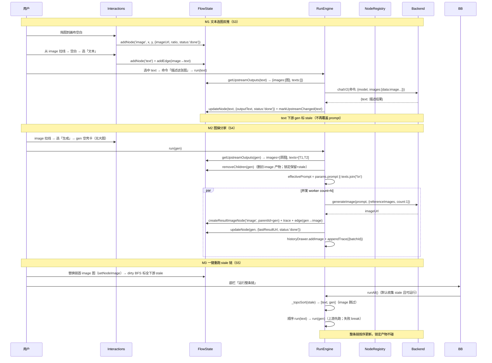

# 图操分家 · 实施设计（无兼容模式 · 主线大改造 ②）

> 日期：2026-08-18
> 编制：软件架构师 高见远（Gao）
> 上游：`图操分家-增量PRD-2026-08-18.md`（权威，§4 节点语义表为改造基准，§5 需求池 S1-S5）、`项目总览与路线决策-2026-08-18.md`（决策 1 + 关键约束 3）、`工作流改造方案-审查意见-2026-08-18.md`（三/四/六/七）、`工作流现状分析-2026-08-18.md`、`资产增强-实施设计-2026-08-18.md`（R2/R3 能力基线）
> 代码核对（以下事实均已逐文件读取确认，基线 commit `1e7922f` 之后）：`src/v1/types/flow.d.ts`、`src/v1/engine/run-engine.ts`、`src/v1/state/flow-state.ts`、`src/v1/nodes/{node-registry,image-gen,text-gen}.ts`、`src/v1/persistence.ts`、`src/v1/canvas/{interactions,card-view,canvas-view}.ts`、`src/v1/ui/{cmd-panel,compare-panel,bottom-bar,action-bar,outpaint-panel,history-drawer,asset-drawer}.ts`、`src/v1/{main,api,reproduce,history-persist,asset-store}.ts`、`src/index.html`、`backend/api/project_api.py`
> 性质：主线大改造，5 阶段 = 5 任务，每任务可独立验证；里程碑 M1（T03 末）/ M2（T04 末）/ M3（T05 末）

---

## 0. 关键前提与代码现状固化（设计依据，防脱节）

**用户拍板的前提（务必贯彻）**：
1. **无迁移 / 数据全部不兼容**：不写任何 `migrateNode` / 旧格式读取逻辑；节点模型与 .icproj 格式推倒重来；打开旧 .icproj 只提示「旧项目不兼容」。审查意见 §五（迁移拆分）不再适用。
2. **R2/R3 能力保留**：配方随采纳落盘（adopt 写配方字段）、历史批次分组（batchId + 批次卡）、复制配方、跨项目复现——在新节点模型下继续工作（trace 挂 image 节点、采纳入口在 image 节点上）。
3. **空壳操作卡是灵魂**：gen 节点永远不显示产物大图，视觉上数据（image）/操作（gen）一眼可分，不妥协成"又变成半个数据节点"。
4. **后端优先零改动**：后端 `project_api.py` 仅透传 .icproj JSON、单行 append history、透传 assets.json 记录——字段级校验全在前端，后端零改动。

**关键代码事实（设计的前提）**：
- 脏标记传播**已是**全下游 BFS（`flow-state.getAllDownstreams`，`dirty.markUpstreamChanged` 调用）；本改造是验证 + 适配，非新增（对齐审查意见二.1）。
- 拓扑运行引擎 `runAll + _topoSort` **已存在**（Kahn、遇失败停止、按序 await）；本改造是增强（只挑 stale + 跳过 image）而非新建（对齐审查意见二.2）。
- 真缺口 = ① 数据收集层（`getReferenceImages` 只收图、不收文；`applyTextToDownstream` 旁路覆盖 prompt）② 分家后的顶掉适配（gen 重跑删旧 image 产物）。
- R2/R3 已合入（commit `1e7922f`）：`ImageAssetRecord` 配方字段、`metaFromNode/recipeFromRecord`、`batchId` 写侧透传 + history-drawer 批次视图均已就绪；本次**基本零改动**（仅 node 类型相关回归）。

---

## 1. 实现方案概述

### 1.1 三类节点如何落地

| 节点 | 核心角色 | 可运行 | 输入（走线） | 输出（走线） | 卡片形态 |
|---|---|---|---|---|---|
| `image` | 纯数据图 | **否** | 无（仅作链首素材；可被替换图） | `imageUrl` → 下游取为参考图/输入图 | 缩略图 + trace（生成档案）+ 锁定/采纳角标 |
| `text` | 数据 + 操作（**有意例外**） | **是** | 上游图（走图片参数）+ 上游文（拼 user prompt）+ 命令 | `outputText` → 下游 gen 取为 prompt 原料 | 文本卡 + outputText + 指令输入 + 历史 |
| `gen` | 生成操作 | **是** | 上游图（参考图）+ 上游文（按连线顺序/上游 id 序**拼接**） | **不输出图**；产物 = 新建 image 节点（连右侧） | **空壳操作卡**：状态色/流光 + 最近产物弱缩略图（角标「产物在右侧」）+ prompt/参数 chip + 发送 |

**技术路线**：不是"在旧模型上打补丁"，而是**类型收敛 + 行为收敛**一次到位：
- `NodeType` 从 `'image-gen' | 'text-gen'` 收敛为 `'image' | 'text' | 'gen'`（S1-1）；
- 参数模型：`StyleTransferParams` 重构为 `GenParams`（**删除 `modelType`/`textModel`**，新增 `mode: 'draw' | 'outpaint'` 供扩图归位）；`TextGenParams` 保留（`instruction` 命令 + `model`）；
- 数据收集：`getUpstreamOutputs(node)` 统一取直接上游图 + 文（S1-3/S2-1），`getReferenceImages` 收窄为只取图（显示层别名）；
- 运行分派：`run()` 按类型分派 `text` → `runTextNode`、`gen` → `runGenBatch`（含 `mode='outpaint'` 分支）；**删除** `runImageReverse`（反推游离）与 `applyTextToDownstream`（旁路）；
- 产物形态：`createResultCard` 改为 `createResultImageNode`，永远建 **image 类型**产物节点（S4-2）；`_writeBackToSelf` 删除（gen 永不写回自身）。

### 1.2 node-registry 注册（S1-1）

文件从 `nodes/{image-gen,text-gen}.ts` 改为 `nodes/{image,text,gen}.ts`，各注册一个 `NodeDefinition`：

```
image.ts → register({ type:'image', label:'图片', creatable:true, canRun:()=> '图片节点为纯数据，不可运行', buildOptions:()=>({}) })
text.ts  → register({ type:'text',  label:'文本', creatable:true, canRun: 模型非空+命令非空, buildOptions:{ model } })
gen.ts   → register({ type:'gen',   label:'生成', creatable:true, canRun: 模型非空 + (prompt 或上游文本非空)；outpaint 模式另需上游图, buildOptions:{ model,aspectRatio,resolution,count,referenceImages:ctx.getUpstreamOutputs(id).images } })
```

注意：`text.ts` 必须继续导出 `TEXT_HISTORY_LIMIT`、`DEFAULT_CHAT_MODEL_KEY`（`api.ts` / `flow-state.ts` / `persistence.ts` / `cmd-panel.ts` 的 import 路径同步改 `./nodes/text`）。

### 1.3 空壳操作卡（gen）方案（S4-3，灵魂不妥协）

- `FlowNode` 新增可选字段 `lastResultUrl?: string | null`：gen 最近一次产物缩略图（弱显示用，随 .icproj 持久化）。
- gen 卡片渲染（`card-view.ts` 新增 `_buildGenCard` 分支）：
  - **不渲染 `pcard-img` 大图主视觉**；卡片主体 = 状态色/流光 + 一张**小缩略图**（`lastResultUrl`，无则占位「无产物」）+ 右上角标「产物在右侧」+ prompt/模型/比例/分辨率/张数 chip 行 + 发送。
  - 小缩略图点击 → 不强弹大图（产物图在右侧 image 节点上，用户直接点产物节点）；仅 title 提示「最近一次产物，产物在右侧 image 节点」。
  - 无 `lastResultUrl`（未跑过）→ 显示「空壳操作卡」占位文案（如「连接上游后发送，产物将生成在右侧」）。
- 与 `image` 数据卡视觉差异：image 卡 = 大图 + 角标；gen 卡 = 无大图 + chip 行 + 状态色。CSS 类 `.pcard.gen-card` 实现。

---

## 2. 数据模型变更

### 2.1 `src/v1/types/flow.d.ts`

```ts
type NodeType = 'image' | 'text' | 'gen';           // 删除 'image-gen' / 'text-gen'

interface TextGenParams { instruction?: string; model: string; }   // 不变（text 用）

/** gen 参数（原 StyleTransferParams 重构） */
interface GenParams {
  prompt: string;             // 生成提示词；为空时运行时 = 上游文本拼接（S4-7）
  model: string;              // "provider:key:model"（绘图模型）
  aspectRatio: string;
  resolution: string;
  count: number;              // 1-4
  mode?: 'draw' | 'outpaint'; // 默认 'draw'；'outpaint' = 扩图模式（S4-8 归位）
  // 删除：modelType / textModel
}

interface FlowNode {
  // ……现有字段全部保留（id/type/x/y/ratio/status/title/params/imageUrl/imageOrigin/
  //     outputText/textHistory/refImages/error/lastRunAt/parentId/trace）……
  lastResultUrl?: string | null;  // 新增：gen 最近一次产物缩略图（空壳卡弱显示）；非 gen 恒 null
}

/** 上游输出统一收集（S1-3 新增） */
interface UpstreamOutputs {
  images: string[];                         // 直接上游 image 节点的 imageUrl ∪ 本节点 refImages（去重保序）
  texts: Array<{ text: string; nodeId: string }>; // 直接上游 text 节点的 outputText（按连线顺序/上游 id 序）
}

interface FlowContext {
  // ……现有成员保留……
  getUpstreamOutputs(nodeId: string): UpstreamOutputs;  // 新增：数据收集唯一权威入口
  getReferenceImages(nodeId: string): string[];         // 保留（= getUpstreamOutputs(id).images，显示层别名）
}

interface FlowProject {
  format: 'icv';
  version: '4.0';             // 从 '3.4' 推倒重来（无迁移）
  // ……其余字段不变……
}

interface GenerationTrace { /* 不变：prompt/model/aspectRatio/resolution/count/refImageHashes/refImageUrls/seed/createdAt/parentId/outputType */ }
interface HistoryEntry      { /* 不变（R3 已含 batchId） */ }
interface ImageAssetRecord  { /* 不变（R2 已含配方字段） */ }
interface AdoptMeta         { /* 不变（R2 已落盘） */ }
```

**语义**：`image` 节点 `params` 恒 `{}`（无参数）；`outputText/textHistory` 仅 text 用；`trace` 仅 image 产物节点有；`refImages` 保留为「用户主动挂载的参考图」（image 节点无此语义，恒 `[]`）。

### 2.2 持久化新格式（S1-2，无迁移）

`.icproj` v4.0 结构（与 3.4 同壳，节点类型与字段语义全新）：

```jsonc
{
  "format": "icv",
  "version": "4.0",
  "projectName": "...",
  "canvas": { "scale": 1, "panX": 60, "panY": 40 },
  "nodes": [
    { "id": "...", "type": "image", "x": 0, "y": 0, "ratio": 0.75, "status": "done",
      "title": "图片", "params": {}, "imageUrl": "data:image/...", "imageOrigin": { "path": "..." },
      "outputText": null, "textHistory": [], "refImages": [], "error": null,
      "lastRunAt": null, "parentId": null, "trace": { "prompt": "...", "outputType": "img2img", ... },
      "lastResultUrl": null },
    { "id": "...", "type": "text", "params": { "instruction": "", "model": "..." }, "outputText": "...", ... },
    { "id": "...", "type": "gen",  "params": { "prompt": "", "model": "...", "aspectRatio": "3:4",
      "resolution": "2k", "count": 1, "mode": "draw" }, "imageUrl": null, "lastResultUrl": "data:image/...", ... }
  ],
  "edges": [ { "id": "...", "from": "...", "to": "..." } ],
  "createdAt": 0, "updatedAt": 0
}
```

**打开检测（Q1 拍板落地）**：

```
persistence.restore(raw):
  format !== 'icv'            → toast '项目文件格式错误'，return false
  version !== '4.0'           → toast '旧项目不兼容，将新建空白项目'，return false（不加载、不清当前画布）
  通过 → normalizeNodeV4 逐节点校验（仅接受 image/text/gen；非法节点过滤、连线按现存节点过滤）
```

- **删除 `migrateNode`**（含 image-result 迁移、3.2/3.3 兼容、normalizeTextHistory 之外的全部旧分支），替换为严格 v4.0 归一 `normalizeNodeV4`（对类型/字段做防御性校验，**不做任何旧类型转换**）。
- `collect()`：`version: '4.0'`；nodes 序列化保留 `lastResultUrl`（spread 天然带出）。
- `flow-state.replaceAll` 归一补 `lastResultUrl: typeof n.lastResultUrl === 'string' ? n.lastResultUrl : null`。
- **assets.json / history.jsonl**：结构与新模型**同构**（R2/R3 后字段无节点类型），无法按"新旧"区分；设计上**保留现有容错加载**（不迁移、不改写、不主动删除）——旧 .icproj 硬拒绝是"数据不兼容"的执行点，全局资产/历史行继续按现有 `_normalize` / 读侧回退展示（无配方显示「配方缺失」、无 batchId 回退单图）。见 §9 待明确事项（若主理人要求资产库/历史也"不加载"，加开关 `ICV_RESET_GLOBAL_DATA=1`，默认关）。

---

## 3. getUpstreamOutputs 设计（S1-3 / S2-1，数据收集唯一权威入口）

### 3.1 函数签名与语义

```ts
// flow-state.ts
getUpstreamOutputs(id: string): UpstreamOutputs {
  const node = this.getNode(id); if (!node) return { images: [], texts: [] };
  const images: string[] = []; const seen = new Set<string>();
  // ① 本节点用户主动挂载的参考图（gen/text 的 refImages；image 恒 []，前置）
  (node.refImages || []).forEach(u => { if (u && !seen.has(u)) { seen.add(u); images.push(u); } });
  // ② 直接上游一层（不穿透、不 BFS）：
  //    - image 节点 → 输出图 imageUrl
  //    - gen 节点 → 无输出（imageUrl 恒 null，跳过）
  //    - text 节点 → 无图输出，跳过
  this.getUpstreams(id).forEach(u => {
    if (u.type === 'image' && u.imageUrl && !seen.has(u.imageUrl)) { seen.add(u.imageUrl); images.push(u.imageUrl); }
  });
  // ③ 直接上游 text 节点的输出文本：按连线顺序（edges 数组插入序 = 用户拖连先后）→ 上游 id 序兜底（Q2 拍板）
  const texts = this.getUpstreams(id)
    .filter(u => u.type === 'text' && !!u.outputText)
    .map(u => ({ text: u.outputText as string, nodeId: u.id }))
    .sort((a, b) => this._edgeIndexTo(id, a.nodeId) - this._edgeIndexTo(id, b.nodeId)
                  || a.nodeId.localeCompare(b.nodeId));
  return { images, texts };
}

private _edgeIndexTo(id: string, fromId: string): number {
  const i = this.getEdgesTo(id).findIndex(e => e.from === fromId);
  return i === -1 ? Number.MAX_SAFE_INTEGER : i;
}
```

### 3.2 与 getReferenceImages 的关系（替代 / 保留）

| 消费方 | 现状 | 改造后 |
|---|---|---|
| run-engine `ctx.getReferenceImages` | 运行参考图 | **改用 `ctx.getUpstreamOutputs(id).images`**（运行真相走新入口） |
| node defs `buildOptions` | `ctx.getReferenceImages` | **改用 `ctx.getUpstreamOutputs(id).images`** |
| cmd-panel `_renderRefs`（显示） | `flowState.getReferenceImages` | 保留别名（显示层只关心图） |
| card-view `_refStrip`（显示） | `flowState.getReferenceImages` | 保留别名 |
| outpaint-panel 取源图 | `flowState.getReferenceImages` | 保留别名（或用 images[0]） |

**约定**：`getUpstreamOutputs` = 运行/数据权威；`getReferenceImages` = 仅图 URL 的显示别名（`return this.getUpstreamOutputs(id).images`），不改语义（仍是本节点 refImages ∪ 直接上游 image 输出图，去重保序）。S1-3 验收 = 连 A→B→C 打印确认 C 只取 B 的直接上游图/文。

### 3.3 连线规则放开（S2-2）

`flow-state.canConnect` 改造：

```
现有规则保留：不能连自己 / 不能重复 / 不能成环（_wouldCycle）
删除：'text-gen 不能作为接收端（to）'  →  text 可作 to（接收上游图/文，反推归位）
新增：'image 不能作为接收端（to）'     →  图片是纯数据，无输入语义
新增：'gen 不能作为发送端（from）'     →  生成节点无数据输出（产物在右侧 image 节点）；引擎内部 gen→image 边走 addEdge 不经 canConnect
```

`insertStep`（连线中点 + 插入）默认插入 **text 节点**（text 可作 from 与 to：image→text→gen / text→text→gen 均成立），不再硬编码 image-gen。

---

## 4. 关键机制设计

### 4.1 文本走线（S3，M1 完成）

**text 运行（runTextNode）**：
```
输入 = getUpstreamOutputs(nodeId)：
  images → 过滤 data:image（后端 chat_v2 会静默丢弃其它引用；若请求了图但全被过滤 → toast 提示，不阻断纯文本运行）
  texts  → 拼进 user prompt（「上游文本：\n{t1}\n{t2}\n\n指令：{命令}」）
  command → params.instruction（临时，发送后清空，Q5 保留）
调 Backend.chatV2 → 成功：
  写 outputText 回写自身 + pushTextHistory + appendTextTrace(kind:'text')
  + dirty.markUpstreamChanged(nodeId)（下游标 stale——文本输出变化，数据流已变；不再覆盖任何 prompt）
失败：fail + error，不写历史
finally：清空 instruction（Q5）
```

**删除旁路（S3-3）**：`applyTextToDownstream` 函数整体删除；调用点改造：
- `run-engine.runTextGen` 成功分支：删 `applyTextToDownstream(nodeId, text)`，保留 `dirty.markUpstreamChanged(nodeId)`；
- `card-view._commitTextEdit`：删 `applyTextToDownstream` → `dirty.markUpstreamChanged(nodeId)`；
- `cmd-panel._refillHistoryItem`（历史回填）：删 `applyTextToDownstream` → `dirty.markUpstreamChanged(nodeId)`。

**删除反推开关（S3-2）**：`cmd-panel._openImageModelMenu` 的「绘图模型 / 文本模型」双 tab 整段删除；模型 chip 打开 = 直接列绘图模型（gen）/ 对话模型（text）；`isImageReverse`、`IMAGE_TEXT_REVERSE_PLACEHOLDER`、`.reverse` class 相关分支全部删除。`runImageReverse` 删除（反推 = text 节点 + 上游图连线）。

### 4.2 图操分家（S4，M2 完成）

**gen 运行（runGenBatch）**：
```
params 快照；refs = getUpstreamOutputs(id).images；upstreamTexts = getUpstreamOutputs(id).texts
effectivePrompt = params.prompt.trim() || upstreamTexts.map(t=>t.text).join('\n')   // S4-7：手动改写覆盖拼接
if params.mode === 'outpaint':   // 扩图模式（单张）
    dataUrl = composeOutpaintDataUrl(refs[0], params.aspectRatio)   // 白底居中适配合成（新增共享工具）
    prompt  = params.prompt.trim() || OUTPAINT_PROMPT_PREFIX
    调 Backend.generateImage(prompt, { model, aspectRatio, resolution:'4k', count:1, referenceImages:[dataUrl] })
    成功 → createResultImageNode(outputType:'outpaint', batchId)
else:                             // 普通 draw 模式（count=N）
    removeChildren(nodeId)                                  // 重跑顶掉旧 image 产物（S4-5）
    isTxt2Img = refs.length === 0
    并发 N 个 worker（count=1）→ 每张成功 → createResultImageNode(outputType: isTxt2Img?'txt2img':'img2img', batchId)
    有成功 → gen done + markUpstreamChangedExcept(新产物跳过) + toast「成功 x/y」；全失败 → gen fail（保留旧产物）
```

**关键差异 vs 现状**：**gen 永不写回自身**（`_writeBackToSelf` 删除；`txt2img` 不再有"第 1 张写回自身"分支）——产物永远在新建 image 节点上；gen 自身 `imageUrl` 恒 null，仅 `lastResultUrl` 记录最近产物缩略图。

**createResultImageNode（原 createResultCard）**：
```
addNode('image', layout.x, y, { parentId: genId, imageUrl, imageOrigin: origin, ratio: r,
  status:'done', title:'生成结果', params: {}, lastRunAt, lastResultUrl: null })
addEdge(genId, node.id, { suppressStale: true })      // 引擎内部边，不经 canConnect
node.trace = buildImageTrace(node, refs, outputType, imageUrl)   // trace 挂 image 产物节点（S4-4）
historyDrawer.addImage(..., { batchId }) + historyPersist.appendTrace({ ..., batchId })  // R3 透传不变
flowState.updateNode(genId, { lastResultUrl: imageUrl })         // 回写 gen 空壳卡弱缩略图
```

**removeChildren 适配（S4-5）**：`flow-state.removeChildren(parentId)` 逻辑**基本不动**（纯引擎产出判定 = 出边空 + 入边恰 {parent→child}；锁定/手动改造保留 + 标 stale）。适配点仅：
- 子节点类型从 image-gen 变为 **image**（判定不依赖类型，天然兼容）；
- toast 文案微调（「有锁定的产物节点，已保留并标待重跑」沿用）；
- **验证**：gen 重跑 → 删旧 image 产物（parentId=gen）→ 建新；锁定产物保留 + 标 stale（S4-5/S4-9）。

**trace 归属（S4-4）**：产物 image 节点挂 trace（完整生成档案）；gen 不挂 trace。复现入口/按钮显隐按 image 节点 trace：
- `interactions._showCardMenu` 复现项：`node.type === 'image' && node.trace`；
- `action-bar.sync` 复现按钮显隐：`!!node.trace`（image 产物有、gen 无 → 天然隐藏）；
- `reproduce.reproduceFromNode` 不变（读 node.trace）。

**compare-panel / bottom-bar（S4-6）**：`_comparableNodes` / `_comparableIds` 改为 `n.type === 'image' && !!n.imageUrl`（gen/text 不可比）。

**扩图归位（S4-8）**：
```
image 节点右键「扩图」 → _createOutpaintGen(imageId):
  addNode('gen', 右侧避让, { params: { prompt:'', model: await resolveOutpaintModel(imageNode),
      aspectRatio:'1:1', resolution:'4k', count:1, mode:'outpaint' } })
  addEdge(imageId, genId)                     // 连上游图（gen 的 getUpstreamOutputs.images 即该图）
  selection.select(genId) + floatingPanels.show()   // 打开 cmd-panel 供改比例/描述
  运行 = runGenBatch 的 outpaint 分支（参数持久化于 gen.params，支持重跑——相较现状「扩图参数不持久化」是增强）
```
- 新增共享工具 `src/v1/engine/outpaint-util.ts`：`RATIO_CANVAS`、`OUTPAINT_PROMPT_PREFIX`、`composeOutpaintDataUrl(src, ratio)`（白底居中适配合成，替代交互面板的拖放/缩放态）；`outpaint-panel.ts` 改为从该工具 import（删除重复常量）。
- 交互式扩图弹层（拖放/缩放）**保留**，入口改为 gen（mode='outpaint'）卡片 action-bar「调整扩图」→ `runEngine.runOutpaint(genId, opts)`（产出 image 节点 parentId=genId）；非 P0，如工程师评估成本高可先隐藏该入口，不影响 S4-8 验收。

### 4.3 一键重跑 stale 链（S5，M3 完成）

**增强 runAll（S5-2）**：
```ts
async runAll(ids?: string[]): Promise<void> {
  // 默认目标 = 全部 stale 且可运行（text/gen）；image 数据节点跳过（其产物由 gen 重跑顶掉/新建）
  const targets = ids && ids.length > 0
    ? ids.filter(id => this._isRunnable(id))
    : flowState.nodes.filter(n => n.status === 'stale' && this._isRunnable(n.id)).map(n => n.id);
  const sorted = this._topoSort(targets);          // 上游先跑（Kahn，已有）
  for (const id of sorted) {
    const node = flowState.getNode(id);
    if (!node || node.status === 'done') continue; // 上游未 done 语义 = 拓扑序天然先跑上游
    await this.run(id);
    const after = flowState.getNode(id);
    if (after && after.status === 'fail') break;   // 失败停止（已有）
  }
}
private _isRunnable(id: string): boolean {
  const n = flowState.getNode(id); return !!n && (n.type === 'text' || n.type === 'gen');
}
```
- 说明：脏标记 BFS 保证"改链首 → 全下游标 stale"，故 stale 集合天然是完整受影响链；拓扑序保证上游先跑；`run()` 内 canRun 校验保留（image 不可运行不 toast——runAll 已前置过滤，避免刷屏）。

**底栏按钮（S5-3）**：`index.html` 底栏新增「运行整条链」按钮（`#btn-run-chain`，位于「运行选中」旁）；`bottom-bar.ts` 绑定 → `runEngine.runAll()`；`_sync()` 中按「存在 stale 且可运行的节点」启停（无 stale 时禁用并显示 `0` 或普通态）。

### 4.4 多文本拼接（S4-7，Q2 拍板）

- 拼接顺序 = **连线顺序**（`edges` 数组插入序 = 用户拖连先后），未连线/异常按**上游 id 序**兜底（`getUpstreamOutputs` 的 `texts` 排序，§3.1）。
- `effectivePrompt = params.prompt.trim() || texts.join('\n')`：
  - gen 面板输入框显示 `params.prompt`（**手动改写入口**，改写即覆盖拼接）；输入框为空时占位提示「将使用上游 N 个文本拼接」；
  - `gen.canRun`：`(prompt.trim() || texts.length > 0) && model`（有上游文本时允许空 prompt 运行）。
- cmd-panel 在 gen 选中时展示「上游文本」只读 chip 列表（texts 摘要），提示拼接来源。

### 4.5 拖放 / 上传 / 换图（S4-1）

`interactions._dropImage` / `_bindFileInput` 改造：

| 落点 | 现状 | 改造后 |
|---|---|---|
| 空白处 | 建 image-gen + refImages=[src] | **建 image 节点**：`addNode('image', x, y, { imageUrl: src, ratio: r, status:'done' })` |
| 拖到 image 节点 | 追加参考图 | **替换该图**：`setNodeImage(id, src, ratio)` + `dirty.markUpstreamChanged(id)`（换图 → 下游标 stale） |
| 拖到 gen / text 节点 | 追加参考图 | 追加 refImages（保留；getUpstreamOutputs 纳入） |
| 双击空 image 卡 | 弹文件选择器加参考图 | 弹文件选择器**设为 imageUrl**（同上替换语义） |

---

## 5. 接口 / 函数变更清单

### 5.1 `src/v1/state/flow-state.ts`
| 函数 | 变更 |
|---|---|
| `getUpstreamOutputs(id)`（新增） | §3.1 实现；`_edgeIndexTo` 私有辅助 |
| `getReferenceImages(id)` | 改为 `return this.getUpstreamOutputs(id).images;`（显示别名） |
| `canConnect(from,to)` | 删 `text-gen 不能作 to`；新增 `image 不能作 to`、`gen 不能作 from`；防环/防重/防自连保留 |
| `insertStep(edgeId)` | 默认插入 `text` 节点（不再 image-gen）；删 text-to 防御分支 |
| `removeChildren(parentId)` | 适配（子节点类型 image；逻辑不变）；toast 文案核对 |
| `replaceAll` / `_cloneNode` | 归一补 `lastResultUrl` |
| import | `TEXT_HISTORY_LIMIT` 路径改 `../nodes/text` |

### 5.2 `src/v1/engine/run-engine.ts`
| 函数 | 变更 |
|---|---|
| `applyTextToDownstream`（导出） | **删除** |
| `runImageReverse`（私有） | **删除** |
| `_writeBackToSelf`（私有） | **删除**（gen 永不写回自身） |
| `run(nodeId)` | 分派：`text`→`runTextNode`；`gen`→`runGenBatch`；`image`→canRun false（不 toast 由 UI 前置过滤） |
| `runTextNode(nodeId)`（原 runTextGen 重构） | 输入 = getUpstreamOutputs（images 过滤 data:image + texts 拼接 + command）；成功写回自身 + markUpstreamChanged + text trace；finally 清 instruction（Q5） |
| `runGenBatch(nodeId)`（原 runBatch 重构） | effectivePrompt 拼接；`mode==='outpaint'` → 单张扩图分支；draw → 并发 N 张全建 image 节点（无写回自身）；removeChildren 前置 |
| `runOneWorker(...)` | 成功分支统一 `createResultImageNode`（删 isTxt2Img index===0 写回分支） |
| `createResultImageNode(...)`（原 createResultCard） | addNode 类型改 `'image'`；写 node.trace + addImage/appendTrace（batchId）；回写 gen.lastResultUrl |
| `runOutpaint(nodeId, opts)` | 产出节点改 `'image'`；batchId 生成沿用；入口改为 gen（mode='outpaint'） |
| `runAll(ids?)` | §4.3 增强：默认 stale + `_isRunnable` 过滤 + 拓扑 + 失败停止 |
| `ctx` | `getReferenceImages` → `getUpstreamOutputs(id).images` |
| 新增 `_isRunnable(id)` | 私有：type text/gen |

### 5.3 `src/v1/nodes/*`
| 文件 | 变更 |
|---|---|
| `nodes/image-gen.ts` | **删除**；新建 `nodes/image.ts`（type 'image'，canRun 恒 false） |
| `nodes/text-gen.ts` | **删除**；新建 `nodes/text.ts`（type 'text'，保留 TEXT_HISTORY_LIMIT / DEFAULT_CHAT_MODEL_KEY 导出） |
| `nodes/gen.ts`（新增） | type 'gen'；canRun/buildOptions 按 §4.4/§1.2 |

### 5.4 `src/v1/persistence.ts`
| 函数 | 变更 |
|---|---|
| `migrateNode` | **删除**（含 image-result 迁移、3.2/3.3 兼容分支） |
| `normalizeNodeV4(raw)`（新增） | 严格 v4.0 归一：仅接受 image/text/gen；字段防御校验；lastResultUrl 归一；不做任何旧类型转换 |
| `restore(raw)` | version 必须 `'4.0'`；旧版本 toast「旧项目不兼容，将新建空白项目」return false |
| `collect()` | `version: '4.0'` |
| import | `TEXT_HISTORY_LIMIT` 路径改 `./nodes/text` |

### 5.5 `src/v1/canvas/interactions.ts`
| 函数 | 变更 |
|---|---|
| `_dropImage` | 空白 → 建 image 节点（imageUrl）；拖到 image → 替换图；拖到 gen/text → 追加 refImages |
| `_bindFileInput` | image 节点 → 设 imageUrl；gen/text → 追加 refImages |
| `_newNodeCandidates` / `_showNewNodeMenu` | 可作 to 的候选 = text + gen（image 不作接收端）；canvas 右键新建 = 三类全列出 |
| `_fillDefaultModelFor` | text → chat 模型；gen → 绘图模型；image → 不回填 |
| `_showCardMenu` | 运行/重跑仅 text/gen；复现仅 `image && trace`；**新增 image 右键「扩图」**（建 gen outpaint 预填 + 连图）；画布/节点新建类型字符串更新 |
| `_handleMenuAction` | 'reproduce' 判据更新；新增 'expand-gen' action（扩图归位） |

### 5.6 `src/v1/canvas/card-view.ts`
| 函数 | 变更 |
|---|---|
| `buildCard` | 三分支：text 卡（原 textgen 路径）/ image 卡（大图 + 角标）/ **gen 空壳卡**（新增 `_buildGenCard`：无大图、小缩略图 + 角标「产物在右侧」+ chip 行） |
| `updateCard` | 主视觉来源：image→imageUrl；text→outputText；gen→lastResultUrl 弱缩略图（或无）；badges 仅 image |
| `_commitTextEdit` | 删 applyTextToDownstream → `dirty.markUpstreamChanged(nodeId)` |
| `_refStrip` | 走 getReferenceImages 别名（不变）；gen 卡显示上游文本摘要 chip |
| `_handleBadgeClick` | 不变（image 节点 imageUrl + trace → metaFromNode 配方落盘，R2 保留） |

### 5.7 `src/v1/ui/cmd-panel.ts`
| 函数 | 变更 |
|---|---|
| `_openImageModelMenu` / `_openModelMenu` | **删除双 tab 反推切换**；模型 chip = 绘图（gen）/ 对话（text）单选列表 |
| `sync` | 删 `isImageReverse` / `.reverse` / `IMAGE_TEXT_REVERSE_PLACEHOLDER`；image 节点选中 → 面板隐藏（无运行参数）；gen/text 面板按类型渲染；gen 显示上游文本 chip |
| `_onSend` | gen → 写 prompt + run；text → 写 instruction + run（命令临时清空）；image → 不响应 |
| `_refillHistoryItem` | 删 applyTextToDownstream → markUpstreamChanged |
| `_renderRefs` | gen/text 用 getUpstreamOutputs(id).images（别名不变） |

### 5.8 `src/v1/ui/compare-panel.ts` / `bottom-bar.ts` / `action-bar.ts` / `outpaint-panel.ts`
| 文件 | 变更 |
|---|---|
| compare-panel | `_comparableNodes` → `n.type === 'image' && !!n.imageUrl` |
| bottom-bar | `_comparableIds` → image；**新增「运行整条链」按钮**（`#btn-run-chain` → runEngine.runAll()；sync 启停） |
| action-bar | image：显示 扩图/下载/复现(有 trace)；gen：仅 风格调节（聚焦 prompt）+(mode='outpaint' 时) 调整扩图；text：隐藏（现状） |
| outpaint-panel | 常量/合成逻辑迁移到 `engine/outpaint-util.ts`；入口改 gen（mode='outpaint'）；`open(nodeId)` 从 node.imageUrl/上游图取源 |

### 5.9 `src/v1/reproduce.ts` / `main.ts` / `api.ts` / `history-persist.ts` / `asset-store.ts`
| 文件 | 变更 |
|---|---|
| reproduce | `_createNodeFromTrace` 建 **gen** 节点（参数 GenParams：无 modelType/textModel，mode:'draw'） |
| main.ts | import `./nodes/image`、`./nodes/text`、`./nodes/gen`（删旧两文件 import）；`fillDefaultModels` 类型判定 text / gen / image |
| api.ts | `DEFAULT_CHAT_MODEL_KEY` import 路径改 `./nodes/text`；其余零改动 |
| history-persist | **零改动**（buildImageTrace/buildTextTrace/appendTrace 签名不变，batchId 由调用方携带） |
| asset-store | **零改动**（R2 已含 metaFromNode/recipeFromRecord；image 产物 trace 优先自动生效） |

### 5.10 后端
**零改动**（`project_api.py`：.icproj 透传、history 单行 append、assets.json 透传均无需变；版本检测在前端 persistence）。

---

## 6. 涉及文件清单（相对路径 + 改动点）

| # | 文件 | 改动点 |
|---|---|---|
| 1 | `src/v1/types/flow.d.ts` | NodeType 收敛；GenParams（删 modelType/textModel + mode）；FlowNode+lastResultUrl；UpstreamOutputs 新增；FlowContext+getUpstreamOutputs；FlowProject v4.0 |
| 2 | `src/v1/nodes/image.ts`（新增，删 image-gen.ts） | image 节点定义（不可运行） |
| 3 | `src/v1/nodes/text.ts`（新增，删 text-gen.ts） | text 节点定义（保留 TEXT_HISTORY_LIMIT / DEFAULT_CHAT_MODEL_KEY 导出） |
| 4 | `src/v1/nodes/gen.ts`（新增） | gen 节点定义（draw/outpaint 两态 canRun/buildOptions） |
| 5 | `src/v1/nodes/node-registry.ts` | 零改动（Map 注册机制不变） |
| 6 | `src/v1/state/flow-state.ts` | getUpstreamOutputs 新增；getReferenceImages 别名；canConnect 放开；insertStep→text；replaceAll/_cloneNode lastResultUrl；removeChildren 适配 |
| 7 | `src/v1/engine/run-engine.ts` | 删 applyTextToDownstream/runImageReverse/_writeBackToSelf；runTextNode/runGenBatch/createResultImageNode/runOutpaint 重构；runAll 增强；ctx 换 getUpstreamOutputs |
| 8 | `src/v1/engine/outpaint-util.ts`（新增） | RATIO_CANVAS / OUTPAINT_PROMPT_PREFIX / composeOutpaintDataUrl 共享工具 |
| 9 | `src/v1/persistence.ts` | 删 migrateNode；normalizeNodeV4；restore 拒绝旧版本；collect v4.0 |
| 10 | `src/v1/canvas/interactions.ts` | _dropImage/_bindFileInput 建 image/换图；菜单类型与扩图入口；_fillDefaultModelFor |
| 11 | `src/v1/canvas/card-view.ts` | gen 空壳卡渲染；image/text/gen 三分支；文本编辑联动改 markUpstreamChanged |
| 12 | `src/v1/ui/cmd-panel.ts` | 删反推开关 UI；image 隐藏/gen 拼接提示；历史回填改 markUpstreamChanged |
| 13 | `src/v1/ui/compare-panel.ts` | _comparableNodes → image |
| 14 | `src/v1/ui/bottom-bar.ts` | _comparableIds → image；新增运行整条链按钮绑定 |
| 15 | `src/v1/ui/action-bar.ts` | 按类型显隐（image 扩图/下载/复现；gen 风格调节/调整扩图；text 隐藏） |
| 16 | `src/v1/ui/outpaint-panel.ts` | 常量迁移；入口改 gen（mode='outpaint'） |
| 17 | `src/v1/reproduce.ts` | _createNodeFromTrace → gen 节点 |
| 18 | `src/v1/main.ts` | 节点文件 import；fillDefaultModels 类型判定 |
| 19 | `src/v1/api.ts` | import 路径（仅一行） |
| 20 | `src/index.html` | 底栏新增「运行整条链」按钮；gen 空壳卡所需静态容器（如有） |
| 21 | `src/v1/styles/app.css` | `.pcard.gen-card` 空壳卡样式（chip 行/弱缩略图/角标）；「运行整条链」按钮样式；`.reverse`/旧反推样式清理 |
| — | `src/v1/ui/history-drawer.ts` / `src/v1/ui/asset-drawer.ts` / `src/v1/asset-store.ts` / `src/v1/history-persist.ts` / `backend/**` | **零改动**（R2/R3 能力直接复用；回归核对项） |

---

## 7. 任务列表（5 任务 = 5 阶段，含依赖与验收）

> 约定：每任务完成需 `npx tsc --noEmit` 通过；`grep -rn "image-gen\|text-gen" src/` 仅剩注释/文档为通过；验收要点对齐 PRD §5 各 ID 与 M1/M2/M3。

### T01（S1 准备 · 地基）类型收敛 + 持久化推倒重来 + 节点注册
- **目标文件**：`src/v1/types/flow.d.ts`、`src/v1/nodes/{image,text,gen}.ts`（新增）、`src/v1/persistence.ts`、`src/v1/main.ts`、`src/v1/state/flow-state.ts`（类型部分）、`src/v1/engine/run-engine.ts`（类型部分）、`src/v1/canvas/{interactions,card-view}.ts`（类型部分）、`src/v1/ui/{cmd-panel,compare-panel,bottom-bar,action-bar}.ts`、`src/v1/reproduce.ts`、`src/v1/api.ts`、`src/index.html`（按钮静态骨架可选）
- **依赖**：无（地基先行）
- **改动**：
  - flow.d.ts：NodeType/GenParams/FlowNode.lastResultUrl/UpstreamOutputs/FlowContext/FlowProject v4.0。
  - 三节点文件注册；main.ts import 切换。
  - persistence：删 migrateNode → normalizeNodeV4；restore 拒绝非 v4.0（旧项目 toast）。
  - 全库类型字符串机械替换：`'text-gen'`→`'text'`、`'image-gen'` 按语境→`'image'`（数据卡）或 `'gen'`（生成器）；`StyleTransferParams`→`GenParams` 引用同步。
  - 拖图/上传空白处建 image 节点；`createResultCard` 改建 image 节点（产物形态即新模型，机械部分随类型收敛落地）。
- **验收（S1-1/S1-2 + M2 产物形态部分）**：
  - `tsc --noEmit` 通过；`grep image-gen|text-gen` 无代码残留。
  - 打开旧 .icproj（3.4/3.3/3.2）→ toast「旧项目不兼容，将新建空白项目」且不加载、不崩溃。
  - 新项目保存/打开往返正常（v4.0）；右键新建仅 image/text/gen 三类。
  - 拖图 → 新建 image 节点（有图、无运行按钮）；运行 gen（旧批次逻辑暂存）→ 产物为 image 节点。

### T02（S2 统一取上游）getUpstreamOutputs + 连线规则放开
- **目标文件**：`src/v1/state/flow-state.ts`、`src/v1/engine/run-engine.ts`（ctx/buildOptions）、`src/v1/nodes/{gen,text}.ts`、`src/v1/ui/cmd-panel.ts`（refs 显示）、`src/v1/canvas/card-view.ts`（refStrip）
- **依赖**：T01
- **改动**：getUpstreamOutputs 实现（图+文、直接上游一层、texts 排序）；getReferenceImages 收窄别名；canConnect 放开（text 可 to、image 不可 to、gen 不可 from）；insertStep 插 text；gen/text buildOptions 走 getUpstreamOutputs。
- **验收（S1-3/S2-1/S2-2）**：连 A→B→C，console/QA 断言 C 只取 B 的直接上游图/文；text 节点前可插步骤、可作接收端；防环/防重/防自连仍生效；cmd-panel 参考图区/卡片缩略行显示正确。

### T03（S3 文本走线 · M1 完成）反推归位 + 删反推开关 + 删旁路
- **目标文件**：`src/v1/engine/run-engine.ts`（runTextNode、删 runImageReverse/applyTextToDownstream）、`src/v1/ui/cmd-panel.ts`（删双 tab/反推 UI）、`src/v1/canvas/card-view.ts`（文本编辑联动）、`src/v1/nodes/text.ts`、`src/v1/ui/action-bar.ts`
- **依赖**：T02
- **改动**：runTextNode 输入 = 上游图（data:image 过滤）+ 上游文拼接 + 命令；结果写回自身；删反推开关 UI；三个 applyTextToDownstream 调用点改 markUpstreamChanged。
- **验收（S3-1/3-2/3-3/3-4 = M1）**：拖图 → image → 拉 text 连图 → 命令「描述这张图」→ 结果写回 text 自身；任何 UI 无「反推模式」chip；text 运行后下游 gen 的 prompt 不被自动覆盖；请求体含图/文/命令。

### T04（S4 图操分家 · M2 完成）gen 空壳 + 顶掉适配 + trace 归属 + 扩图 + 拼接
- **目标文件**：`src/v1/engine/run-engine.ts`（runGenBatch/createResultImageNode/runOutpaint/删 _writeBackToSelf）、`src/v1/engine/outpaint-util.ts`（新增）、`src/v1/canvas/card-view.ts`（gen 空壳卡）、`src/v1/canvas/interactions.ts`（右键扩图）、`src/v1/ui/{compare-panel,bottom-bar,action-bar,outpaint-panel}.ts`、`src/v1/reproduce.ts`、`src/v1/nodes/gen.ts`、`src/v1/state/flow-state.ts`（removeChildren 适配）
- **依赖**：T03
- **改动**：runGenBatch 全建 image 节点（无写回自身）；effectivePrompt 拼接规则；createResultImageNode 建 image + trace + lastResultUrl 回写；removeChildren 验证；compare/bottom-bar 改 image；扩图归位（image 右键 → gen mode='outpaint' 预填 + 连图 + 参数持久化）；reproduce 建 gen。
- **验收（S4-1~S4-9 = M2）**：上传图 → image → 拉 gen（空壳卡无大图）→ 运行 → 新建 image 产物节点（连右侧、含 trace）；gen 重跑删旧建新、原图不动；锁定产物保留 + 标 stale；多选 image 可对比、gen/text 不可比；image 右键扩图 → gen 已连图、参数已填、运行出图；两个 text 连 gen → prompt 拼接「A+B」、手动改写仍可编辑。

### T05（S5 清理+重跑 · M3 完成 + 回归）runAll 增强 + 底栏一键 + 回归
- **目标文件**：`src/v1/engine/run-engine.ts`（runAll 增强 + _isRunnable）、`src/v1/ui/bottom-bar.ts`（运行整条链按钮）、`src/index.html`（按钮）、`src/v1/styles/app.css`（按钮/空壳卡样式收口）、回归核对：`src/v1/ui/history-drawer.ts`、`src/v1/ui/asset-drawer.ts`、`src/v1/asset-store.ts`、`src/v1/history-persist.ts`
- **依赖**：T04
- **改动**：runAll 默认收集 stale + 跳过 image + 拓扑 + 失败停止；底栏「运行整条链」绑定与启停；S5-4 收纳轻量验证（cursorY 避让）；回归清单逐项执行。
- **验收（S5-1/5-2/5-3 + R-1/R-2 = M3）**：改链首（换图/换上游文本）→ 全链下游（text/gen/image 三类）标黄；底栏一键 → 按拓扑序顺序跑通、失败停止并提示；锁定 image 产物不被碰；回归清单（§8）全绿。

---

## 8. 回归影响面

| # | 现有能力 | 是否受影响 | 回归要点 |
|---|---|---|---|
| 1 | 锁定保护（removeChildren / 采纳自动置 locked） | **保留（语义更清晰）** | 锁在 image 节点上；gen 重跑不碰锁定产物；采纳仍自动锁定 |
| 2 | hashRef 指纹去重主键 | **不受影响** | key 生成/比对零改动；同图跨节点/跨项目仍一条资产记录（S4-9） |
| 3 | 复现（画布 reproduceFromNode / 图库·资产库 reproduceFromHistory） | **适配** | 画布复现仅 image 节点（有 trace）；reproduce 新建 gen 节点；资产库记录配方优先不变（R2） |
| 4 | 拖入画布（application/history-image） | **保留** | 单图卡/批次卡拖入 → 建 image 节点（不再是 image-gen） |
| 5 | 对比面板（2/4/8 宫格、格内采纳/锁定） | **适配** | 可对比 = image 节点；格内采纳 metaFromNode（trace 优先）配方落盘（R2） |
| 6 | 撤销/重做（flow + assets 并行快照） | **保留** | _cloneNode/replaceAll 补 lastResultUrl；引擎运行期 suspend 语义不变 |
| 7 | 历史图库（history.jsonl、按批次/按时间视图） | **保留** | image 行仍由 createResultImageNode 写入（batchId 透传）；text 行不变；旧行容错 |
| 8 | 资产库（配方显示/复制配方/跨项目复现） | **保留** | 采纳入口在 image 节点角标/对比格；R2 记录配方优先链零改动 |
| 9 | 原子保存 / 自动保存 / 关闭保护 / 项目名 | **保留** | persistence.collect v4.0 后 save/open 往返一致 |
| 10 | 扩图（runOutpaint） | **改造** | 入口改为 image 右键建 gen（mode='outpaint'）；参数持久化可重跑；交互面板入口改 gen |
| 11 | 批次进度 toast（成功 x/y）/ 自动弹历史抽屉 | **保留** | addImage 仍触发 openDrawer(true)；toast 逻辑不动 |
| 12 | 文本处理 / 反推 | **改造（M1 核心）** | text 运行写回自身 + 走线；反推开关消失；历史回填不再覆盖下游 prompt |
| 13 | R2 配方落盘 / R3 批次分组 | **保留** | metaFromNode 从 image 产物 trace 构造；batchId 生成点改 runGenBatch/runOutpaint |
| 14 | 已知行为（非本次引入）：旧图入历史的内存副本与 jsonl 原行重复展示 | **不新增** | batch 视图下按单图展示 |

**建议回归清单（QA 使用）**：
1. M1：拖图 → image → 拉 text 连图 → 命令 → 文本写回；无「反推模式」chip。
2. M2：image → gen（空壳卡）→ 运行 → 新 image 产物 + trace；gen 重跑删旧建新；原 image 不动；锁定产物保留。
3. M3：换链首图 → 全链黄 → 底栏「运行整条链」→ 顺序跑通；失败停止。
4. 对比面板多选 image 可比、gen/text 不可比；格内采纳配方落盘。
5. 资产库：采纳 → 重启 → 切项目 → 配方显示 + 复现；复制配方；批次视图批次卡。
6. 历史图库：count=4 → 批次卡 4/4；逐张 查看大图/拖入/复现。
7. 撤销/重做：建节点/连线/采纳/替换图/扩图各手势。
8. 旧 .icproj 打开 → 明确提示不兼容、不崩溃。
9. 文本历史回填/就地编辑 → 下游只标 stale 不覆盖 prompt。

---

## 9. 共享知识（跨文件约定与风险）

1. **类型收敛命名**：`'text-gen'` → `'text'`；`'image-gen'` 按语境拆为 `'image'`（数据卡）/ `'gen'`（生成器）；代码中任何新代码禁止再出现旧类型字符串（注释历史说明除外）。
2. **数据收集唯一权威**：`flowState.getUpstreamOutputs(id)`；`getReferenceImages(id)` 仅为图 URL 显示别名。任何"运行时取上游数据"必须走 getUpstreamOutputs（运行真相），"显示缩略行/参考图区"可走别名。
3. **有效 prompt 规则（唯一约定）**：gen 的 effectivePrompt = `params.prompt.trim() || 上游 text 输出按连线顺序拼接`；手动改写覆盖拼接；清空输入框恢复拼接。拼接顺序 = edges 插入序（用户拖连先后），异常按上游 id 序（Q2）。
4. **产物归属（唯一约定）**：gen 永不写回自身、永不显示大图；产物永远 = 新建 image 节点（parentId=genId，trace 挂 image，history/batchId 随行）；gen 仅 `lastResultUrl` 弱缩略图 + 角标「产物在右侧」。
5. **trace / 采纳 / 复现三处显隐统一按 image 节点 trace**：interactions 右键复现、action-bar 复现按钮、reproduce.reproduceFromNode 的判据都是 `node.type === 'image' && node.trace`。
6. **无迁移纪律**：不写任何 migrateNode / 旧格式读取 / 旧类型转换；`.icproj` 版本必须 `'4.0'`，否则 toast「旧项目不兼容，将新建空白项目」并 return false。删除 migrateNode 后注意清理旧注释与 dead code（persistence.ts 顶部注释、image-gen.ts 中 modelType 反推注释等）。
7. **batchId / 配方字段约定（R3/R2 沿用，零改动）**：batchId = `${nodeId}_${批次启动时间戳}`，生成点 = runGenBatch / runOutpaint；配方字段名与 AdoptMeta 对齐，缺失 = undefined；读侧优先级 = 记录配方 → metaByKey → 历史反查。
8. **text 命令是临时的（Q5）**：instruction 发送后清空（成功/失败均清）；反推输出属 outputText，与指令分离。
9. **数据只取直接上游一层（S2-1）**：getUpstreamOutputs 不 BFS、不穿透；分家后链是 数据→操作→数据→操作，操作节点直接上游就是数据节点，一层天然够用。
10. **chatV2 图片限制**：仅 data:image 内嵌图会传给后端；text 运行对上游图做 `data:image` 前缀过滤，请求了图但全被过滤 → toast 提示不阻断。
11. **运行整条链**：runAll 默认目标 = 全部 stale 且可运行节点（text/gen）；image 数据节点跳过（不 toast）；拓扑序保证上游先跑；失败停止。
12. **风险点**：
    - **T01 大而全**：类型收敛是全库机械替换（约 15 文件），宽 diff 易漏——缓解：tsc 门禁 + `grep image-gen|text-gen` 清零 + 每文件小步提交。
    - **循环依赖**：删除 applyTextToDownstream 后 card-view → run-engine 的运行时环消失（反而降耦）；outpaint-util 为纯工具无环；其余维持现状（Vite 对延迟使用型环安全）。
    - **空壳卡回退**：gen 卡严禁出现大图主视觉（灵魂）；review 时按"是否一眼可分数据/操作"检查。
    - **removeChildren 误删**：image 产物若被用户手动连线/锁定 → 保留 + 标 stale（现有逻辑覆盖）；验证时重点测锁定产物。
    - **assets/history 旧文件**：结构与新模型同构无法按新旧区分；保留容错加载（不删用户全局资产）。若主理人要求"不加载"，加开关 `ICV_RESET_GLOBAL_DATA=1`（默认关）。
13. **待明确事项**：
    - assets.json / history.jsonl 旧文件处理（保留容错加载 vs 严格不加载）——本设计建议保留加载，需主理人确认。
    - image 节点右键「复制」动作：PRD §4 表格列了「复制」，现状画布右键无节点复制；建议本期对齐资产库「复制配方」（复制 image 产物 trace 配方），画布节点复制列 P1。
    - gen 空壳卡最近产物缩略图的显示强度（Q3 拍板弱化：小缩略图 + 角标；本设计按此实现）。

---

## 附录 A：类图（Mermaid）

```mermaid
classDiagram
    class FlowNode {
        +string id
        +NodeType type
        +number x
        +number y
        +number ratio
        +NodeStatus status
        +string title
        +Record params
        +string imageUrl
        +ImageOrigin imageOrigin
        +string outputText
        +TextGenHistoryItem[] textHistory
        +string[] refImages
        +string error
        +number lastRunAt
        +string parentId
        +GenerationTrace trace
        +string lastResultUrl
    }
    class NodeType {
        <<enum>>
        image
        text
        gen
    }
    class GenParams {
        +string prompt
        +string model
        +string aspectRatio
        +string resolution
        +number count
        +string mode
    }
    class TextGenParams {
        +string instruction
        +string model
    }
    class UpstreamOutputs {
        +string[] images
        +TextOutput[] texts
    }
    class TextOutput {
        +string text
        +string nodeId
    }
    class GenerationTrace {
        +string prompt
        +string model
        +string aspectRatio
        +string resolution
        +number count
        +string[] refImageHashes
        +string[] refImageUrls
        +string seed
        +number createdAt
        +string parentId
        +string outputType
    }
    class FlowContext {
        +getUpstreams(nodeId) FlowNode[]
        +getDownstreams(nodeId) FlowNode[]
        +getUpstreamOutputs(nodeId) UpstreamOutputs
        +getReferenceImages(nodeId) string[]
        +getImageModels() Promise~List~
    }
    class NodeDefinition {
        +NodeType type
        +string label
        +string defaultTitle
        +number defaultRatio
        +Record defaultParams
        +canRun(node, ctx) boolean|string
        +buildOptions(node, ctx) Record
    }
    class NodeRegistry {
        +register(def)
        +get(type) NodeDefinition
        +list() NodeDefinition[]
    }
    class FlowState {
        +FlowNode[] nodes
        +FlowEdge[] edges
        +getUpstreams(id) FlowNode[]
        +getDownstreams(id) FlowNode[]
        +getAllDownstreams(id) FlowNode[]
        +getUpstreamOutputs(id) UpstreamOutputs
        +getReferenceImages(id) string[]
        +getChildren(parentId) FlowNode[]
        +removeChildren(parentId)
        +canConnect(from, to) string|null
        +connect(from, to)
        +insertStep(edgeId) FlowNode
        +addNode(type, x, y, extra) FlowNode
        +removeNode(id)
        +addEdge(from, to, opts) FlowEdge
        +removeEdge(id)
        +updateNode(id, patch)
        +updateNodeParams(id, patch)
        +setNodeImage(id, url, ratio)
        +pushTextHistory(id, text)
        +replaceAll(project)
        +captureSnapshot() FlowSnapshot
        +applySnapshot(snap)
    }
    class RunEngine {
        +run(nodeId)
        +runSelected()
        +runAll(ids)
        +runOutpaint(nodeId, opts)
        +isBusy() boolean
        -runTextNode(nodeId)
        -runGenBatch(nodeId)
        -runOneWorker(...)
        -createResultImageNode(...)
        -_isRunnable(id) boolean
        -_topoSort(ids) string[]
    }
    class OutpaintUtil {
        +RATIO_CANVAS
        +OUTPAINT_PROMPT_PREFIX
        +composeOutpaintDataUrl(src, ratio)
    }
    class Persistence {
        +collect() FlowProject
        +restore(raw) boolean
        +save(silent)
        +open()
        -normalizeNodeV4(raw) FlowNode|null
    }
    class HistoryPersist {
        +hashRef(url) string
        +buildImageTrace(node, refs, outputType, imageUrl) GenerationTrace
        +buildTextTrace(node) HistoryEntry
        +appendTrace(entry)
        +loadHistory() HistoryEntry[]
    }
    class AssetStore {
        +adopt(key, nodeId, imageUrl, originalPath, meta)
        +adoptByUrl(url, nodeId, meta, originalPath)
        +metaFromNode(node) AdoptMeta
        +recipeFromRecord(rec) AdoptMeta
        +getAdoptedAssets() AssetAsset[]
        +isLockedByImageUrl(url) boolean
        +isLockedNode(nodeId) boolean
    }
    class CmdPanel {
        +sync()
        -_onSend()
        -_renderRefs()
        -_renderChips(node)
    }
    class CardView {
        +renderAll()
        -buildCard(node) HTMLElement
        -updateCard(el, node)
        -_buildGenCard(node) string
        -_commitTextEdit(nodeId, ta)
        -_refStrip(node) string
    }
    class Interactions {
        -_dropImage(src, world, ...)
        -_bindFileInput()
        -_showCardMenu(x, y, node)
        -_showNewNodeMenu(...)
        -_createOutpaintGen(nodeId)
        -_fillDefaultModelFor(nodeId)
    }
    class ComparePanel {
        -_comparableNodes(ids) FlowNode[]
        -_cellAdopt(url, nodeId)
    }
    class BottomBar {
        -_comparableIds() string[]
        +_sync()
    }
    class ReproduceService {
        +reproduceFromNode(nodeId)
        +reproduceFromHistory(entry)
        -_createNodeFromTrace(trace, x, y) FlowNode
    }

    NodeRegistry o-- NodeDefinition
    NodeDefinition --> FlowContext : canRun/buildOptions(ctx)
    FlowState ..> UpstreamOutputs : 数据收集
    RunEngine --> FlowState : 唯一生成入口
    RunEngine --> NodeRegistry : def.get(type)
    RunEngine --> OutpaintUtil : outpaint 合成
    Persistence --> FlowState : collect/restore
    Persistence ..> FlowProject : v4.0 无迁移
    HistoryPersist --> Backend : appendTrace/loadHistory
    AssetStore ..> FlowNode : metaFromNode(trace 优先)
    CmdPanel --> RunEngine : send
    CardView --> FlowState : 渲染
    Interactions --> FlowState : 建节点/连线
    Interactions --> RunEngine : run
    ComparePanel --> AssetStore : 采纳/锁定
    BottomBar --> RunEngine : runAll(stale)
    ReproduceService --> RunEngine : run()
```



## 附录 B：时序图（Mermaid）



---

*设计完。请工程师按 T01→T05 顺序施工；QA 按 §8 回归清单 + PRD §5 各阶段验收要点回归。*
