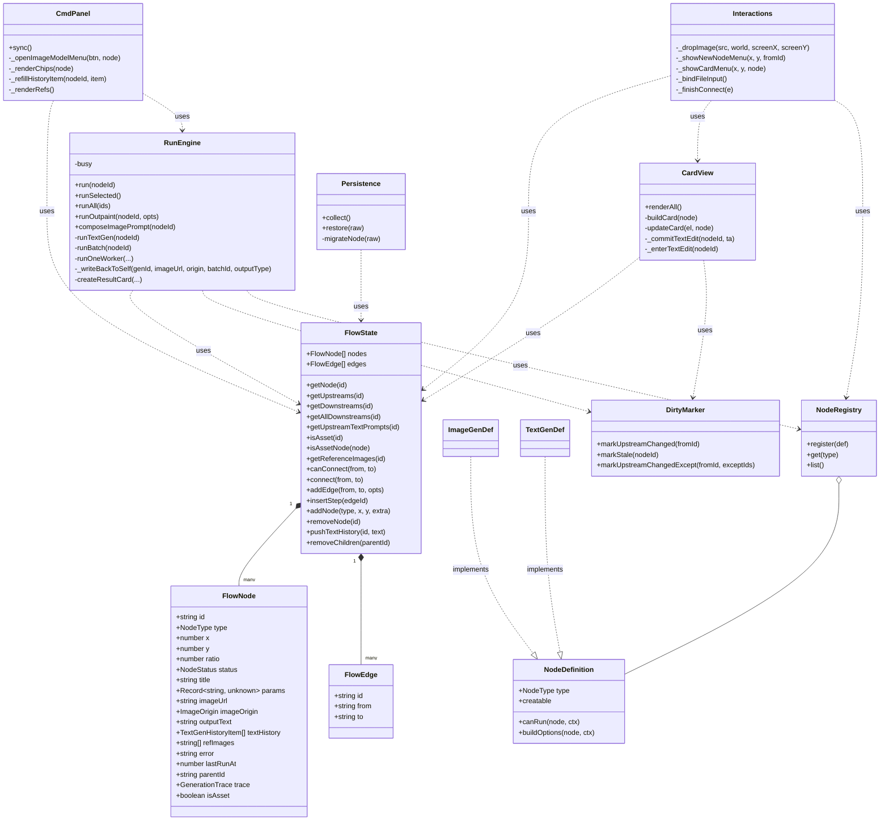
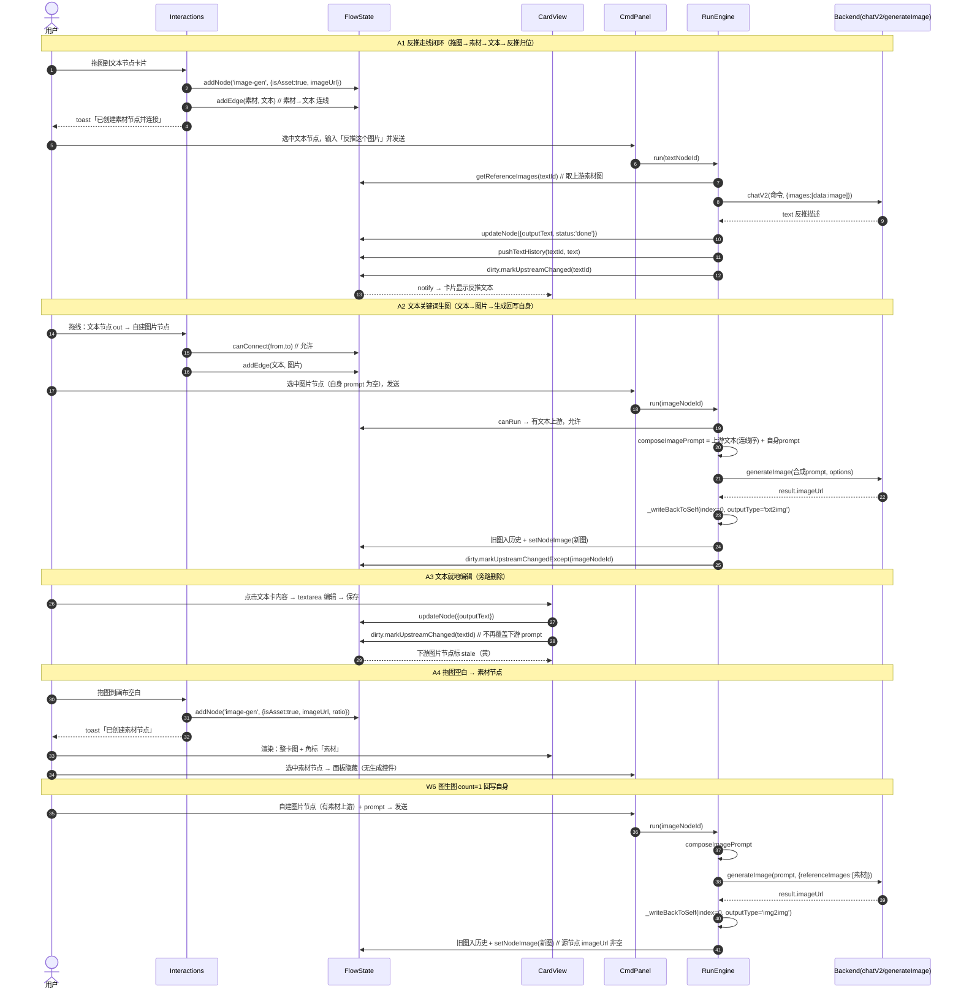

# 文本走线 + 反推归位 · 实施设计

> 日期：2026-08-18
> 性质：增量实施设计（施工蓝图）——基于用户逐轮拍板的需求敲定版 + 增量 PRD，**只做双卡模型上的轻量改造**，不引入三类节点/空壳卡、不动持久化版本、不写迁移、后端零改动、不做一键重跑链/视频节点/素材 CRUD。
> 上游：`文本走线-需求敲定-2026-08-18.md`（最高权威）、`文本走线-增量PRD-2026-08-18.md`（次权威）、主理人汇总的 Q1-Q7 拍板结果。
> 代码基线：commit cc506bc（已核实 run-engine / flow-state / interactions / cmd-panel / card-view / nodes / persistence 现状）。

---

## 1. 实现方案概述

四条主线（对应原始需求 ①-④），均基于「线即真相」原则：

| 主线 | 技术路线 | 新增 vs 增强 vs 删除 |
|---|---|---|
| **反推归位** | 反推从「image-gen 隐藏开关 + 游离 text 节点」改为「文本节点显式执行」：文本节点有图片上游（素材/自建 imageUrl）时，`runTextGen` 把 `data:image` 图附带进 `chatV2 options.images`，命令照常，结果写回**自身 outputText + textHistory** | 增强 `runTextGen`；**删除** `runImageReverse`；**删除** image-gen `modelType='text'` 反推分支及指令面板双 tab UI |
| **文本走线** | 删除旁路 `applyTextToDownstream`（不再偷偷覆盖下游 image-gen `params.prompt`）；文本变化三处联动统一为「写 outputText + `dirty.markUpstreamChanged` 标下游 stale」；image-gen 生成 prompt 收口为单一入口 `composeImagePrompt`（上游文本按连线序拼接 + 自身 prompt 非空追加） | **删除** `applyTextToDownstream`；**新增** `composeImagePrompt` / `getUpstreamTextPrompts`；**增强** `canRun` 放宽 |
| **生成回写** | 图生图/文生图 count=1 统一回写自身（旧图入历史、新图覆盖 imageUrl）；锁定保护沿用（当前图锁定 → 不顶掉、改建产出节点 + toast）；count>1 保持现状（第 1 张回写自身（锁定则建产出）+ 第 2..N 张建产出节点） | **增强** `_writeBackToSelf`（参数化 outputType、写回条件从 `isTxt2Img && index===0` 放宽为 `index===0`）；**删除** runBatch 图生图汇总段「源节点清空 imageUrl」逻辑 |
| **素材节点（isAsset）** | 不新增 `image-asset` 类型：复用现有 image-gen 节点加 `isAsset` 顶层标记区分素材态。整卡显示图、角标「素材」、无指令面板、不可运行、可连线（作参考图/反推源）；拖图到空白 → 建素材节点；拖图到文本卡 → 自动建素材节点并建 素材→文本 连线 | **新增** `FlowNode.isAsset` 字段 + `flowState.isAsset()` 判定 + 素材渲染/面板/连线判分支；**改写** `_dropImage` 空白/文本分支 |

总体形态变化（用户拍板口径）：
- 节点规则：文本节点永远可运行、结果可编辑可顶掉；上传/拖入图 = 素材（只展示、不可运行、可连线）；自建图片节点 = 生成 + 结果回写自身可无限迭代。
- 连线组合：图片→文本（反推）、文本→图片（关键词）、图片→图片（参考图）均允许；**文本→文本、任何→素材 拒绝**。
- 不新增类型、不升级持久化版本、不写迁移、后端零改动。

---

## 2. 数据模型变更

### 2.1 `FlowNode` 新增 `isAsset` 字段（唯一的模型变更）

```ts
interface FlowNode {
  // ... 既有字段不变
  isAsset?: boolean;  // 素材态标记（仅 image-gen 节点为素材时 true；text-gen / 自建 image-gen 缺省 undefined/false）
}
```

- **位置**：节点**顶层字段**（与 `parentId` 同类），不放进 `params`——它是节点形态标记而非生成参数，params 是生成/命令参数。
- **类型**：`boolean | undefined`（缺省 undefined，序列化时不输出 key，最小化 diff）。
- **序列化**：`persistence.collect()` 用 `{ ...n }` 展开已自动携带 isAsset；`flowState.replaceAll()` / `_cloneNode()` 用 `...n` 展开自动保留；**唯一需显式补的是 `persistence.migrateNode()` 的 image-gen / image-result 分支**（显式构造对象，需加 `isAsset: r.isAsset === true`），否则打开旧文件重存会丢标记。
- **判定辅助**：`flowState.isAsset(id)` / `flowState.isAssetNode(node)`，所有判分支统一调用，禁止散落 `node.isAsset === true` 的判断写法。

### 2.2 `StyleTransferParams` 不动

- `modelType?: 'draw' | 'text'` 字段**保留**（旧文件兼容），但**运行时忽略**：canRun 不再读它、引擎不再分派、UI 不再展示。旧 `modelType='text'` 节点按 draw 处理（Q7）。
- `textModel` 字段保留但不再被 UI/引擎使用（旧数据残留无害）。

### 2.3 持久化版本不动

- `.icproj` 保持 `version: '3.4'`，不升级、不写迁移。`isAsset` 作为节点字段随序列化透传即可。
- `FlowEdge` **不新增排序字段**：Q2 排序键 = `flowState.edges` 数组索引（`addEdge` 按 push 顺序 append、`removeEdge` filter 保持相对顺序，故数组顺序天然=连线建立顺序）。`getEdgesTo(id)` 返回顺序即建立顺序。

---

## 3. 关键机制设计

### 3.1 runTextGen 接入上游图（反推归位）

```
runTextGen(nodeId):
  1. 快照命令 instruction / 当前 outputText / buildOptions（model）
  2. refs = flowState.getReferenceImages(nodeId)   // 上游素材/自建图 imageUrl（去重保序，一层）
  3. 若 refs 非空：
       dataImages = refs.filter(u => u.startsWith('data:image'))
       若 dataImages.length === 0 → fail + toast「图片格式不支持反推」（W2-4，不静默丢图）
       否则 options.images = dataImages
  4. chatV2(user, { ...options, metaPrompt: system })   // 命令照常（反推命令由用户输入）
  5. 成功 → 写回自身 outputText + pushTextHistory + dirty.markUpstreamChanged(nodeId) + appendTrace + toast
  6. 失败 → fail + 原因；finally 清 instruction（现状保留）
```

- 无图片上游 → 走普通文本处理（不附图），行为不变。
- 多张上游图（多素材连一文本）：**全部 data:image 一并传入**（chatV2 支持 images 数组）。详见 §8 待明确。
- 反推命令由用户在文本节点指令框输入（如「反推这个图片」），不再是 image-gen 上的开关。

### 3.2 删除旁路：applyTextToDownstream 移除

- 删除 `run-engine.ts` 的 `applyTextToDownstream` 导出函数。
- 三处调用点统一改为「写 outputText + `dirty.markUpstreamChanged(nodeId)`」（该函数语义=全下游 BFS 标 stale，含 dirty/notify）：

| 调用点 | 现状 | 改为 |
|---|---|---|
| run-engine `runTextGen` 成功分支 | `applyTextToDownstream(nodeId, text)` | `dirty.markUpstreamChanged(nodeId)` |
| card-view `_commitTextEdit`（就地编辑保存） | `applyTextToDownstream(nodeId, newText)` | `dirty.markUpstreamChanged(nodeId)` |
| cmd-panel `_refillHistoryItem`（历史回填） | `applyTextToDownstream(nodeId, item.text)` | `dirty.markUpstreamChanged(nodeId)` |

- 效果：文本变化后**下游 image-gen 的 `params.prompt` 保持原值**（trace 可见、线即真相），仅状态标 stale（黄）。

### 3.3 prompt 合成单一入口（文本走线）

- `flowState.getUpstreamTextPrompts(nodeId): string[]`：直接上游中 `type==='text-gen'` 且 `outputText` 非空的节点，按 `getEdgesTo(nodeId)` 顺序（=连线建立顺序，Q2）返回 `outputText.trim()`。只取一层，不做 BFS。
- `runEngine.composeImagePrompt(nodeId): string`（**唯一入口**，禁止其它地方拼 prompt）：
  ```
  parts = flowState.getUpstreamTextPrompts(nodeId)   // 上游文本（连线序）
  own = (params.prompt || '').trim()
  if own: parts.push(own)                             // 自身 prompt 非空追加在后（Q5）
  return parts.join('\n')                             // 分隔符=换行（Q2 建议）
  ```
- `runBatch` 中 `const prompt = this.composeImagePrompt(nodeId)` 替代 `(params.prompt || '').trim()`。
- `canRun`（draw）放宽：自身 prompt 空但有文本上游 → 允许运行；两者皆空 → 拒绝「请输入提示词」（W3-3）。
- W3-4（P1）：cmd-panel 显示只读「最终 prompt 预览」= `composeImagePrompt(nodeId)` 的结果。

### 3.4 生成回写统一（改动点 6，Q1 拍板）

- `runOneWorker` 写回条件：`isTxt2Img && index === 0` → **`index === 0`**（文生图/图生图统一：每批第 1 张写回自身）。
  - 锁定保护保留：写回前 `assetStore.isLockedByImageUrl(gen.imageUrl)` → 不写回、改建产出节点（`createResultCard`）+ 现状 toast 语义。
  - `index > 0`（第 2..N 张）→ 各建产出节点（W6-3，一张卡只承载一张主图）。
- `_writeBackToSelf` 参数化：新增 `outputType: 'txt2img' | 'img2img'`（默认 `'txt2img'`），透传到 `historyDrawer.addImage` 与 `buildImageTrace`/`appendTrace`，保证图生图回写的旧图入历史与 trace 标记正确。
- **删除** `runBatch` 汇总段的图生图「源节点旧 imageUrl 入历史后清空」逻辑（现 401-422 行）：图生图运行成功后源节点 `imageUrl` 非空且为新图（W6-2），不再变回「空生成器」。
- `isTxt2Img` 变量保留，仅用于 `outputType` 标记与 refs 透传，不再决定回写/清空分支。

### 3.5 isAsset 素材节点（改动点 5，Q3 拍板）

**创建路径**：
1. 拖图/选图到**画布空白** → `_dropImage` 空白分支改为建素材节点：`addNode('image-gen', x, y, { isAsset: true, imageUrl: src, ratio: r, status: 'idle' })`（替代现状「新建生成节点 refImages=[src]」）。W5-1。
2. 拖图/选图**落到文本节点卡片** → 自动建素材节点 + `addEdge(素材, 文本)`（素材→文本 连线），toast「已创建素材节点并连接」；不再报「文本节点不接收图片」（W1-3/Q4）。
3. 拖图/选图落到**自建 image-gen 卡片** → 保留现状 `addRefImage`（追加参考图）。
4. 拖图落到**素材节点** → 拒绝（素材是链首数据，不接收上游），toast 提示。

**形态**：
- 渲染：整卡显示图（`mainSrc = node.imageUrl`，现有逻辑已满足）；卡片加 `pcard-asset` class + 角标「素材」。
- 指令面板：选中素材节点 → 面板隐藏（不显示模型/比例/发送/历史等任何生成控件；W5-2）。
- 不可运行：`image-gen.canRun` 首行 `if (node.isAsset) return '素材节点不可运行'`；右键菜单不显示「运行当前卡/重新运行」。
- 保留图片卡既有能力：双击查看大图、采纳/锁定角标、删除、拖动（W5-4，现有机制天然覆盖）。
- 连线：可作 **from**（→ 自建 image-gen 参考图、→ 文本反推源）；不可作 **to**（canConnect 拒绝）。`getReferenceImages` 语义不变：上游素材节点 `imageUrl` 自动贡献（现有 `u.imageUrl ? [u.imageUrl]` 分支已覆盖，素材节点无 refImages）。

**isAsset 判分支清单（务必列全，防漏判）**：

| # | 判分支位置 | 行为 |
|---|---|---|
| 1 | `nodes/image-gen.ts` `canRun` | 首行返回「素材节点不可运行」（数据层闸门） |
| 2 | `engine/run-engine.ts` `run()` 分派前 | `isAsset(nodeId)` → 静默 return（不 toast、不设 busy），防 run-all 噪音 |
| 3 | `ui/cmd-panel.ts` `sync()` 最前 | 素材节点 → 隐藏面板并 return（含默认模型回填跳过） |
| 4 | `state/flow-state.ts` `canConnect` | `to` 是素材 → 拒绝「素材节点不能作为输入」 |
| 5 | `state/flow-state.ts` `insertStep` | `to` 是素材/text-gen → 拒绝插入步骤（W1-4 防御） |
| 6 | `canvas/interactions.ts` `_showCardMenu` | 素材节点不显示「运行当前卡」「重新运行」 |
| 7 | `canvas/interactions.ts` `_dropImage` / `_bindFileInput` | 拖图/选图落到素材 → 拒绝并提示 |
| 8 | `canvas/interactions.ts` `_showNewNodeMenu` | from=素材 可作 from 新建下游；菜单不出现「新建素材」项（无入口，天然满足） |
| 9 | `canvas/card-view.ts` `buildCard`/`updateCard` | 素材角标「素材」+ `pcard-asset` class；主视觉=imageUrl |
| 10 | `canvas/card-view.ts` dblclick | 双击查看大图（素材 imageUrl 非空，现状已满足，确认不回归） |
| 11 | `engine/run-engine.ts` `runAll`/`runSelected` | 经 `run()` 静默跳过（无需额外改，确认） |
| 12 | `state/flow-state.ts` `getReferenceImages` | 上游素材 imageUrl 自动贡献（语义不变，确认无遗漏） |
| 13 | `ui/compare-panel.ts` `_comparableNodes` | image-gen + imageUrl → 素材自动可对比（符合「素材也是图」语义，零改动） |
| 14 | `persistence.ts` `migrateNode` | image-gen/image-result 分支补 `isAsset` 透传（防重开丢失） |
| 15 | `reproduce.ts` | 素材 trace=null → 无「复现」入口（天然满足） |
| 16 | 画布右键「新建节点」菜单 | 无素材项（天然满足，确认） |

### 3.6 canConnect 放开（改动点 1，W1-1）

```
canConnect(from, to):
  节点存在 / from===to / 重复边 → 不变
  to 是素材节点            → 拒绝「素材节点不能作为输入」
  to 是 text-gen：
      from 是 text-gen     → 拒绝「暂不支持文本连文本」
      from 是 image-gen    → 允许（素材/自建图 → 文本，反推输入）  ★ 放开点
  from 是 text-gen：
      to 是 image-gen 自建 → 允许（关键词，现状保留）
      to 是 image-gen 素材 → 已被「to 素材拒绝」覆盖
  from 是 image-gen：
      to 是 image-gen 自建 → 允许（参考图，现状保留）
  _wouldCycle 防环 → 不变
```

- 素材→文本、图片→文本、文本→图片、图片→图片 全部放行；文本→文本、任何→素材 拒绝。

---

## 4. 接口 / 函数变更清单

| 文件 | 函数/常量 | 变更 |
|---|---|---|
| `types/flow.d.ts` | `FlowNode` | + `isAsset?: boolean`；注释更新 |
| `state/flow-state.ts` | `canConnect(from,to)` | 组合判定重写（§3.6） |
| | `isAsset(id)` / `isAssetNode(node)` | **新增**：统一素材判定 |
| | `getUpstreamTextPrompts(id)` | **新增**：上游文本（连线序，一层） |
| | `insertStep(edgeId)` | to=text-gen 或 isAsset 拒绝（防御） |
| | `replaceAll` / `_cloneNode` / `addNode` | `...n` 展开自动透传 isAsset（确认，无需代码改动） |
| | `getReferenceImages(id)` | 语义不变（确认素材上游自动贡献） |
| `nodes/image-gen.ts` | `canRun(node, ctx)` | 删 modelType==='text' 分支；首行 isAsset 拒绝；draw 放宽（自身 prompt 空但有文本上游 → true） |
| | `buildOptions` | 不变（prompt 合成在引擎） |
| `nodes/text-gen.ts` | `canRun` / `buildOptions` | 不变（仅注释更新：反推归位到文本节点） |
| `engine/run-engine.ts` | `applyTextToDownstream` | **删除**导出（三处调用改 dirty） |
| | `run(nodeId)` | 删 image-gen+modelType==='text' 分派；isAsset 静默 return |
| | `runImageReverse` | **整方法删除** |
| | `runTextGen(nodeId)` | 接入上游图（data:image 过滤 + 前置校验 W2-4）；成功分支改 dirty.markUpstreamChanged |
| | `composeImagePrompt(nodeId)` | **新增**：prompt 合成唯一入口 |
| | `runBatch(nodeId)` | prompt 用 composeImagePrompt；删图生图汇总段清空逻辑；isTxt2Img 仅作 outputType 标记 |
| | `runOneWorker(...)` | 写回条件 `index===0`（不再限 isTxt2Img）；锁定检查保留 |
| | `_writeBackToSelf(genId, imageUrl, origin, batchId, outputType)` | 参数化 outputType |
| `canvas/interactions.ts` | `_showNewNodeMenu` | 候选按 from 类型过滤（from=图片 → [文本,图片生成]；from=文本 → [图片生成]） |
| | `_dropImage` | 空白→建素材节点；落到文本卡→自动建素材+连线；落到素材→拒绝 |
| | `_bindFileInput` | 与 _dropImage 同口径（文本分支自动建素材+连线） |
| | `_showCardMenu` | isAsset → 不显示运行/重跑项 |
| `ui/cmd-panel.ts` | import | 删 `applyTextToDownstream`（改 dirty） |
| | `_openImageModelMenu` | 删双 tab → 仅绘图模型列表（W2-2） |
| | `sync()` | 素材节点隐藏面板；删 isImageReverse / reverse class / 反推占位符 |
| | `_runHint` | 删反推分支 |
| | `_renderChips` | 删 modelType==='text' 分支 |
| | `_refillHistoryItem` | 改 dirty.markUpstreamChanged（W4-3） |
| | （P1）prompt 预览行 | 显示 composeImagePrompt 只读结果（W3-4） |
| `canvas/card-view.ts` | `_commitTextEdit` | 改 dirty.markUpstreamChanged（W4-1） |
| | `buildCard` / `updateCard` | 素材角标「素材」+ `pcard-asset` class；text-gen 空态文案（P1：有图片上游→「已连接上游图，可反推」，W2-5） |
| `persistence.ts` | `migrateNode` | image-gen / image-result 分支 + `isAsset: r.isAsset === true` |
| `styles/app.css` | `.pcard-asset-badge` 等 | **新增**素材角标样式 |
| `ui/compare-panel.ts`、`reproduce.ts`、`api.ts`、`state/dirty.ts`、`state/history.ts`、`nodes/node-registry.ts`、`canvas/canvas-view.ts` | — | **预期零改动**（回归验证确认） |

---

## 5. 涉及文件清单（相对路径 + 改动点）

| 文件（相对 `src/v1/`） | 改动点（逐条） |
|---|---|
| `types/flow.d.ts` | ① FlowNode + `isAsset?: boolean`；② StyleTransferParams.modelType 注释标注「保留字段、运行时忽略（旧数据容错）」 |
| `state/flow-state.ts` | ① canConnect 重写（§3.6）；② + `isAsset(id)`/`isAssetNode(node)`；③ + `getUpstreamTextPrompts(id)`；④ insertStep 防御 to=text-gen/isAsset；⑤ 注释说明 edges 数组顺序=连线建立顺序（Q2 排序键） |
| `nodes/image-gen.ts` | ① canRun：删 modelType==='text' 分支；② 首行 isAsset 拒绝；③ draw 放宽（hasOwnPrompt || hasUpstreamText）；④ 注释更新 |
| `nodes/text-gen.ts` | ① 注释更新（反推归位：文本节点运行时可带上游图；textModel 无 UI） |
| `engine/run-engine.ts` | ① 删 `applyTextToDownstream` 导出；② run() 分派改造（删 reverse 分支、isAsset 静默 return）；③ 删 `runImageReverse` 整方法；④ `runTextGen` 接入上游图（data:image 过滤 + W2-4 前置校验 + 成功分支改 dirty）；⑤ + `composeImagePrompt`；⑥ `runBatch` prompt 合成 + 删图生图汇总段清空逻辑；⑦ `runOneWorker` 写回条件 `index===0`；⑧ `_writeBackToSelf` 参数化 outputType |
| `canvas/interactions.ts` | ① `_showNewNodeMenu` 按 from 类型过滤；② `_dropImage` 三分支重构（空白→素材、文本卡→自动建素材+连线、素材→拒绝）；③ `_bindFileInput` 同口径；④ `_showCardMenu` isAsset 隐藏运行项 |
| `ui/cmd-panel.ts` | ① import 改 dirty；② `_openImageModelMenu` 删双 tab；③ `sync()` 素材隐藏 + 删 reverse 逻辑；④ `_runHint`/`_renderChips` 删反推分支；⑤ `_refillHistoryItem` 改 dirty；⑥ P1 prompt 预览 |
| `canvas/card-view.ts` | ① `_commitTextEdit` 改 dirty；② 素材角标「素材」+ `pcard-asset` class；③ P1 text-gen 空态文案（有图片上游时） |
| `persistence.ts` | ① `migrateNode` image-gen/image-result 分支 + `isAsset: r.isAsset === true` |
| `styles/app.css` | ① + `.pcard-asset-badge` 角标样式（及选中态无面板时的视觉确认） |
| `ui/compare-panel.ts` 等其余文件 | 预期零改动（回归验证） |

---

## 6. 任务列表（有序、含依赖）

> 4 个任务（≤5），按依赖排序；每个任务含目标文件 + 验收要点（对齐 PRD W1-W6 ID 与 A1-A5）。

### T01 数据模型与连线规则（改动点 1 + Q3/Q7 数据模型）
- **目标文件**：`types/flow.d.ts`、`state/flow-state.ts`、`persistence.ts`、`canvas/interactions.ts`（仅 W1-2/W1-3）
- **依赖**：无（首个任务）
- **优先级**：P0
- **内容**：FlowNode.isAsset 字段；canConnect 组合判定放开（图片→文本 允许、文本→文本 拒绝、任何→素材 拒绝）；isAsset/isAssetNode 判定；getUpstreamTextPrompts；insertStep 防御；migrateNode isAsset 透传；拖线松手新建菜单按 from 过滤；拖图到文本卡自动建素材节点并连线。
- **验收要点**：W1-1（图片→文本可建边；文本→文本、任何→素材返回拒绝原因）；W1-2（from=图片 → 候选含文本；from=文本 → 仅图片生成）；W1-3（拖图到文本卡 → 出现素材节点 + 素材→文本 连线，不再报「文本节点不接收图片」）；W1-4（to=text-gen 仍提示不能插步骤）；A5 部分（打开/保存含素材节点项目不丢标记）。

### T02 引擎核心：反推归位 + 文本走线 + 生成回写（改动点 2/3/6 引擎侧）
- **目标文件**：`engine/run-engine.ts`、`nodes/image-gen.ts`、`nodes/text-gen.ts`、`canvas/card-view.ts`（仅 `_commitTextEdit` 联动）
- **依赖**：T01
- **优先级**：P0
- **内容**：runTextGen 接入上游图（data:image 过滤 + W2-4 前置校验）；删 runImageReverse；删 applyTextToDownstream（引擎 + card-view 两处调用改 dirty.markUpstreamChanged）；composeImagePrompt 单一入口 + runBatch 使用；image-gen canRun 重写（isAsset 拒绝 + draw 放宽 + 删反推分支）；runBatch/runOneWorker 回写统一（index===0 写回自身、图生图不再清空 imageUrl、_writeBackToSelf 参数化 outputType）。
- **验收要点**：W2-1（文本节点有图片上游 → 运行后 outputText 为反推描述；无上游 → 普通文本处理）；W2-3（旧 modelType='text' 节点按 draw 运行不报错）；W2-4（非 data:image 上游 → fail + 明确原因）；W3-1（文本结果变化后下游 prompt 不变、仅标 stale——run-engine 成功分支口径）；W3-2（连 2 个文本 → trace 的 prompt 含两段按连线序；自身 prompt 追加在后）；W3-3（只连文本上游不填 prompt 可运行；两者皆空仍拒绝）；W6-1/2/3（图生图 count=1 回写自身、旧图可历史见、源节点 imageUrl 非空；count=3 → 1 张自身 + 2 张产出；锁定图重跑 → 建产出节点）；A1/A2 主体。

### T03 素材节点 + 指令面板 + 渲染（改动点 4/5 + W2-2 面板删反推 UI）
- **目标文件**：`ui/cmd-panel.ts`、`canvas/interactions.ts`（拖图空白建素材、文件选择器、右键菜单）、`canvas/card-view.ts`（素材角标、空态文案）、`styles/app.css`
- **依赖**：T01、T02
- **优先级**：P0（含 P1 项 W2-5/W3-4，可延后但建议一并交付）
- **内容**：_dropImage 空白→素材节点、素材→拒绝；指令面板删文本模型 tab/反推 UI、素材节点隐藏面板、_refillHistoryItem 改 dirty；卡片素材角标「素材」+ 样式；P1：文本节点有图片上游空态文案、最终 prompt 预览。
- **验收要点**：W2-2（image-gen 面板无「文本模型/反推」入口，模型 chip 仅绘图）；W4-3（历史回填 → 下游 prompt 不变、仅标 stale）；W5-1（拖图空白 → 素材节点整卡显图、角标「素材」、不可运行）；W5-2（选中素材节点无生成控件；新建菜单无素材项）；W5-3（素材→自建图 连线运行=图生图；素材→文本 连线运行=反推）；W5-4（素材可双击看大图、采纳/锁定、删除、拖动）；A3（就地编辑保存后下游 prompt 不变、仅标 stale）；A4 主体。

### T04 集成验证与回归（全量）
- **目标文件**：全部改动文件交叉验证 + `ui/compare-panel.ts` / `reproduce.ts` / `api.ts` / `state/dirty.ts` 等零改动文件确认
- **依赖**：T01、T02、T03
- **优先级**：P0
- **内容**：编译通过（`npm run build` / tsc）；按 §7 回归清单逐项手工验证；修复集成期问题（如有，改动计入对应文件）。
- **验收要点**：A1-A5 全量；§7 回归清单全绿；isAsset 判分支清单（§3.5 表 16 项）逐项确认无漏判。

---

## 7. 回归影响面（回归清单）

| # | 影响面 | 预期 | 验证方式 |
|---|---|---|---|
| 1 | 锁定保护 | 回写自身前锁定检查保留（锁定 → 建产出节点 + toast）；removeChildren 锁定保护不变 | 锁定图重跑文生图/图生图 |
| 2 | 脏标记 | 文本三处联动改 dirty.markUpstreamChanged（全下游 BFS 标 stale 语义不变） | 编辑文本 → 下游标黄 |
| 3 | 历史 | textHistory 保留可回填；图生图回写旧图入历史（outputType 正确标记 img2img） | 图生图 count=1 后查历史图库 |
| 4 | 资产 | 采纳/锁定角标不变；素材节点可用采纳/锁定 | 素材节点点角标 |
| 5 | 对比面板 | 素材节点计入可对比（image-gen+imageUrl）；文本不计入（不变） | 多选素材+成图对比 |
| 6 | 拖入画布 | 拖图空白 → 素材节点（行为变更，A4 验收）；拖图到自建图卡 → 仍追加参考图 | 三种拖放目标 |
| 7 | 撤销/重做 | 拖图建素材+自动连线在一次 record 后（一步撤销）；引擎回写 suspend 不入栈 | 撤销拖图/回写 |
| 8 | 文生图现状 | count=1 回写自身（不变）；count>1 第 1 张回写 + 2..N 产出（不变） | 文生图 count=1/3 |
| 9 | 图生图现状 | count=1 回写自身（变更）；count>1 第 1 张回写 + 2..N 产出（变更，原清空逻辑删除） | 图生图 count=1/3 |
| 10 | 反推 UI | image-gen 面板不再有文本模型 tab（变更）；文本节点面板承担反推命令 | 选中 image-gen / text-gen 面板 |
| 11 | 旧数据 | modelType='text' 节点按 draw 处理（params.model 空则提示选绘图模型）；游离 text 节点保留为普通文本节点 | 打开旧反推项目 |
| 12 | 扩图/复现 | runOutpaint 独立链路不受影响；reproduce 强制 modelType=draw 不受影响 | 扩图、复现入口 |
| 13 | 空态 | 拖图空白不再建「refImages 生成节点」——若有旧交互依赖需更新（A4 口径） | 拖图空白 |
| 14 | 多选运行 | run-all 含素材节点 → 静默跳过不 toast 噪音 | 选中素材+成图 run-all |

---

## 8. 共享知识（跨文件约定与风险点）

### 8.1 跨文件约定

1. **isAsset 判定唯一入口**：一律 `flowState.isAsset(id)` / `flowState.isAssetNode(node)`，禁止散落 `node.isAsset === true`。判分支清单见 §3.5 表（16 项），新增任何节点入口（新菜单/新面板/新引擎入口）必须先查该表。
2. **prompt 合成唯一入口**：`runEngine.composeImagePrompt(nodeId)`——上游文本（`flowState.getUpstreamTextPrompts` 连线序拼接 `\n`）+ 自身 `params.prompt`（非空追加在后）。任何地方不得自行拼接（trace / 面板预览 / 引擎统一走它）。
3. **文本变化三处联动口径统一**：运行成功 / 就地编辑 / 历史回填 = 写 `outputText` + `dirty.markUpstreamChanged(nodeId)`；**永不覆盖下游 prompt**（旁路已删除）。
4. **反推 data:image 约束**：chatV2 只接受 `data:image` 前缀图（api.ts 已过滤）；引擎前置校验——上游图存在但无 data:image → fail + toast「图片格式不支持反推」，不静默丢图。
5. **连线顺序即真相**：Q2 排序键 = `flowState.edges` 数组索引（建立顺序）；`addEdge` push、`removeEdge` filter 保持相对顺序；不得在 restore/排序处打乱 edges 顺序。
6. **生成回写口径（Q1）**：每批第 1 张（index=0）写回自身（旧图入历史、新图覆盖 imageUrl）；当前图锁定 → 不写回、建产出节点 + toast；第 2..N 张建产出节点。文生图/图生图统一。
7. **后端零改动**：chatV2 / generateImage 接口不变；data:image 约束沿用。
8. **旧数据容错（Q7）**：`modelType='text'` 运行时忽略、按 draw 处理；`textModel` 残留无害；不写迁移、不弹反推 UI。

### 8.2 风险点

1. **isAsset 漏判**：最大风险。素材节点形态与 image-gen 相同，任何未判分支的入口（运行/面板/连线/菜单/拖放）都会把素材当生成节点处理。施工按 §3.5 表逐项核对；验收 T04 逐项走查。
2. **回写顶掉与锁定/产出节点边界**：index=0 写回自身与锁定建产出节点分支必须互斥且全覆盖（locked → 建产出，绝不顶掉锁定图）；count>1 时第 1 张写回自身后，第 2..N 张建产出节点——注意批次内并发的游标布局与 source 节点位置（现状已处理）。
3. **旧 modelType='text' 节点容错**：其 `params.model` 可能为空（只有 textModel）——按 draw 运行会提示「请先选择绘图模型」，属可接受容错（用户重选），不得为兼容而重新启用 text 分支。
4. **图生图回写后的 getReferenceImages 语义**：回写自身后源节点 imageUrl=新图，下游自动取新图作参考图（语义不变）；用户挂载的 refImages 与上游素材图仍贡献——符合「线即真相」。
5. **拖图行为变更**：拖图空白从「建生成节点」变为「建素材节点」——涉及旧交互心智，A4 验收重点；若用户要生成图需显式新建图片节点再连线或写 prompt。
6. **多文本拼接顺序**：依赖 edges 数组顺序，删除/重建连线会改变拼接顺序（符合「按连线建立顺序」语义）；若未来需要稳定排序可给 FlowEdge 加 createdAt，本期不做。

### 8.3 待明确事项（施工默认值，如有异议需主理人确认）

1. **反推多图**：多张素材图连同一文本节点时，默认把全部 `data:image` 一并传入 chatV2（多图反推）；若模型不支持多图，可降级为只取第一张（当前 runImageReverse 只取一张）。
2. **文件选择器对文本节点**：默认与拖图同口径（自动建素材节点并连线）；Q4 只明确拖图，选图路径保持一致降低心智成本。
3. **素材节点被拖图**：默认拒绝并 toast「素材节点不能添加参考图」（素材是链首数据）；备选是静默无操作。
4. **W2-5/W3-4（P1）**：空态文案与 prompt 预览为 P1 增强，本期建议一并交付但允许延后。

---

## 附：Mermaid 视图

### 类图（class-diagram）



### 时序图（sequence-diagram）



---

*（另存独立文件：`docs/class-diagram.mermaid`、`docs/sequence-diagram.mermaid`）*
