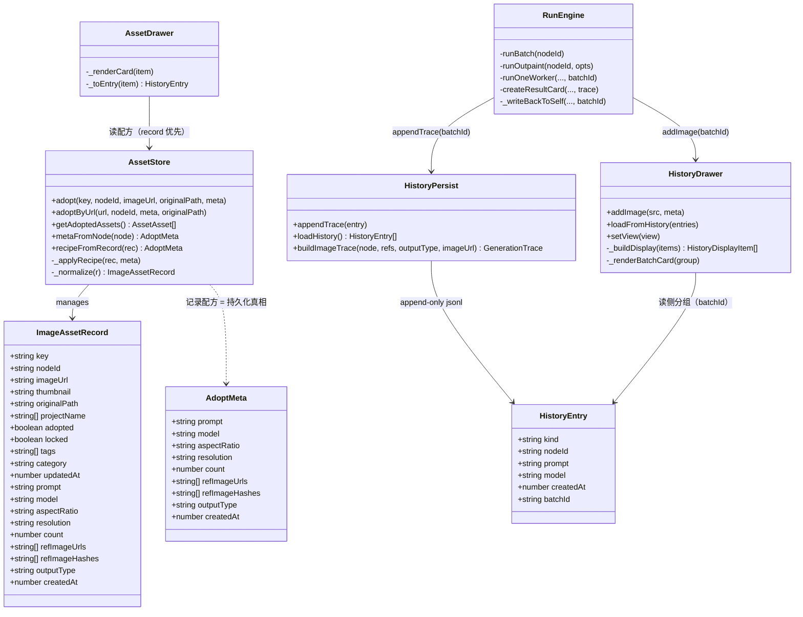
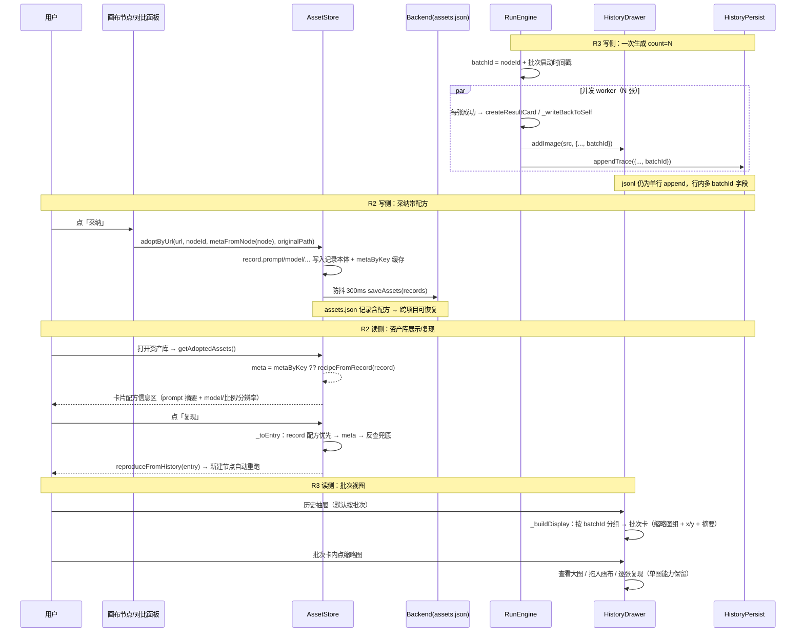

# 资产增强 · 实施设计（R2 资产配方持久化 + R3 历史批次分组）

> 日期：2026-08-18
> 编制：软件架构师 高见远（Gao）
> 上游：`资产增强-增量PRD-2026-08-18.md`（P0 仅 R2 + R3）、`项目总览与路线决策-2026-08-18.md`（决策 2/3、待施工路线①、约束 1-3）、`参考项目-图库资产库对比分析-2026-08-18.md`
> 代码核对（以下事实均已逐文件读取确认）：`src/v1/asset-store.ts`、`src/v1/history-persist.ts`、`src/v1/ui/history-drawer.ts`、`src/v1/ui/asset-drawer.ts`、`src/v1/types/flow.d.ts`、`src/v1/engine/run-engine.ts`、`src/v1/persistence.ts`、`src/v1/reproduce.ts`、`src/v1/canvas/card-view.ts`、`src/v1/ui/compare-panel.ts`、`src/v1/main.ts`、`src/index.html`、`backend/api/project_api.py`
> 性质：增量小改（前端 8 文件改、2 文件零改动核对、后端零改动），最小变更、可独立验证

---

## 0. 代码现状关键事实（设计前提）

在动手设计前，先固化以下与 PRD 直接相关的**代码事实**（防止设计与现状脱节）：

1. **采纳时 meta 根本没人传**：`card-view.ts:112` 与 `compare-panel.ts:139` 都调用 `assetStore.adoptByUrl(url, nodeId, undefined, node?.imageOrigin?.path)` —— **meta 恒为 `undefined`**。因此 `metaByKey`（内存缓存）实际上几乎从未被填充，资产库「复现」长期依赖 `historyDrawer.getEntryByImageUrl` 反查兜底；跨项目反查失败即「空白失败」。**R2 若只改 asset-store 而不改两个调用点，配方依然落不了盘。**
2. **`adopt()` 写 meta 的时机**：`adopt(key, nodeId, imageUrl?, originalPath?, meta?)` 中 `if (meta) this.metaByKey.set(key, meta)` 在 `if (rec.adopted) return;` **之前** → 重复采纳也会刷新 meta。设计上沿用该语义（配方刷新放记录上同样放 return 之前）。
3. **落盘链**：adopt → `_afterChange()` → `flowState.dirty=true` + `notify()` + `_persistDebounced()`（300ms 防抖）→ `Backend.saveAssets(this.list())`。配方字段只要写进 record，**自动**随现有防抖落盘，无新落盘路径。
4. **`_normalize` 是资产记录唯一的读盘归一入口**（`loadFromBackend` / `applySnapshot` 共用），新增字段必须在此容错（旧记录缺字段 → `undefined`，不报错）。
5. **history.jsonl 是后端单行 append**（`append_json_line`，逐行 `json.loads`，坏行跳过）；`loadHistory` 原样返回 entries。加可选 `batchId` 不改变单行模型、无需后端改动。
6. **trace 写点共 3 处**（run-engine）：`createResultCard`（新产出节点，L585-609）、`_writeBackToSelf`（文生图第 1 张写回自身，L523-533）、文本/反推两处 `appendTrace(buildTextTrace(...))`（**text 不入批次**）。img2img 旧图入历史的 `addImage`（L405-416）与 `_writeBackToSelf` 内旧图 `addImage`（L506-517）**只写内存、不 append jsonl**。
7. **资产记录读盘兼容**：后端 `_read_records` 兼容 v1（数组）/v2（`{version,records}`），记录本身透传，字段级容错全在前端 `_normalize`。**后端零改动**。
8. **历史抽屉当前无「查看大图」**：单图历史卡只有拖拽 + hover「复现」（`_renderImageItem`）；「查看大图」目前仅资产库有（`openImageModal`）。PRD A3/R3-4 要求批次卡缩略图保留「查看大图」→ 对批次卡是**新增能力**，需引入 `openImageModal`（注意循环依赖风险，见 §8）。
9. **抽屉默认行为**：history-drawer 默认 tab='image'；PRD Q1 主理人已拍板**默认「按批次」**。

---

## 1. 实现方案概述

### 1.1 R2 资产配方持久化 —— 写侧为主 + 读侧增强

**技术路线**：配方「随采纳落盘」= 把 `AdoptMeta` 字段写入 `ImageAssetRecord` 记录本体（`assets.json`），复用现有 300ms 防抖落盘；资产库读侧改为「记录配方优先」。

- **写侧（核心新增/增强）**：
  - `assetStore.adopt()` / `adoptByUrl()` 收到 meta 时，除写内存 `metaByKey` 外，**将配方字段合并写入记录本体**（新增私有 `_applyRecipe(rec, meta)`，仅覆盖非 undefined 字段，不整体替换）。
  - **两个调用点必须改为构造并传入 meta**（这是 R2 落地的必要前置，代码事实 1）：`card-view._handleBadgeClick`、`compare-panel._cellAdopt` 用节点 `node.trace`（有则）或 `node.params`（兜底）构造 `AdoptMeta`，新增共享 helper `assetStore.metaFromNode(node)`。
  - `_normalize` 扩展：对新增配方字段容错（旧记录 → `undefined`，不报错）。
- **读侧（增强）**：
  - 资产库卡片增加配方信息区（prompt 摘要 1-2 行截断 + model / 比例 / 分辨率）+ hover「复制配方」按钮；无配方显示「配方缺失（可经历史反查）」占位。
  - `asset-drawer._toEntry()` 优先级改为：**记录配方（持久化真相）→ metaByKey（会话缓存）→ historyDrawer 反查兜底**（原：meta → 反查）。
  - `getAdoptedAssets()` 在 `metaByKey` 未命中时用 `recipeFromRecord(rec)` 合成 meta，保持 `AssetAsset.meta` 契约可用。
- **兼容**：`hashRef` 主键、`adopted/locked` 三态语义、`projectName[]` 追加逻辑全部不动；新字段纯增量。

### 1.2 R3 历史批次分组 —— 写侧 batchId + 读侧分组

**技术路线**：jsonl 单行模型**不动**；写侧在生成批次时给每张成功图的行加可选 `batchId`；读侧在 history-drawer 内按 `batchId` 分组渲染批次卡。

- **写侧（新增）**：`run-engine` 在 `runBatch`（count=N）与 `runOutpaint`（count=1）启动时生成一次 `batchId`，经 `runOneWorker` 透传到 `createResultCard` / `_writeBackToSelf`，随 `historyDrawer.addImage`（内存）与 `historyPersist.appendTrace`（jsonl 行）写入。text 分支不生成。
- **读侧（新增）**：history-drawer 增加 `view: 'batch' | 'time'` 状态（默认 `'batch'`）+ 视图切换控件；`batch` 视图下 image tab 按 `batchId` 分组为批次卡（缩略图组 ≤4 +N、成功计数 `x/y`、配方摘要、逐图 查看大图/拖入画布/复现）；无 `batchId` 旧行回退单图卡。`time` 视图保持现有渲染（零改动路径）。
- **批次卡不损失单图能力**：每张缩略图保留拖拽（`application/history-image`）、hover「复现」、点击查看大图（新增，复用 `openImageModal`）。

### 1.3 新增 vs 增强一览

| 项 | 类型 | 说明 |
|---|---|---|
| `ImageAssetRecord` 配方字段（9 个可选） | 新增字段 | 纯增量，只增不改 |
| `HistoryEntry` image 分支 `batchId?` | 新增字段 | 只加字段，不改单行模型 |
| `adopt/adoptByUrl` 写配方入记录 | 增强 | 复用现有防抖落盘 |
| 两个采纳调用点传 meta | 增强（必要前置） | 现状传 undefined，是「复现空白」根因 |
| run-engine batchId 生成与透传 | 新增 | 3 个 trace/addImage 写点 |
| history-drawer 批次视图 | 新增 | 读侧分组，time 视图保持原样 |
| asset-drawer 配方展示/复制/复现优先 | 增强 | 记录配方优先 |
| 后端 | 零改动 | assets.json 记录透传、history.jsonl 单行 append 均无需变 |

---

## 2. 数据模型变更

### 2.1 `ImageAssetRecord` 新增可选配方字段（R2-1）

```ts
interface ImageAssetRecord {
  // ……现有字段全部保留（key/nodeId/imageUrl/thumbnail/originalPath/projectName/adopted/locked/tags/category/updatedAt）……
  // R2 新增（全部可选；缺失 = undefined，不写 null）
  prompt?: string;              // 生成提示词
  model?: string;               // "provider:key:model"
  aspectRatio?: string;         // '3:4' | '1:1' | '16:9' | 'Auto'
  resolution?: string;          // '1k' | '2k' | '4k'
  count?: number;               // 本批张数 1-4
  refImageUrls?: string[];      // 本次实际参考图 URL（复现直接可用）
  refImageHashes?: string[];    // 参考图指纹（hashRef）
  outputType?: string;          // 'txt2img' | 'img2img' | 'outpaint'
  createdAt?: number;           // 生成完成时间戳（trace.createdAt）
}
```

**兼容性说明**：
- `key`（hashRef 图指纹）仍是唯一主键，去重语义不变；`locked` 锁定语义不动（adopt 仍自动置 locked）。
- 新字段只从 `adopt`（带 meta）写入；`setLocked`/`unadopt`/`addTags` 不触碰配方字段。
- 旧 assets.json 记录无这些字段 → `_normalize` 归一为 `undefined` → 卡片显示「配方缺失」占位 + 保留反查兜底（R2-4）。
- 配方写入采用**合并语义**（`_applyRecipe` 只覆盖非 undefined 字段）：重复采纳/部分 meta 不会清空既有配方。

### 2.2 `HistoryEntry` image 分支新增 `batchId?`（R3-1）

```ts
// HistoryEntry image 分支（kind:'image'）增加：
batchId?: string;   // 一次生成的批次号（count=N 共用一个）；text 分支不加
```

**兼容性说明**：
- jsonl 仍是单行 append-only；旧行无 `batchId` → 读侧按单图回退展示（R3-4）。
- `GenerationTrace`（node.trace）**不加** batchId（trace 挂节点、语义是单张图的配方；批次分组只发生在历史读侧，避免污染节点模型）。

### 2.3 `AdoptMeta` 与记录本体的关系

- **持久化真相 = 记录本体**（R2 后 `ImageAssetRecord.prompt/model/...` 随 assets.json 落盘，跨项目/跨会话可恢复）。
- `metaByKey`（内存 Map）降级为**会话级快速缓存**：采纳时仍写一份（读侧少一次对象构造），重启后清空；`getAdoptedAssets()` 在未命中时用 `recipeFromRecord(rec)` 合成，保证 `AssetAsset.meta` 对外契约不变。
- 读侧统一入口 `asset-drawer._toEntry()` 的取数优先级：**record 配方 → metaByKey → historyDrawer 反查**（R2-3「复现优先从记录配方构造」）。

---

## 3. batchId 生成规则（主理人委托架构师定）

**规则**：

```
batchId = `${nodeId}_${startTs}`
```

- `nodeId`：生成节点（gen 节点）的 `node.id`，可读、可溯源到具体生成器；
- `startTs`：**批次启动时刻** `Date.now()`（十进制毫秒），在 `runBatch`/`runOutpaint` 内**生成一次**，同批全部成功图共用；
- 可读可溯：一眼知道「哪个节点、什么时候跑的一批」；同节点重跑 → `startTs` 不同 → batchId 不同，可区分；
- 示例：`a1b2c3d4_1723987654321`。

**为什么用批次启动时间而非完成时间**：worker 是并发、完成时序不定，写 trace 发生在各 worker 完成瞬间，批次「完成时间」在写第一条时不可知；启动时间在批次开头确定、天然共享，且语义为「这一次运行会话」。

**生成点与透传链**：

```
runBatch(nodeId)                        ── 生成 batchId = nodeId_startTs
  └─ runOneWorker(..., batchId)         ── 透传
      ├─ createResultCard(..., { outputType, refs, batchId })  → addImage(batchId) + appendTrace(batchId)
      └─ _writeBackToSelf(..., batchId) → 新图 appendTrace(batchId)；旧图 addImage 不带 batchId
runOutpaint(nodeId)                     ── 生成 batchId（单张也算一批）
  └─ createResultCard(..., { outputType:'outpaint', refs, batchId })
```

**边界约定**：
- 旧图入历史（img2img 清空分支 L405-416、`_writeBackToSelf` 旧图 L506-517）的 `addImage` **不带当前 batchId** —— 旧图属于上一次运行的批次，其历史 jsonl 行（若存在）已带原 batchId；内存副本按无 batchId 单图回退展示，与现状重复展示行为一致（非本次回归，见 §8 已知行为）。
- text-gen / 图片反推（`buildTextTrace`）**不生成 batchId**（Q5 拍板：text 不入批次）。
- 扩图（outpaint）生成 batchId（count=1 的批次），批次视图下显示为单张批次卡（或不显示计数、按单图处理均可，推荐按单张批次卡展示，便于与其它批次卡一致排序）。

---

## 4. 接口 / 函数变更清单

### 4.1 `src/v1/asset-store.ts`

| 函数 | 变更 |
|---|---|
| `adopt(key, nodeId, imageUrl?, originalPath?, meta?)` | 在 `if (rec.adopted) return;` **之前**新增：`if (meta) { this.metaByKey.set(key, meta); this._applyRecipe(rec, meta); }`（签名不变，行为增强） |
| `adoptByUrl(url, nodeId, meta?, originalPath?)` | 不变（内部走 adopt，自动受益） |
| `_getOrCreate(...)` | 新记录字面量**不加**配方字段（可选字段省略 = undefined），无需改动或仅注释说明 |
| `_normalize(r)` | 新增 9 个配方字段容错归一：字符串 → 非 string 置 `undefined`；数组 → `Array.isArray` 过滤 string；`count/createdAt` → number 校验 |
| `_applyRecipe(rec, meta)`（新增私有） | 合并写入配方字段，仅覆盖非 undefined 值；数组拷贝 |
| `metaFromNode(node): AdoptMeta`（新增导出） | 从 `node.trace`（优先）或 `node.params`（兜底）构造 AdoptMeta，供 card-view / compare-panel 采纳时传 meta |
| `recipeFromRecord(rec): AdoptMeta`（新增导出/私有） | 从记录配方字段合成 AdoptMeta（读侧合成 meta 用） |
| `getAdoptedAssets()` | `meta: this.metaByKey.get(rec.key) ?? recipeFromRecord(rec)`（保证跨会话 meta 不空） |

### 4.2 `src/v1/canvas/card-view.ts` / `src/v1/ui/compare-panel.ts`

| 函数 | 变更 |
|---|---|
| `_handleBadgeClick`（card-view L112） | `assetStore.adoptByUrl(url, node.id, assetStore.metaFromNode(node), node.imageOrigin?.path)` —— 传 meta |
| `_cellAdopt`（compare-panel L139） | `assetStore.adoptByUrl(url, nodeId, assetStore.metaFromNode(node), node?.imageOrigin?.path)` —— 传 meta |

### 4.3 `src/v1/engine/run-engine.ts`

| 函数 | 变更 |
|---|---|
| `runBatch(nodeId)` | 计算 `total` 后生成 `const batchId = \`${nodeId}_${Date.now()}\`;`，传入 `runOneWorker(..., batchId)` |
| `runOneWorker(genId, prompt, options, layout, progress, isTxt2Img, index, refs, batchId)` | 参数追加 `batchId: string`；成功分支传给 `createResultCard` / `_writeBackToSelf` |
| `createResultCard(genId, imageUrl, layout, paramOverrides, trace, origin)` | `trace` 参数扩展为 `{ outputType, refs, batchId? }`；`historyDrawer.addImage(..., { ..., batchId })` 与 `appendTrace({ ..., batchId })` 带上 batchId |
| `_writeBackToSelf(genId, imageUrl, origin, batchId)` | 追加参数 `batchId: string`；新图 `appendTrace` 带 batchId；旧图 `addImage` **不带** |
| `runOutpaint(nodeId, opts)` | 成功路径生成 `batchId`，`createResultCard` 的 trace 参数带 batchId |

### 4.4 `src/v1/ui/history-drawer.ts`

| 项 | 变更 |
|---|---|
| `HistoryItem` / `HistoryImageMeta` | 各加 `batchId?: string` |
| `addImage(src, meta)` | 透传 `batchId` |
| `loadFromHistory(entries)` | image 行解析 `batchId: typeof e.batchId === 'string' ? e.batchId : undefined` |
| 新增状态 | `private view: 'batch' | 'time' = 'batch'`（Q1 默认按批次） |
| `init()` | 绑定 `#history-view` 内 `.history-view-btn` 点击 → `setView(view)` + active class |
| `setView(view)`（新增） | 更新状态 + active class + `render()`；text tab 下视图不生效（text 不入批次） |
| `_filtered()` | 不变（tab + 搜索先过滤） |
| `_buildDisplay(items)`（新增） | image tab 且 view==='batch' 时按 `batchId` 分组：`Map<batchId, HistoryItem[]>`，无 batchId → single；输出 `HistoryDisplayItem[] = single | batch{ batchId, items }`，按组内最新时间戳倒序 |
| `_renderBatch(...)` | 渲染对象改为 display 项：single → 原 `_renderImageItem`；batch → 新增 `_renderBatchCard(group)` |
| `_renderBatchCard(group)`（新增） | 批次卡：缩略图行（≤4 +「+N」角标）、右上成功计数 `x/y`（x=组内行数，y=`items[0].count ?? x`）、配方摘要（首行 prompt 截断 + model · 比例）、逐缩略图保留 拖拽 / hover 复现 / 点击查看大图 |
| `_toEntry(item)` | 追加 `...(item.batchId ? { batchId: item.batchId } : {})` 保真 |

### 4.5 `src/v1/ui/asset-drawer.ts`

| 项 | 变更 |
|---|---|
| `_renderCard(item)` | 缩略图下方新增配方信息区：`prompt` 摘要（1-2 行截断，title 全文）+ `model · 比例 · 分辨率`；无配方显示「配方缺失（可经历史反查）」；hover 动作新增「复制配方」（`data-act="copy"`，无配方置灰 + title 提示） |
| `_toEntry(item)` | 取数优先级改为：**record 配方 → meta → historyDrawer 反查**；即 `const m = item.meta; const recPrompt = item.record.prompt; ...` 或复用 `recipeFromRecord(record)` 与 meta 合并（record 优先） |
| click handler | 新增 `act === 'copy'` → `navigator.clipboard.writeText(prompt)` + toast「已复制配方」 |

### 4.6 零改动核对（不改代码，仅回归确认）

- `src/v1/history-persist.ts`：`buildImageTrace` / `appendTrace` / `loadHistory` 签名与行为不变（batchId 由调用方在构造 HistoryEntry 时携带；类型在 flow.d.ts 加字段即可）。
- `src/v1/api.ts`：`appendHistory(entry: unknown)` / `saveAssets(records)` 契约不变。
- `src/v1/persistence.ts`：`save`/`open` 不变；assets.json 与 history.jsonl 读写自动兼容新字段。
- `src/v1/main.ts`：初始化与互斥编排不变（视图切换控件由 historyDrawer.init 自绑定）。
- `backend/api/project_api.py`：零改动（记录透传、单行 append 均无需变）。

---

## 5. 涉及文件清单

| # | 文件（相对路径） | 改动点 |
|---|---|---|
| 1 | `src/v1/types/flow.d.ts` | `ImageAssetRecord` 加 9 个可选配方字段（§2.1）；`HistoryEntry` image 分支加 `batchId?: string`；`AdoptMeta` 注释更新（说明已随记录落盘，不再「不持久化」） |
| 2 | `src/v1/asset-store.ts` | `adopt` 写配方入记录（`_applyRecipe`）；`_normalize` 配方容错；新增 `metaFromNode` / `recipeFromRecord`；`getAdoptedAssets` meta 合成 |
| 3 | `src/v1/canvas/card-view.ts` | 采纳调用点传 `assetStore.metaFromNode(node)` |
| 4 | `src/v1/ui/compare-panel.ts` | 采纳调用点传 `assetStore.metaFromNode(node)` |
| 5 | `src/v1/ui/asset-drawer.ts` | 卡片配方信息区 + 复制配方按钮 + 配方缺失占位；`_toEntry` 记录配方优先 |
| 6 | `src/v1/engine/run-engine.ts` | `runBatch`/`runOutpaint` 生成 batchId；`runOneWorker`/`createResultCard`/`_writeBackToSelf` 透传 batchId；addImage/appendTrace 带 batchId |
| 7 | `src/v1/ui/history-drawer.ts` | `batchId` 字段透传；`view` 状态 + `setView`；`_buildDisplay` 分组；`_renderBatchCard` 批次卡渲染（含逐图 查看大图/拖拽/复现）；`_toEntry` batchId 保真 |
| 8 | `src/index.html` | 历史抽屉 `#history-tabs` 下方加视图切换控件：`#history-view`（按批次/按时间两个 `.history-view-btn`） |
| 9 | `src/v1/styles/app.css` | `.history-view` 分段控件样式；`.history-batch*` 批次卡样式（缩略图行/计数徽标/摘要/+N）；`.asset-recipe*` 配方区样式（1-2 行截断 line-clamp/小字 chips/缺失占位）；复制按钮态样式 |
| — | `src/v1/history-persist.ts`、`src/v1/api.ts`、`src/v1/persistence.ts`、`src/v1/main.ts`、`backend/api/project_api.py` | **零改动**（回归核对项） |

---

## 6. 任务列表（按实现顺序，含依赖与验收）

> 约定：每个任务完成后需 `npx tsc --noEmit`（或项目内类型检查脚本）通过；验收要点以 PRD 验收标准 A1-A4 为主线。

### T1 数据模型与资产配方落盘（R2 数据层 + 静态骨架）

- **目标文件**：`src/v1/types/flow.d.ts`、`src/v1/asset-store.ts`、`src/index.html`
- **依赖**：无（基础设施，先行）
- **改动**：
  - flow.d.ts：ImageAssetRecord 配方字段、HistoryEntry.batchId、AdoptMeta 注释。
  - asset-store.ts：adopt 写配方入记录（_applyRecipe 合并语义）；_normalize 配方容错；metaFromNode / recipeFromRecord helper；getAdoptedAssets meta 合成。
  - index.html：历史抽屉视图切换控件静态骨架（空壳，样式与逻辑在 T3）。
- **验收要点**：
  - 采纳一张图（带 meta 的调用）后等待 >300ms，`assets.json` 中该记录含 prompt/model/aspectRatio/resolution/count/refImageUrls/refImageHashes/outputType/createdAt 字段。
  - 重启应用后 `loadFromBackend` 保留配方字段；旧 assets.json（无配方字段）加载不报错，卡片不白屏。
  - `_normalize` 对缺字段/坏类型（如 prompt 为数字）容错为 undefined。
  - hashRef 主键、locked 语义、projectName 追加行为无变化（A4 部分）。

### T2 采纳配方接线 + 资产库展示（R2 全链路收口）

- **目标文件**：`src/v1/canvas/card-view.ts`、`src/v1/ui/compare-panel.ts`、`src/v1/ui/asset-drawer.ts`、`src/v1/styles/app.css`（配方区样式）
- **依赖**：T1
- **改动**：
  - 两个采纳调用点构造并传 meta（`assetStore.metaFromNode(node)`，trace 优先、params 兜底）。
  - asset-drawer：卡片配方信息区渲染、hover「复制配方」、无配方占位；`_toEntry` 记录配方优先（record → meta → 反查）；copy 动作写剪贴板 + toast。
- **验收要点**：
  - A1：项目 A 采纳（画布角标或对比面板）→ 重启 → 切项目 B → 资产库卡片显示 prompt/model/比例/分辨率，点「复现」能重建节点并带参数（不空白失败）。
  - 旧记录（无配方字段、且跨项目无反查）：显示「配方缺失」占位，复现按钮仍可用但走兜底（有历史可反查时成功）。
  - 「复制配方」：有配方时复制 prompt 全文；无配方时置灰并提示。
  - 资产库搜索（prompt/model/tags）在配方持久化后跨项目仍可命中（record 优先）。
  - 取消采纳/锁定/查看大图/拖入画布行为不变。

### T3 R3 批次分组（写侧 batchId + 读侧批次卡）

- **目标文件**：`src/v1/engine/run-engine.ts`、`src/v1/ui/history-drawer.ts`、`src/v1/styles/app.css`（批次卡/视图切换样式）
- **依赖**：T1（不依赖 T2，可与 T2 并行；若工程师顺序实现则 T3 在 T2 之后）
- **改动**：
  - run-engine：runBatch/runOutpaint 生成 batchId（§3 规则）并透传至 createResultCard/_writeBackToSelf → addImage/appendTrace。
  - history-drawer：batchId 透传（addImage/loadFromHistory/_toEntry）；view 状态与切换；_buildDisplay 分组；_renderBatchCard 批次卡（缩略图组 ≤4 +N、成功计数 x/y、配方摘要、逐图 查看大图/拖拽/复现）；text tab 无批次。
  - styles：视图分段控件、批次卡样式。
- **验收要点**：
  - A2：一次生成 count=4 → 历史抽屉默认「按批次」显示 1 张批次卡（4 张缩略图 + 4/4 + 配方摘要）；切「按时间」仍为 4 条平铺。
  - A3：批次卡内每张缩略图可查看大图（openImageModal + 原图 path）、可拖入画布（application/history-image）、可逐张复现（参数为该图 trace）。
  - 同节点重跑两批 → 两个不同 batchId → 两张批次卡，可区分。
  - 部分失败（count=4 成功 3）→ 批次卡计数 3/4。
  - 旧 jsonl 行（无 batchId）在批次视图下按单图卡回退展示，不丢失（R3-4）。
  - text 行不入批次；text tab 无视图切换影响（A4 部分）。
  - history.jsonl 仍为单行 append；行内容新增 batchId 字段，无行合并/重写。

---

## 7. 回归影响面

| # | 现有能力 | 是否受影响 | 回归要点 |
|---|---|---|---|
| 1 | hashRef 指纹去重主键 | **不受影响** | key 生成/比对逻辑零改动；同图跨项目仍单条记录（A4） |
| 2 | locked 锁定保护（removeChildren / _writeBackToSelf 保护点） | **不受影响** | adopt 仍自动置 locked；run-engine 锁定判定分支未动（仅透传 batchId） |
| 3 | 历史反查兜底（historyDrawer.getEntryByImageUrl） | **保留** | asset-drawer._toEntry 优先级变化：记录→meta→反查；需回归旧记录无配方时反查仍可复现 |
| 4 | 复现按钮（画布 reproduceFromNode / 图库·资产库 reproduceFromHistory） | **增强不破坏** | 资产库复现改走记录配方优先；画布复现零改动；图库复现经 _toEntry 保真 batchId 后仍构造正确 trace |
| 5 | 拖入画布（application/history-image） | **保留** | 单图卡与批次卡缩略图均需保持可拖；拖拽语义不变 |
| 6 | 对比面板（2/4/8 宫格、格内采纳/锁定） | **仅采纳多传 meta** | 面板渲染/对比逻辑零改动；格内采纳后配方可落盘 |
| 7 | 历史抽屉按时间视图 | **保留** | time 视图 = 现有渲染路径（view='time' 时跳过分组） |
| 8 | 历史搜索（prompt/model/tags） | **增强** | 批次视图下先过滤后分组；单图搜索行为不变 |
| 9 | 撤销/重做（assetStore.applySnapshot） | **保留** | 快照经 list()/captureSnapshot 携带新字段；applySnapshot 经 _normalize 恢复配方 |
| 10 | 项目保存/打开（assets.json / history.jsonl） | **兼容** | 后端零改动；新字段透传；旧文件容错 |
| 11 | text-gen / 图片反推历史 | **不受影响** | text 行无 batchId；text tab 无批次视图 |
| 12 | 扩图（runOutpaint） | **受影响（轻微）** | 产出图带 batchId（单张批次）；需回归扩图成功链路与批次视图展示 |
| 13 | 批次进度 toast（成功 x/y）与自动弹历史抽屉 | **不受影响** | addImage 仍触发 openDrawer(true)；toast 逻辑不动 |
| 14 | 已知行为（非本次引入）：旧图入历史的内存副本与 jsonl 原行重复展示 | **不新增** | 现状 time 视图已存在；batch 视图下内存副本按单图展示（不误并组） |

**建议回归清单（QA 使用）**：
1. 画布角标采纳 → 重启 → 切项目 → 资产库卡片配方显示 + 复现成功（A1）。
2. count=4 生成 → 历史默认批次卡（4/4）→ 切时间视图 4 条 → 切回（A2）。
3. 批次卡内缩略图：查看大图 / 拖入画布 / 逐张复现（A3）。
4. 锁定图重跑不顶掉；同一图跨项目不重复入库（A4）。
5. 旧 assets.json / 旧 history.jsonl 打开不报错、配方缺失占位、无 batchId 回退单图。
6. 文本生成/反推历史、搜索、撤销采纳、取消采纳、对比面板采纳。

---

## 8. 共享知识（跨文件约定）

1. **batchId 命名**：`${nodeId}_${startTs}`（startTs = 批次启动 `Date.now()` 十进制毫秒）。生成点：`runBatch` / `runOutpaint` 内各生成一次，透传到同批所有成功图；text 分支不生成；旧图入历史的内存 `addImage` 不带当前 batchId。
2. **配方字段命名**：与 `AdoptMeta` 完全对齐 —— `prompt / model / aspectRatio / resolution / count / refImageUrls / refImageHashes / outputType / createdAt`，全部可选，缺失 = `undefined`（不写 null）。写入采用合并语义（只覆盖非 undefined），数组拷贝。
3. **读侧取数优先级（唯一约定）**：记录配方（持久化真相）→ `metaByKey`（会话缓存）→ `historyDrawer.getEntryByImageUrl`（反查兜底）。任何读配方的地方（asset-drawer 展示/搜索/复现、getAdoptedAssets.meta）统一走该优先级。
4. **`_normalize` 是资产记录唯一读盘归一入口**：新增字段必须在此容错；旧记录 → undefined，禁止在 UI 层再对旧格式做分支。
5. **历史默认视图 = 按批次**（Q1 拍板）；视图切换为会话级状态，不持久化（本期最小化）。
6. **text 不入批次**（Q5 拍板）；`GenerationTrace`（node.trace）不加 batchId。
7. **零后端改动**：assets.json 记录透传、history.jsonl 单行 append 均不变；字段级兼容全部在前端。
8. **风险提示 —— 循环依赖**：`history-drawer.ts` 为批次卡「查看大图」需引入 `openImageModal`（来自 `canvas/card-view.ts`），会形成 `history-drawer → card-view → run-engine → history-drawer` 的延迟使用型环。Vite/Rollup 对「仅运行时调用、无顶层使用」的环是安全的（asset-drawer 已示范同类 import）。若构建报循环警告/异常，备用方案：由 `main.ts` 注入 `historyDrawer.setViewImageHandler(fn)`（与 setMutex 同模式），不动 card-view 依赖。
9. **待明确事项（P1，本期不做）**：Q4 反查成功时自动补写配方到记录 —— 本期**不自动补写**（避免写侧膨胀）；仅读侧展示兜底。批次卡「一键恢复会话」（R7）依赖 batchId 落库，本期不交付。

---

## 附录 A：类图（Mermaid）



## 附录 B：时序图（Mermaid）


