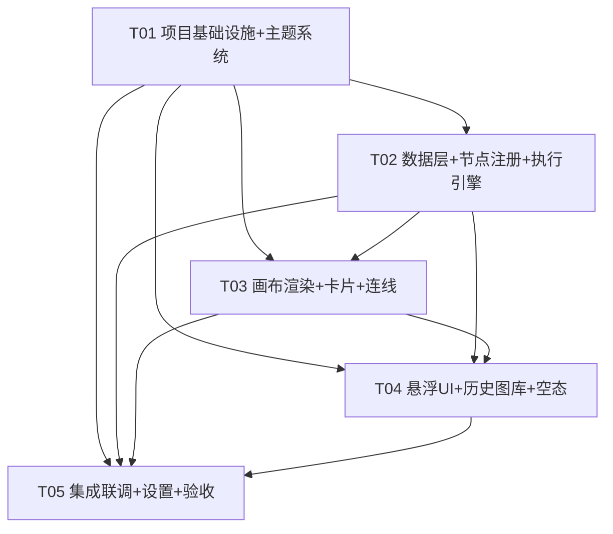
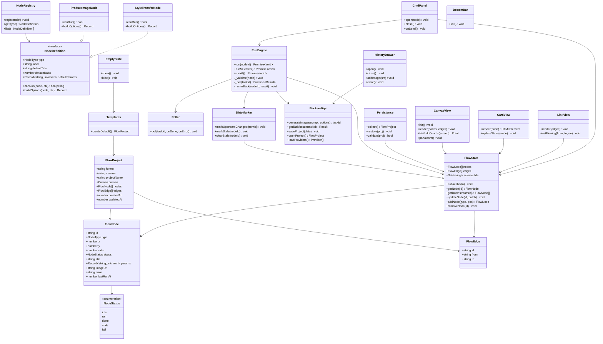
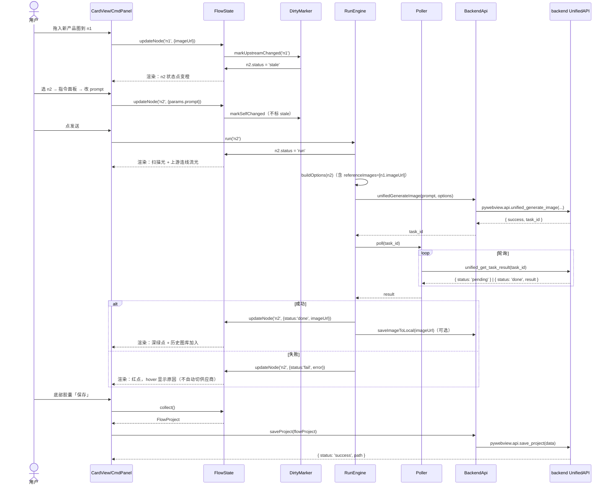

# Infinite Canvas ICV v1 增量架构设计与任务分解

> 版本：v1.0（草案，待主理人/用户拍板）
> 作者：高见远（架构师）
> 日期：2026-08-11（重启启动日）
> 上游输入：《重启方案总结-2026-08-11.md》、《prototypes/ui-v2.html》（v4 终稿）、`.workbuddy/memory/2026-08-11.md`、`Infinite Canvas 1.0结构目录.md`、`src/` 与 `backend/` 全量盘点

---

## 〇、待明确事项（需主理人/用户拍板，按优先级排列）

| # | 事项 | 我的建议（默认值） | 影响 |
|---|------|------------------|------|
| A1 | **新项目启动形态**：打开应用时是"空画布 + 空态引导"，还是"自动加载内置 2 步模板"？ | 首次启动自动创建默认模板（产品图→换风格），右上角允许清空；后续启动恢复上次 .icproj | 决定空态引导与模板默认加载的实现时机 |
| A2 | **输入节点图片持久化方式**：产品图以 base64 内嵌 .icproj，还是复制到 `image_save_path` 后存文件引用？ | 首版内嵌 base64（简单可靠、离线可开）；后续版本再切文件引用 | 决定 .icproj 体积与 save/load 实现 |
| A3 | **风格标签页参数面板形态**：原型第 3 个 tab「风格」目前只有 tab 切换，具体放哪些参数？ | 复用现有 AIDraw 参数组：模型选择（供应商:模型）、比例（3:4/1:1/16:9/Auto）、分辨率（1k/2k/4k）、张数（1-4）、参考图缩略图（上游自动带入） | 决定 style-transfer 节点的 params 结构与 UI |
| A4 | **历史图库拖入手势体感**：拖历史图到画布上，落在哪个语义？ | 拖到输入节点上→替换该节点图片；拖到空白处→新建一个输入节点（若画布已有未连接输入节点则插入为新输入并重连） | 决定 canvas drop 交互与节点插入逻辑 |
| A5 | **多选「运行选中」入口**：原型拍板"多选不弹面板"，但运行入口放哪？ | 底部胶囊条常态显示「运行选中」（多选时高亮可用）+ 右键菜单项；单选时同一按钮=运行当前卡 | 决定 T05 集成细节 |
| A6 | **空态引导文案/形态**：首次无节点时显示什么？ | 画布中央居中引导卡：标题 + 一句说明 + 「创建默认模板」按钮；同时底部胶囊「打开」可用 | 决定 empty-state 组件内容 |
| A7 | **供应商/设置面板范围**：底部胶囊「设置」是否保留完整的供应商增删改查 UI？ | 保留（复用 provider-panel 逻辑但改 UI 风格），因为供应商配置是必须项；第一版可只保留"查看/启用/默认模型" | 决定 settings 面板的工作量 |
| A8 | **深色暖棕黑冷暖度**：memory 中待确认项，原型当前为 #232220 系 | 按原型默认，不阻塞开发 | 纯视觉微调 |
| A9 | **旧 .icproj（v2 自由画布格式）兼容**：打开旧项目怎么处理？ | 首版检测到 `format!=='icv'` 时提示"旧版项目不支持，请新建"，不做迁移 | 决定 load_project 的校验逻辑 |

### 拍板记录（主理人/用户确认，2026-08-12，开发以此为最终口径）

| # | 结论 |
|---|------|
| A1 | **空态引导**：首次打开空画布 + 居中引导卡（标题+一句说明+「创建默认模板」按钮）；不自动加载模板；打开已有项目恢复上次 .icproj |
| A2 | **base64 内嵌**（用户无偏好，主理人拍板）：简单可靠、离线可开；大体积风险接受，保存时 Toast 提示；后续版本再切文件引用 |
| A3 | **复用 AIDraw 参数组**：模型（供应商:模型）、比例（3:4/1:1/16:9/Auto）、分辨率（1k/2k/4k）、张数（1-4）、参考图缩略图（上游自动带入） |
| A4 | **替换或新建**：拖到输入节点上→替换该节点图片；拖到空白处→新建输入节点 |
| A5 | **胶囊条按钮 + 右键**：底部胶囊条常态显示「运行选中」（多选时高亮可用；单选时同一按钮=运行当前卡）；右键菜单同步提供 |
| A6 | 空态引导按默认（居中引导卡 + 「创建默认模板」按钮） |
| A7 | 设置面板保留供应商增删改查（改温馨风格 UI）；首版只保留"查看/启用/默认模型" |
| A8 | 深色按原型 #232220 系，不阻塞 |
| A9 | 旧项目 `format!=='icv'` 提示"旧版项目不支持，请新建" |

---

## 一、现状盘点结论（基于代码全量阅读）

### 1.1 前端 src/（约 90 个 TS 文件）

#### A. 可直接复用（搬迁/轻改即用）

| 文件 | 结论 | 说明 |
|---|---|---|
| `src/utils/api.ts` | **复用** | pywebview API 封装 + 错误码映射表（401/402/422/429/500/502/503/504）完整可用 |
| `src/utils/uid.ts` | **复用** | ID 生成器 |
| `src/utils/dom.ts` | **复用** | DOM 工具 |
| `src/cards/ai-draw-api.ts` | **复用（核心资产）** | 已解耦纯函数：`_getImageModels()`（拉取供应商绘图模型）、`generate()`（生图全流程：loading→轮询→落图→历史）、`_toBase64`、`_mergeImageAndMask`。**换风格节点直接复用 `generate` 的核心调用链** |
| `src/cards/ai-draw-status.ts` | **复用** | 生成中/完成/失败状态 UI 逻辑，改造为「状态点 + 扫描光」动画 |
| `src/cards/pipeline-engine.ts` | **复用（需改造）** | 已有拓扑排序 `_topoSort`、`getDependencyChain`、`hasCycle`；**新引擎在此基础上加"脏标记传播 + 分段执行"**，核心算法可保留 |
| `src/core/canvas.ts` | **复用（需改造）** | 缩放/平移/坐标换算 `toCanvasCoords` 直接可用；改造点：点阵背景、左键拖拽语义、去 Minimap 依赖 |
| `src/state/app-state.ts` 及各 state 切片 | **复用思路** | AppState 聚合模式保留，但字段全部替换为 flow 模型（见 4.2） |
| `src/components/history-sidebar.ts` | **复用（需改造）** | 历史图库的 `addImage/clear/_renderGrid` 逻辑可复用；改造为左侧悬浮抽屉 + 拖入画布 |
| `src/independent/image-modal.ts` | **复用** | 图片大图查看器 |
| `src/independent/theme-manager.ts` | **复用（轻改）** | 主题切换逻辑保留；改造为读新 CSS 变量 + 新按钮 id |
| `src/independent/project-manager.ts` | **复用（需改造）** | 保存/打开流程复用；改造为调新 `Storage.collectFlowData()` |
| `src/ui/*`（toast/dialog/button 等） | **按需复用** | Toast 可直接复用，其余以原型 HTML/CSS 为准 |
| `src/types/*.d.ts` | **复用 + 新增** | `pywebview.d.ts` 保持；新增 `src/v1/types/flow.d.ts` |

#### B. 必须砍（不再编译/打包，文件可物理保留但移出 import 链）

| 模块/文件 | 原因 |
|---|---|
| `src/cards/text-card.ts`、`compare-card.ts`、`drawing-board-card.ts`、`agent-card.ts`、`preview-card.ts`、`image-input-card.ts` | 七种通用卡片体系废弃，第一版只有 2 种节点（输入/换风格） |
| `src/cards/features/drawing-board/*`（6 文件） | 画板功能，非本版 |
| `src/groups/*`（4 文件） | 分组功能，非本版（第二版再评估） |
| `src/components/minimap.ts`、`model-panel.ts`、`prompt-library.ts`、`settings.ts`、`provider-panel.ts` | 小地图废弃；设置/供应商面板形态重做（见 A7） |
| `src/components/connection.ts` | 连线交互重做：模板默认连好、拖连线非首版；但 `_wirePointOnCard` 贝塞尔路径算法可参考进新 link-view |
| `src/core/commands.ts`、`command-manager.ts`、`undo-redo.ts`、`history.ts`、`clipboard.ts`、`snapshot.ts` | 命令系统/撤销重做/剪贴板非首版 P0（已拍板不做的项）；快照由新 persistence 替代 |
| `src/independent/laser-cutter.ts` | 激光切割花活，明确砍 |
| `src/independent/agent-panel.ts`、`src/agent/*`、`src/cards/agent-*.ts` | Agent 对话是第二版预留 |
| `src/cards/base-card.ts`、`card-shell.ts`、`card-factory.ts`、`card-contract.ts`、`data-source.ts`、`connection-rules.ts`、`event-bus-init.ts` | 通用卡片外壳体系废弃；但其中的**契约/注册思想**被新 node-registry 继承（见 3.2） |
| `src/cards/ai-draw-bindings.ts` | 绑定逻辑内联进新节点 UI |

#### C. 需改造（核心改造文件）

| 文件 | 改造点 |
|---|---|
| `src/index.html` | 全新骨架：顶栏（logo+项目名+未保存点）、左悬浮图库抽屉、画布、底部胶囊条、指令面板容器、空态容器 |
| `src/main.ts` | 入口重写：只 import v1 模块；保留 pywebview 就绪等待/全局错误处理 |
| `src/styles/*`（app.css/variables.css/canvas.css 等） | 全部重写为温馨园艺风 Token（原型已给出全部色值/圆角/阴影）；删除旧卡片样式 |
| `src/bridge.ts` | 保留 window 桥接模式，新增 v1 模块桥接 |

### 1.2 后端 backend/（11 个 py）

| 文件 | 结论 | 说明 |
|---|---|---|
| `backend/api/errors.py` | **直接复用** | 错误分层（AppError + 4xx/5xx 子类）完整 |
| `backend/api/unified_api.py` | **直接复用 + 0 改动** | `generate_image_async(prompt, options)` 已支持 `model`、`aspectRatio`、`resolution`、`count`、`referenceImages`（见 L530 `_build_image_request` 内 `inline_data` 拼接）；`get_task_result` 轮询；**换风格 = referenceImages=[上游图] + prompt + model，全部现成** |
| `backend/api/provider_api.py` | **直接复用** | 供应商/模型 CRUD + test/fetch_models |
| `backend/api/image_api.py` | **直接复用** | 保存图片 + 缩略图生成 |
| `backend/api/project_api.py` | **直接复用** | .icproj 读写（json.dump/load，数据格式由前端决定，后端无感知） |
| `backend/api/settings_api.py` | **直接复用** | 设置 + 提示词库读写 |
| `backend/api/clipboard_api.py` | 保留（首版不用） | 剪贴板非首版 |
| `backend/api/gemini_compat.py` | **直接复用** | 被 unified_api 依赖 |
| `backend/api/utils.py` | **直接复用** | get_tk_root |
| `main.py` | **微改（可选）** | 窗口标题可改为 "Infinite Canvas — 园艺视觉工作流"；API 类无需改（`unified_generate_image`/`unified_get_task_result` 已透传） |
| 新增 `backend/api/flow_api.py`（可选） | **建议新增（小）** | 若需要「按节点跑批」的便捷入口；但首版可完全由前端拼装 options 调用现成 API，**不加也可**——倾向不加，减少后端面 |

**后端结论：backend 全部保留复用，0 必须改动；脏标记、状态机、参数联动全部在前端状态层实现并随 .icproj 持久化。**

---

## 二、第一版目标架构

### 2.1 模块划分（增量目录 `src/v1/`）

```
src/v1/
├── main.ts                  # v1 应用启动编排（替代 src/main.ts 的旧初始化）
├── types/
│   ├── flow.d.ts            # FlowNode/FlowEdge/NodeStatus/FlowProject 类型
│   └── backend.d.ts         # 后端调用返回类型（复用 src/types/pywebview.d.ts）
├── state/
│   ├── flow-state.ts        # 节点/连线/选中/运行态 单一数据源（AppState.flow）
│   ├── dirty.ts             # 脏标记传播：markUpstreamChanged → 下游 stale
│   └── selection.ts         # 单选/多选/框选状态
├── nodes/
│   ├── node-registry.ts     # 注册式节点定义表（继承 CardRegistry 思路）
│   ├── product-image.ts     # ① 输入产品图节点
│   └── style-transfer.ts    # ② 换风格节点
├── engine/
│   ├── run-engine.ts        # 执行引擎：分段执行 + 状态机 + 轮询 + 结果回写
│   └── poller.ts            # get_task_result 轮询封装（复用 ai-draw-api.generate 思想）
├── canvas/
│   ├── canvas-view.ts       # 画布容器：缩放/平移/点阵/坐标换算
│   ├── card-view.ts         # 卡片渲染：图即卡片 + 状态点 + 悬浮按钮
│   ├── link-view.ts         # 连线渲染：贝塞尔 + 流光动画 + hover 中点
│   └── interactions.ts      # 拖拽/框选/组拖/历史图拖入
├── ui/
│   ├── cmd-panel.ts         # 指令面板（参考/标记/风格 tab + 输入框 + 参数 chip + 发送钮）
│   ├── action-bar.ts        # 卡片上方操作条（单选出现，智能避让翻转）
│   ├── history-drawer.ts    # 左侧悬浮图库抽屉（改造 history-sidebar）
│   ├── bottom-bar.ts        # 底部胶囊条（打开/保存/主题/设置 + 运行选中）
│   ├── empty-state.ts       # 空态引导
│   ├── settings-panel.ts    # 设置/供应商面板（重做风格）
│   └── status-visuals.ts    # 状态点/扫描光/流光 class 切换
├── persistence.ts           # .icproj v3 序列化/反序列化（改造 snapshot.ts）
├── templates.ts             # 内置模板：2 步流水线默认布局 + 连线
└── api.ts                   # backend 调用薄封装（基于 src/utils/api.ts 扩展）
```

### 2.2 数据流（用户操作 → 前端状态 → backend 调用 → 生成 → 状态回写）

```
┌──────────┐   ① 操作事件    ┌──────────────┐   ② 改状态      ┌───────────────┐
│  用户 UI  │ ──────────────→ │ flow-state   │ ─────────────→ │  dirty.ts     │
│ (卡片/面板)│ ←─────────────  │ (单一数据源)  │ ←───────────── │ 上游变更→stale │
└──────────┘   ⑧ 渲染刷新      └──────┬───────┘   ③ 触发下游      └───────┬───────┘
                                      │ ④ 执行 run(id)                   │
                                      ▼                                  ▼
                               ┌──────────────┐                  ┌──────────────┐
                               │  run-engine   │ ──⑤ 调 api ───→ │  backend     │
                               │ (状态机+轮询)  │ ←──⑥ task_id ── │  UnifiedAPI  │
                               └──────┬───────┘                  └──────┬───────┘
                                      │ ⑦ 回写 imageUrl/status/error     │
                                      └──────────────────────────────────┘
```

关键路径（换风格节点运行）：
1. 用户选中 style-transfer 卡 → 指令面板出现 → 输入/改风格 prompt → 点发送
2. `flow-state` 更新节点 params → `dirty.ts` 判定"改的是自己，不标 stale"（改上游才标）
3. `run-engine.run('style-transfer')`：校验上游 done → 组装 `options = { model, aspectRatio, resolution, count, referenceImages: [上游 imageUrl] }`
4. `api.unifiedGenerateImage(prompt, options)` → 得 task_id → `poller` 轮询 `unifiedGetTaskResult`
5. 完成 → 回写 `imageUrl` + status=done；失败 → status=fail + error 原因（红点+提示，**不做自动换供应商**）
6. 若有下游 → 标记下游 stale

### 2.3 画布状态模型（节点/连线/状态机）

```
NodeStatus 状态机:

        ┌──────────────────────────────────────────────┐
        │                                              │
        ▼                                              │
      idle ──run──▶ run ──done──▶ done                 │
        ▲              │  │                            │
        │              │  ▼                            │
        │              │ fail ──▶ fail（红点+原因，手动重跑）│
        │              │                               │
        └──── stale ◀──┘（上游 done 后任意节点被标 stale；stale 可 run 重新执行）
```

- **节点**（`FlowNode`）：`{ id, type, x, y, ratio, status, title, params, imageUrl, error, lastRunAt }`；宽固定 260，高 = 260/ratio
- **连线**（`FlowEdge`）：`{ id, from, to }`；模板默认连好，首版不支持手动新建连线（连线中点 + 号做"插入步骤"占位，首版可隐藏或禁用）
- **状态语义**：
  - `idle`：灰点，从未运行
  - `run`：绿脉冲 + 扫描光 + 上游连线流光
  - `done`：深绿点
  - `stale`：橙点，上游已改需重跑
  - `fail`：红点，点击卡片查看原因

---

## 三、文件清单

### 3.1 新增文件（全部相对项目根目录）

| 文件 | 职责 |
|---|---|
| `src/v1/main.ts` | v1 应用启动：等待 pywebview → 加载项目/模板 → 渲染画布 → 绑定 UI |
| `src/v1/types/flow.d.ts` | FlowNode/FlowEdge/NodeStatus/FlowProject/NodeDefinition 类型 |
| `src/v1/types/backend.d.ts` | backend 返回类型声明（task_id/result/image 等） |
| `src/v1/state/flow-state.ts` | 画布数据单一数据源：nodes/edges/selection/runState + 订阅通知 |
| `src/v1/state/dirty.ts` | 脏标记传播算法（上游变更→递归标记下游 stale） |
| `src/v1/state/selection.ts` | 单选/多选/框选集合管理 |
| `src/v1/nodes/node-registry.ts` | 节点定义注册表：type→{ label, defaults, render, run }，新增节点=注册新定义 |
| `src/v1/nodes/product-image.ts` | 输入产品图节点定义（选图/拖图/替换，输出 image） |
| `src/v1/nodes/style-transfer.ts` | 换风格节点定义（prompt + 模型参数 + 参考图=上游 image，输出 image） |
| `src/v1/engine/run-engine.ts` | 执行引擎：run(nodeId)/runSelected()/runAll() + 状态机转换 + 下游 stale |
| `src/v1/engine/poller.ts` | task 轮询器：间隔查询 get_task_result，超时/失败回写 |
| `src/v1/canvas/canvas-view.ts` | 画布容器：缩放/平移/点阵背景/坐标换算（改造自 core/canvas.ts） |
| `src/v1/canvas/card-view.ts` | 卡片 DOM 渲染：图即卡片、标签、状态点、悬浮操作按钮 |
| `src/v1/canvas/link-view.ts` | 连线渲染：贝塞尔曲线、流光动画、hover 状态 |
| `src/v1/canvas/interactions.ts` | 拖拽移动/框选/组拖/历史图拖入落点处理 |
| `src/v1/ui/cmd-panel.ts` | 指令面板：参考/标记/风格 tab、缩略图、输入框、模型/比例/分辨率 chip、发送钮 |
| `src/v1/ui/action-bar.ts` | 卡片上方操作条（单选出现、智能避让翻转） |
| `src/v1/ui/history-drawer.ts` | 左侧悬浮历史图库抽屉 + 拖入手势 |
| `src/v1/ui/bottom-bar.ts` | 底部胶囊条：打开/保存/主题/设置 + 运行选中（A5） |
| `src/v1/ui/empty-state.ts` | 空态引导（A6） |
| `src/v1/ui/settings-panel.ts` | 设置/供应商面板（重做温馨风格，A7） |
| `src/v1/ui/status-visuals.ts` | 状态点/扫描光/流光 class 切换 helper |
| `src/v1/persistence.ts` | .icproj v3 收集/恢复（替代 core/snapshot.ts） |
| `src/v1/templates.ts` | 内置模板定义：2 节点流水线 + 布局 + 连线 + 默认参数 |
| `src/v1/api.ts` | backend 薄封装：generateImage/getTaskResult/saveProject/loadProject/loadSettings/saveImage |
| `src/v1/styles/variables.css` | 温馨园艺风 Token（迁移自原型 :root） |
| `src/v1/styles/app.css` | 应用级样式（布局/顶栏/画布/卡片/面板/胶囊条） |

### 3.2 修改文件

| 文件 | 修改内容 |
|---|---|
| `src/index.html` | 替换为 v1 骨架（顶栏+图库抽屉+画布+指令面板容器+底部胶囊条+空态容器） |
| `src/main.ts` | 重写入口：只 import `v1/main`，保留 pywebview 就绪 + 全局错误处理 |
| `src/bridge.ts` | 增加 v1 模块到 window 的桥接（保持旧模式兼容） |
| `src/utils/api.ts` | 扩展 `unifiedGetTaskResult` 等已有方法（不删旧方法，v1 调用子集） |
| `src/v1/styles/variables.css` 由 `styles/variables.css` 迁移而来（删除旧玻璃极简 Token 或保留不引用） |
| `main.py`（可选微改） | 窗口标题 + 初始尺寸（如 1400×900） |

### 3.3 删除/停用（从 import 链移除，文件先保留便于回滚）

> 策略：不物理删除旧文件（避免误删可回滚），通过 `main.ts` 不再 import 使其退出编译产物；第一版验收通过后再统一清理 `src/cards/`（除 ai-draw-api/ai-draw-status）、`src/groups/`、`src/components/minimap.ts` 等。

---

## 四、数据结构与接口

### 4.1 节点数据

```ts
// src/v1/types/flow.d.ts

type NodeType = 'product-image' | 'style-transfer';  // 首版 2 种，注册式扩展

type NodeStatus = 'idle' | 'run' | 'done' | 'stale' | 'fail';

interface FlowNode {
  id: string;
  type: NodeType;
  x: number;              // 画布坐标
  y: number;
  ratio: number;          // 宽高比 高/宽；卡片高 = 260 / ratio（原型 CARD_W=260）
  status: NodeStatus;
  title: string;          // 标签（左上悬浮）
  params: Record<string, unknown>;   // 节点参数：见 style-transfer params
  imageUrl: string | null; // 结果图（输入节点=所选图；生成节点=生成结果）
  error: string | null;    // fail 原因（红点 hover/点击展示）
  lastRunAt: number | null;
}

interface FlowEdge {
  id: string;
  from: string;   // 上游节点 id
  to: string;     // 下游节点 id
}

interface FlowProject {
  format: 'icv';
  version: '3.0';
  projectName: string;
  canvas: { scale: number; panX: number; panY: number };
  nodes: FlowNode[];
  edges: FlowEdge[];
  createdAt: number;
  updatedAt: number;
}

// style-transfer.params
interface StyleTransferParams {
  prompt: string;                 // 换风格指令
  model: string;                  // "provider_id:model_id"
  aspectRatio: string;            // '3:4' | '1:1' | '16:9' | 'Auto'
  resolution: string;             // '1k' | '2k' | '4k'
  count: number;                  // 1-4
}

// product-image.params（空或仅存文件信息）
interface ProductImageParams {
  fileName?: string;
}
```

### 4.2 节点定义接口（注册式）

```ts
interface NodeDefinition {
  type: NodeType;
  label: string;                        // 悬浮标签
  defaultTitle: string;
  defaultRatio: number;                 // 3/4
  defaultParams: Record<string, unknown>;
  canRun(node: FlowNode, ctx: FlowContext): boolean | string;  // false/原因 → 禁止运行
  buildOptions(node: FlowNode, ctx: FlowContext): Record<string, unknown>; // backend options
}
```

- `product-image`：`canRun` 要求 `imageUrl` 存在（没选图不能跑，其实输入节点不"跑"，它只是源）
- `style-transfer`：`buildOptions` 组装 `{ model, aspectRatio, resolution, count, referenceImages: [上游 imageUrl] }`

### 4.3 .icproj 增量字段（v3 格式）

```json
{
  "format": "icv",
  "version": "3.0",
  "projectName": "园艺花盆-北欧风系列",
  "canvas": { "scale": 1, "panX": 60, "panY": 40 },
  "nodes": [
    {
      "id": "n1",
      "type": "product-image",
      "x": 60, "y": 120, "ratio": 0.75,
      "status": "done", "title": "产品图",
      "params": { "fileName": "花盆.jpg" },
      "imageUrl": "data:image/jpeg;base64,...",
      "error": null,
      "lastRunAt": 1723345000000
    },
    {
      "id": "n2",
      "type": "style-transfer",
      "x": 400, "y": 120, "ratio": 0.75,
      "status": "stale", "title": "北欧风场景",
      "params": {
        "prompt": "把背景换成浅灰水泥墙，加一盆绿萝",
        "model": "provider_1f7e620c:gemini-3-pro-image-preview",
        "aspectRatio": "3:4",
        "resolution": "2k",
        "count": 1
      },
      "imageUrl": null,
      "error": null,
      "lastRunAt": null
    }
  ],
  "edges": [ { "id": "e1", "from": "n1", "to": "n2" } ]
}
```

### 4.4 backend API 调用契约（请求/响应示例）

```
1) 生成（换风格）
POST pywebview.api.unified_generate_image(prompt, options)
请求: prompt = "把背景换成浅灰水泥墙，加一盆绿萝"
      options = {
        "model": "provider_1f7e620c:gemini-3-pro-image-preview",
        "aspectRatio": "3:4",
        "resolution": "2k",
        "count": 1,
        "referenceImages": ["data:image/jpeg;base64,..."]   // 上游产品图
      }
响应: { "success": true, "task_id": "uuid" }
     （异常时后端抛 AppError，被 main.py 捕获为 {"success":false,"error_code":5xx,"message":"..."}）

2) 轮询
pywebview.api.unified_get_task_result(task_id)
响应: { "status": "pending" }
     或 { "status": "done", "result": { "success": true, "image_url": "file:///...", "images": [...] } }
     或 { "status": "done", "result": { "success": false, "error_code": 504, "message": "请求超时..." } }

3) 保存图片（可选，结果落盘历史图库）
pywebview.api.save_image_to_local(image_data)
响应: { "status": "success", "path": "E:/ai图片文件夹/xxx.png", "url": "file:///...", "thumbnail": "file:///..." }

4) 项目保存/打开（复用现有）
pywebview.api.save_project(flowProject)         → { "status": "success", "path": "..." }
pywebview.api.open_project_dialog()             → { "status": "success", "data": { ...flowProject }, "path": "..." }

5) 供应商/模型
pywebview.api.load_providers()                  → { "providers": [...] }
pywebview.api.load_settings()                   → { "image_save_path": "..." }
```

---

## 五、任务列表（按依赖排序，≤5 个）

### T01：项目基础设施 + 主题系统（P0）

**源文件**：`src/index.html`（重写）、`src/main.ts`（重写）、`src/bridge.ts`（改）、`src/v1/main.ts`（新建骨架）、`src/v1/styles/variables.css`（新建）、`src/v1/styles/app.css`（新建）、`src/v1/types/flow.d.ts`（新建）

**职责**：v1 目录骨架 + 应用入口 + 温馨园艺风 Token/全局样式 + 核心类型定义。产出可运行的"空壳应用"（顶栏+画布空白+底部胶囊条静态渲染）。

**验收标准**：
- `npm run build` 通过，pywebview 能打开空壳界面
- 浅色/深色主题切换生效（暖米白/暖棕黑）
- flow.d.ts 类型定义完整（FlowNode/FlowEdge/NodeStatus/FlowProject/NodeDefinition）
- 旧 src/cards、src/groups 等模块已从 main.ts import 链移除，产物不再包含旧卡片

**依赖**：无

### T02：数据层 + 节点注册 + 执行引擎（P0）

**源文件**：`src/v1/state/flow-state.ts`、`src/v1/state/dirty.ts`、`src/v1/state/selection.ts`、`src/v1/nodes/node-registry.ts`、`src/v1/nodes/product-image.ts`、`src/v1/nodes/style-transfer.ts`、`src/v1/engine/run-engine.ts`、`src/v1/engine/poller.ts`、`src/v1/api.ts`、`src/v1/persistence.ts`、`src/v1/templates.ts`

**职责**：画布数据单一数据源 + 脏标记传播 + 节点注册表（2 个节点定义）+ 分段执行引擎 + backend 调用封装 + .icproj v3 读写 + 内置模板。

**验收标准**：
- 单元可验证（可用临时 console 脚本）：创建默认模板 → nodes=2, edges=1
- 改上游（换图/改 prompt）→ 下游自动变 stale；改自己 → 不标 stale
- `run('style-transfer')` 走通：校验上游 done → 调 `unified_generate_image` → 轮询 → 回写 imageUrl + done；失败回写 fail + error
- 失败**不自动切供应商**（已拍板）
- `persistence.collect()/restore()` 与原型 json 结构一致，save/open 往返无损
- 复用 `ai-draw-api.ts` 的 `_getImageModels` 拉取模型列表填充 style-transfer 默认模型

**依赖**：T01

### T03：画布渲染 + 卡片 + 连线（P0）

**源文件**：`src/v1/canvas/canvas-view.ts`、`src/v1/canvas/card-view.ts`、`src/v1/canvas/link-view.ts`、`src/v1/canvas/interactions.ts`、`src/v1/ui/status-visuals.ts`（动画 class）

**职责**：画布缩放/平移/点阵；图即卡片渲染（宽 260、高随 ratio、大图占满、标签左上、操作按钮右上 hover 出现、空步骤虚线卡）；贝塞尔连线 + 流光/扫描光动画；拖拽/框选/组拖/多选；状态点五态。

**验收标准**：
- 卡片按 ratio 正确计算高度（3:4 竖、1:1 方）
- 运行中：目标卡扫描光 + 上游连线流光；完成：深绿点；stale：橙点；fail：红点 + hover 显示原因
- 单选可拖、多选组拖（缩放正确）、框选（Shift）选中多张、点空白取消
- 连线中点 + 号 hover 出现（原型行为），首版点击提示"暂不支持插入步骤"（不报错）
- 历史图库拖入画布触发 A4 语义（拖到输入节点替换 / 空白新建）

**依赖**：T01、T02

### T04：悬浮 UI + 历史图库 + 空态（P0）

**源文件**：`src/v1/ui/cmd-panel.ts`、`src/v1/ui/action-bar.ts`、`src/v1/ui/history-drawer.ts`、`src/v1/ui/bottom-bar.ts`、`src/v1/ui/empty-state.ts`

**职责**：指令面板（参考/标记/风格 tab + 参考图缩略 + 输入框 + 模型/比例/分辨率 chip + 圆形发送钮）；操作条（单选贴卡上沿、智能避让翻转）；左侧悬浮图库抽屉；底部胶囊条（打开/保存/主题/设置）；空态引导；多选"运行选中"入口（A5 建议：胶囊条按钮 + 右键菜单）。

**验收标准**：
- 单选卡片 → 操作条贴卡上沿、指令面板贴卡下沿，跟位移动；取消选中一起收起
- 智能避让：卡片靠近视口底部时面板翻到上方、操作条翻到下方；横向钳制在视口内
- 多选：不弹面板、支持组拖（原型拍板）
- 指令面板 tab 切换、输入框输入→改参→发送→调用 run-engine；"正在编辑·卡片名"标识行正确
- 图库抽屉：默认收起，左缘把手展开/收起，生成图自动加入
- 空态引导（A6）：首次无节点时显示引导 + 「创建默认模板」按钮
- 底部胶囊条 4 按钮全部可用（打开/保存/主题/设置）
- 风格标签页参数面板（A3）落地：模型/比例/分辨率/张数 chip

**依赖**：T01、T02、T03

### T05：集成联调 + 设置面板 + 错误展示 + 验收（P0）

**源文件**：`src/v1/ui/settings-panel.ts`、`src/v1/main.ts`（完善）、`src/utils/api.ts`（扩展）、`main.py`（可选微改）

**职责**：把 T01-T04 串成完整应用：启动流程（恢复上次项目/新建模板）、设置面板（供应商/模型管理，A7）、失败红点+原因展示、Ctrl+S 保存、整体验收自测。

**验收标准**：
- 完整闭环可用：新建/打开模板 → 选产品图 → 改风格 prompt → 发送 → 生成 → 结果图出现在卡片 + 入历史图库
- 改上游 → 下游标 stale → 再跑 → 恢复 done
- 失败处理：网络/额度/超时 → 节点红点 + hover/点击看原因；手动重跑成功恢复（不自动切供应商）
- 设置面板可配置供应商（增删改查 + 默认模型）
- Ctrl+S 保存、底部胶囊打开/保存正常
- **验收唯一标准**：上周出不了的那几张图，用它能不能出来；用户每周愿意主动打开几次（运行体验流畅、无文字日志噪音）

**依赖**：T01、T02、T03、T04

---

## 六、依赖包列表

**现有依赖（保持）**：
```
- typescript@^6.0.3        # 类型检查（devDependency，已有）
- vite@^8.0.12             # 构建（已有，含 removeModuleAttribute 插件适配 pywebview）
- sass@^1.99.0             # SCSS 支持（已有，若新样式用 CSS 变量可不用）
- @fortawesome/fontawesome-free@^7.2.0  # 图标（已有；若按原型全 SVG 描边可移除，建议保留作为兜底）
```

**新增依赖评估（倾向不加）**：
```
- 无必加运行时依赖
- 可选（不推荐）：zustand 状态库 —— 本项目 flow-state 规模小（<10 状态字段），手写订阅足够，不引入
- 可选（不推荐）：react / vue —— 保持原生 TS + DOM，与既有代码风格一致
```

**后端依赖（保持）**：见 `requirements.txt`（requests / pywebview / Pillow），无新增。

---

## 七、共享约定（跨文件契约）

1. **命名**：节点 id 前缀 `n`（`uid('node')`）；连线 `e`（`uid('edge')`）；画布坐标使用世界坐标（canvas 坐标系），DOM 用 `view.scale` 换算
2. **状态码/错误**：全部复用 `backend/api/errors.py` 分层；前端 `api.ts` 统一把 `{success:false,error_code,message}` 映射为 `FlowError { code, message }`，写入 `node.error`
3. **生成调用链**：唯一入口 `run-engine.run()` → `api.unifiedGenerateImage` → `poller`；任何节点类型不得绕过引擎直连 backend
4. **脏标记规则**：`markUpstreamChanged(fromNodeId)` 只标记**直接/间接下游**为 stale；运行中（run）节点不覆盖状态；fail 节点被上游变更后转 stale（允许重跑）
5. **持久化**：只有 `persistence.ts` 可以读/写 .icproj；`collect()` 序列化 nodes/edges/canvas/format；`restore()` 负责校验 `format==='icv'`（A9 逻辑）
6. **UI 规范**：全部使用温馨园艺风 CSS 变量（`--bg-app/--accent/--st-*` 等，以原型 Token 为准）；无 emoji 图标（全 SVG 描边）；不出现文字日志（状态全用视觉点/动画表达，错误原因只在红点 hover 显示）
7. **模块边界**：`nodes/*` 只声明定义，不碰 DOM；`canvas/*` 只做渲染与交互，不直接调 backend；`ui/*` 只读写 flow-state 并调用 engine，不直接拼 backend options
8. **主题**：`data-theme="light|dark"` 切换，localStorage key `infinite_canvas_theme` 沿用
9. **新增节点规范**：在 `node-registry.ts` 注册 `NodeDefinition` + 在 `templates.ts` 可选用到，核心代码零改动（第二版加 3D 复现/场景合成节点即按此扩展）

---

## 八、任务依赖图



---

## 九、Mermaid 图表（类图 + 时序图）

### 9.1 类图（Class Diagram）



### 9.2 时序图（Sequence Diagram：核心闭环）



---

## 十、风险与备注

1. **大图 base64 性能**：内嵌 .icproj 可能较大（每张图几百 KB~MB）；首版接受（A2），保存时 Toast 提示；后续可切文件引用 + 缩略图
2. **pywebview 并发**：`unified_generate_image` 后端已线程安全（_tasks + lock），前端轮询按 task_id 隔离，多卡并发安全
3. **模型可用性**：换风格依赖供应商已配置绘图模型（bltcy.ai 柏拉图已有 Nano Banana Pro/2）；运行前 `_getImageModels` 拉取并校验，无模型时提示去设置
4. **回滚保障**：旧代码全部保留不删，仅停用 import；`git` 需先提交旧基线再动工（若仓库无 git，建议先复制 `src/` 备份）
