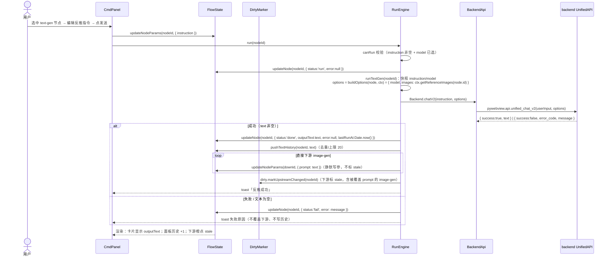
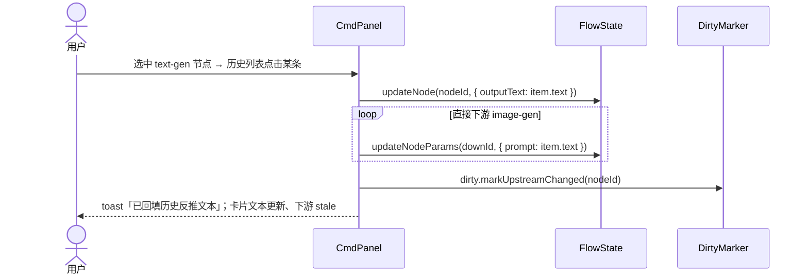
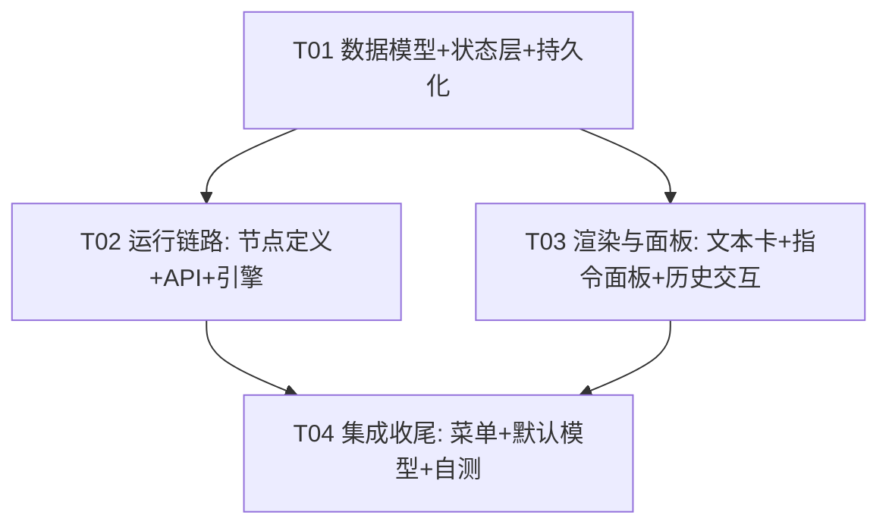

# ICV v1 增量架构设计：文本反推节点（text-gen）

> 版本：v1.0（草案，待主理人/用户拍板）
> 作者：Bob（架构师）
> 日期：2026-08-14
> 上游输入：主理人拍板需求（节点形态/运行/联动/历史/模型五项）、`src/v1/` 全量阅读、backend `unified_chat_v2` 签名核对
> 约束：后端零改动；不动 image-result 语义；保持注册式节点架构；体验敏感项目（文本卡渲染/历史交互要直觉）
> 基线：HEAD a2ff1db（工作区干净）

---

## 〇、结论摘要（给主理人）

- 新增第三种节点类型 `text-gen`（文本反推），完全走注册式架构：`nodes/text-gen.ts` 注册 NodeDefinition + run-engine 按类型分派新分支，不改 image-gen/image-result 语义。
- **联动采用"运行成功时直接写回"**（方案 A + A-1）：text-gen 反推成功 → 直接 image-gen 下游的 `params.prompt` 被覆盖为新文本 → 按既有脏标记把下游标 stale → 用户跑下游时用新文本。覆盖动作本身不额外标 stale（`updateNodeParams` 天然不标），stale 统一由 `dirty.markUpstreamChanged(textGenId)` 触发，与现有机制零冲突。
- **历史存独立字段** `FlowNode.textHistory`（输入/输出分离，与 imageUrl 在节点级一致），上限 20 条、最新在前、连续重复忽略、随项目 3.3 持久化。
- **后端零改动**：复用 `unified_chat_v2(userInput, { model, images })`，同步阻塞调用（无 task 轮询）；已核对 chat_v2 只接受 `data:image` 前缀图片，而当前生成链路统一返回 base64 data URL，参考图恒为 data URL，**无缺口**（唯一边界见待明确事项 #2）。
- **新增 1 个文件 + 修改 10 个文件**，4 个任务（T01→T02/T03 并行→T04），详见 Part B。

---

# Part A：系统设计

## 一、实现思路（Implementation Approach）

### 1.1 核心难点

| 难点 | 现状 | 对策 |
|---|---|---|
| 打破"节点输出都是图" | FlowNode 只有 `imageUrl`（图输出）；text-gen 输出的是文本 | FlowNode 增加 `outputText: string \| null`（仅 text-gen 非 null） |
| 运行引擎按类型分派 | `run()` 无条件走 `runBatch`（image-gen 专用：count 批次/结果卡/轮询） | `run()` 内按 `node.type` 分派；新增 `runTextGen()`（chat_v2 同步阻塞，无批次无轮询无结果卡） |
| 文本→下游 prompt 联动 | 无"输出文本注入下游参数"机制 | 运行成功时直接覆盖直接 image-gen 下游的 `params.prompt`；stale 走既有 `dirty.markUpstreamChanged` |
| 节点级历史 | 只有全局图片历史（history-drawer） | FlowNode 增加 `textHistory`（20 条/去重/保序）+ flow-state `pushTextHistory` + cmd-panel 回填 |
| chat 模型列表 | `fetchImageModels` 过滤 `type==='drawing'` | 新增 `fetchChatModels` 过滤 `type==='chat'`，id 同样 `provider_id:model_id` |

### 1.2 框架/库选型

- **零新增依赖**：延续 v1 原生 TS + DOM + pywebview 桥接，不引入 react/状态库（flow-state 订阅制足够）。
- **后端零改动**：`backend/api/unified_api.py:189 chat_v2` 已支持 `{ metaPrompt, model, images }` 且自动组装多模态 messages；`main.py:178 unified_chat_v2` 已透传。前端只需在 `api.ts` 加一层薄封装。
- **架构模式**：维持既有分层——`nodes/*` 只声明定义、`engine/` 唯一调用 backend、`state/` 单一数据源、`canvas|ui/*` 只渲染与交互。text-gen 只是"再注册一个 NodeDefinition"，不引入新模式。

### 1.3 关键设计决策

1. **联动覆盖时机 = 运行成功时写回**（而非下游 buildOptions 动态取），理由见第五节。
2. **历史存独立字段** `textHistory`（而非 params.textHistory），理由见第二节。
3. **chat_v2 是同步调用**：`Backend.chatV2` 直接 await 返回 `{success, text}`，不建 task、不轮询、不产结果卡；busy 锁沿用（全局串行，避免 pywebview 并发互相干扰）。
4. **文本卡沿用 ratio 体系**：卡片高度仍 = 260/ratio（默认 3/4），文本区溢出滚动；参考图缩略行保留（复用 `getReferenceImages`）。

---

## 二、数据模型变更（flow.d.ts + FlowNode）

```ts
// src/v1/types/flow.d.ts（增量）

type NodeType = 'image-gen' | 'image-result' | 'text-gen';   // ← 新增 'text-gen'

/** text-gen 参数：反推指令（用户可编辑）+ chat 模型 */
interface TextGenParams {
  instruction: string;   // 反推指令，默认 DEFAULT_INSTRUCTION
  model: string;         // "provider_id:model_id"（chat 模型）
}

/** 节点级文本历史条目 */
interface TextGenHistoryItem {
  text: string;          // 反推结果全文
  ts: number;            // 运行完成时间戳（Date.now()）
}

interface FlowNode {
  // ...现有字段不变
  outputText: string | null;             // 新增：text-gen 输出文本；其余类型恒 null
  textHistory: TextGenHistoryItem[];     // 新增：节点级文本历史；非 text-gen 恒 []
}

/** .icproj 项目格式 3.2 → 3.3 */
interface FlowProject {
  version: '3.3';                        // ← 3.2 → 3.3
}
```

### 2.1 历史存哪：权衡与结论

| 方案 | 优点 | 缺点 | 结论 |
|---|---|---|---|
| **X：独立字段 `textHistory`**（推荐） | 输入/输出分离清晰；与 `imageUrl` 在节点级一致（image-gen 的输出也在节点级而非 params）；cmd-panel/card-view 直读；不会被 `updateNodeParams` 误碰 | 需改 flow-state.addNode/replaceAll + persistence 归一 | ✅ 采纳。反正 3.3 迁移必须动 persistence，边际成本低 |
| Y：`params.textHistory` | collect() 已整体序列化 params，改得少 | params 混入输出历史（语义脏）；与 imageUrl 输出在节点级不一致；未来若 params 整包替换有丢历史风险 | ❌ 不采纳 |

### 2.2 常量（共享约定用）

```ts
// src/v1/nodes/text-gen.ts（导出，跨文件引用）
export const TEXT_HISTORY_LIMIT = 20;              // 历史上限
export const DEFAULT_INSTRUCTION = '反推这张图的提示词，中文，输出可直接用于生图';
export const DEFAULT_CHAT_MODEL_KEY = 'icv_default_chat_model';  // localStorage
```

---

## 三、数据结构与接口（类图）

```mermaid
classDiagram
    class FlowNode {
        +string id
        +NodeType type
        +number x
        +number y
        +number ratio
        +NodeStatus status
        +string title
        +Record~string,unknown~ params
        +string imageUrl
        +string outputText
        +TextGenHistoryItem[] textHistory
        +string[] refImages
        +string error
        +number lastRunAt
        +string parentId
    }
    class NodeType {
        <<enumeration>>
        image-gen
        image-result
        text-gen
    }
    class TextGenParams {
        +string instruction
        +string model
    }
    class TextGenHistoryItem {
        +string text
        +number ts
    }
    class FlowProject {
        +string format
        +string version  "3.3"
        +string projectName
        +FlowCanvasState canvas
        +FlowNode[] nodes
        +FlowEdge[] edges
        +number createdAt
        +number updatedAt
    }
    class NodeDefinition {
        <<interface>>
        +NodeType type
        +string label
        +string defaultTitle
        +number defaultRatio
        +Record~string,unknown~ defaultParams
        +canRun(node, ctx) bool|string
        +buildOptions(node, ctx) Record
    }
    class TextGenNode {
        +type = "text-gen"
        +canRun(node, ctx) bool|string
        +buildOptions(node, ctx) Record
    }
    class FlowState {
        +FlowNode[] nodes
        +FlowEdge[] edges
        +getDownstreams(id) FlowNode[]
        +getReferenceImages(id) string[]
        +updateNode(id, patch) void
        +updateNodeParams(id, patch) void
        +pushTextHistory(id, text) void
        +getTextHistory(id) TextGenHistoryItem[]
        +addNode(type, x, y, extra) FlowNode
        +replaceAll(project) void
    }
    class RunEngine {
        +run(nodeId) Promise~void~
        +runSelected() Promise~void~
        +runAll() Promise~void~
        -runBatch(nodeId) Promise~void~
        -runTextGen(nodeId) Promise~void~
        -busy boolean
    }
    class DirtyMarker {
        +markUpstreamChanged(fromId) void
        +markStale(nodeId) void
    }
    class BackendApi {
        +fetchImageModels() Promise~Model[]
        +fetchChatModels() Promise~Model[]
        +resolveDefaultChatModel() Promise~string~
        +chatV2(userInput, options) Promise~{success, text}~
    }
    class CmdPanel {
        +sync() void
        -chatModelOptions Model[]
        -renderTextHistory(node) void
        -refillHistoryItem(nodeId, item) void
    }
    class CardView {
        +updateCard(el, node) void
        -isTextGen boolean
    }
    class Persistence {
        +collect() FlowProject
        +restore(raw) boolean
        -migrateNode(raw) FlowNode
    }

    FlowNode --> NodeType
    FlowNode --> TextGenHistoryItem
    TextGenNode ..|> NodeDefinition
    FlowProject --> FlowNode
    FlowProject --> FlowEdge
    FlowState --> FlowNode
    RunEngine --> FlowState
    RunEngine --> DirtyMarker
    RunEngine --> BackendApi
    CmdPanel --> FlowState
    CardView --> FlowState
    Persistence --> FlowState
    TextGenNode ..> FlowContext : uses getReferenceImages
```

**关键关系说明**：
- `TextGenNode` 实现 `NodeDefinition`（注册式，nodeRegistry 无感知新增）；`buildOptions` 依赖 `FlowContext.getReferenceImages` 组装 `{ model, images }`。
- `RunEngine` 按 `FlowNode.type` 分派：`text-gen` → `runTextGen`（同步 chat_v2）；其余 → `runBatch`（批次轮询）。
- `FlowState.pushTextHistory` 是历史写入唯一入口（run-engine 与 cmd-panel 回填共用数据层方法）。
- `Persistence.migrateNode` 负责 3.3 归一（含旧 3.2 文件兜底），是 `outputText/textHistory` 落盘/读盘的唯一校验点。

---

## 四、运行流程（时序图）

### 4.1 text-gen 运行主链路（run → chat_v2 → 写回 → 覆盖 → stale → 历史）



### 4.2 历史回填（选中 text-gen → 面板历史列表 → 回填当前文本）



---

## 五、联动覆盖细节（重点）

### 5.1 覆盖时机：运行成功时写回（推荐）≠ 下游 buildOptions 动态取

| 方案 | 说明 | 评价 |
|---|---|---|
| **A：text-gen 运行成功时写回下游 params.prompt**（推荐） | 反推成功 → 直接 image-gen 下游 prompt 立即被覆盖为新文本；A-1 直接覆盖、无人工确认中间态 | ✅ 用户可见：跑完 text-gen 选中下游，输入框立刻显示新 prompt，符合"直接覆盖"直觉；下游若手动改过可再改回（可逆）；卡片/面板/保存三方一致 |
| B：下游 buildOptions 动态取上游 outputText | 运行下游时才拼 prompt，节点 params.prompt 不变 | ❌ 用户看不到联动已发生（选中下游输入框是旧值，跑出来却是新文本，割裂）；且会强制覆盖用户手动改的 prompt，不可预期；面板无法展示联动结果 |

**结论：方案 A。** 覆盖动作发生在 `runTextGen` 成功分支、`dirty.markUpstreamChanged` 之前。

### 5.2 覆盖范围与边界

- **范围**：仅 `flowState.getDownstreams(nodeId).filter(d => d.type === 'image-gen')`（**直接**下游、**仅** image-gen）。
- **不覆盖**：
  - image-result（无 prompt 概念）；
  - text-gen 下游（其 instruction 是用户指令语义，不应被上游文本覆盖）；
  - 间接下游（多跳：image-gen 的下一跳是它的图输出，与文本无关）。
- **空文本**：`res.text.trim()` 为空视为失败，不覆盖、不写历史。
- **回填联动**：历史回填（4.2 时序）执行与运行成功完全相同的覆盖动作 + 标 stale，等同"恢复该历史输出"。

### 5.3 与 stale 机制的自洽

- `updateNodeParams` 现有实现**只 Object.assign + notify，不标 stale**（"由调用方决定"）→ 覆盖 prompt 不会误标。
- stale 统一由 text-gen 完成时 `dirty.markUpstreamChanged(nodeId)` 触发 → 直接+间接下游（含被覆盖的 image-gen）转 stale → 用户跑下游时 prompt 已是新文本。**与既有"上游变更→下游 stale→分段执行"完全同构，零冲突。**

---

## 六、文件清单 + 每个文件的改动点

### 5.1 新增文件（1）

| 文件 | 内容 |
|---|---|
| `src/v1/nodes/text-gen.ts` | 节点定义：`type:'text-gen'`、label '文本反推'、defaultTitle '文本反推'、defaultRatio 3/4、defaultParams `{ instruction: DEFAULT_INSTRUCTION, model: '' }`、creatable 默认 true（进新建菜单）；`canRun`：instruction 非空 + model 非空（参考图 0~N 可选）；`buildOptions`：`{ model, images: ctx.getReferenceImages(node.id) }`；导出 `TEXT_HISTORY_LIMIT / DEFAULT_INSTRUCTION / DEFAULT_CHAT_MODEL_KEY` 常量 |

### 5.2 修改文件（10）

| 文件 | 改动点 |
|---|---|
| `src/v1/types/flow.d.ts` | `NodeType` + `'text-gen'`；新增 `TextGenParams`、`TextGenHistoryItem`；`FlowNode` + `outputText: string \| null`、`textHistory: TextGenHistoryItem[]`；`FlowProject.version` 字面量 `'3.2'` → `'3.3'` |
| `src/v1/state/flow-state.ts` | `addNode` 默认字段补 `outputText: null, textHistory: []`（extra 可覆盖）；`replaceAll` 节点归一补 `outputText: n.outputText ?? null`、`textHistory: Array.isArray(n.textHistory) ? n.textHistory.map(h => ({ text: String(h.text ?? ''), ts: Number(h.ts) || 0 })) : []`；新增 `pushTextHistory(id, text)`（去重保序 + 上限裁剪 + notify）、`getTextHistory(id)` |
| `src/v1/engine/run-engine.ts` | `run()` 按类型分派：`node.type === 'text-gen' ? await this.runTextGen(nodeId) : await this.runBatch(nodeId)`；新增私有 `runTextGen(nodeId)`：快照 instruction/model → `def.buildOptions` → `status:'run'` + 流光 → `Backend.chatV2` → 成功分支（写 outputText / pushTextHistory / 覆盖直接 image-gen 下游 prompt / `dirty.markUpstreamChanged` / toast）/ 失败分支（fail + error）；`_runHint` 对 text-gen 显示「· 反推中」（或复用 run 态） |
| `src/v1/api.ts` | 新增 `fetchChatModels()`（仿 `fetchImageModels`，过滤 `m.enabled !== false && m.type === 'chat'`，id 拼接 `provider_id:model_id`，空列表/异常返回 `{id:'',name:'未找到对话模型...'/'加载失败'}`）；新增 `resolveDefaultChatModel()`（localStorage `icv_default_chat_model` 优先，否则第一个可用 chat 模型并记忆）；新增 `Backend.chatV2(userInput, options)`：调 `API.unifiedChatV2`，失败响应（`{success:false,...}`）抛 `Error(message)`，成功返回 `{success:true, text}` |
| `src/v1/ui/cmd-panel.ts` | `sync()` 增加 text-gen 分支：面板加 `textgen` class（隐藏 ratio/res/count chips）；输入框绑定 instruction（`_currentParam('instruction')`）；`chip-model` 点击对 text-gen 拉 `fetchChatModels` 并写 `model`；`_ensureChatModel` 回填 chat 默认模型；历史列表渲染 `cmd-text-history`（20 条、单行截断 + 时间），点击回填（见 4.2 时序）；`_runHint` 支持 text-gen |
| `src/v1/canvas/card-view.ts` | `buildCard`：`isTextGen = node.type === 'text-gen'` 加 `textgen` class；`updateCard` 主视觉分支：text-gen 渲染 `.pcard-text`（显示 outputText，空则「运行后显示反推文本」，`word-break` + 滚动）；`_contentFingerprint` 增补 `text` 维度（文本变化才重建）；参考图缩略行保留（`_refStrip` 对 text-gen 不跳过）；`pcard-act` 对 text-gen 隐藏（无大图）或改「复制」按钮（P2 可选） |
| `src/v1/persistence.ts` | `collect()`：`version:'3.3'`；nodes 映射补 `textHistory: [...(n.textHistory || [])]`（`outputText` 已含在 `...n` 展开）；`restore()`：版本校验接受 `'3.3'`，且**兼容读取 3.2 文件**（`p.version === '3.2'` 也放行；3.2 节点无 outputText/textHistory 由 migrateNode 兜底）；`migrateNode` 增加 text-gen 分支：type 保留，params 归一 `{ instruction, model }`，`outputText: typeof r.outputText === 'string' ? r.outputText : null`，`textHistory` 数组归一（过滤非法条目、不超限），其余字段同现有校验 |
| `src/v1/main.ts` | `import './nodes/text-gen'`（注册副作用）；`fillDefaultModels()` 类型感知：text-gen 节点回填 chat 默认模型（`resolveDefaultChatModel`），其余节点回填绘图模型 |
| `src/index.html` | cmd-panel 内新增历史容器 `<div class="cmd-text-history" id="cmd-text-history"></div>`（放在 `cmd-input` 与 `cmd-controls` 之间）；可选：给 `chip-ratio/chip-res/chip-count` 加可切换隐藏的 data 属性 |
| `src/v1/styles/app.css` | 文本卡样式：`.pcard.textgen .pcard-img` 内文本区（`.pcard-text`：白底/浅底、13px、`word-break:break-word`、`overflow-y:auto`、内边距）；`.cmd-panel.textgen #chip-ratio, .cmd-panel.textgen #chip-res, .cmd-panel.textgen #chip-count { display:none }`；历史列表样式：`.cmd-text-history`（标题「历史反推结果」+ 条目：摘要单行截断 + hover 高亮 + 时间灰字） |
| `src/v1/canvas/interactions.ts` | （T04，小改）`_showCanvasMenu` 的「新建生成节点」改为遍历 `nodeRegistry.list().filter(d => d.creatable !== false)` 通用渲染（自动含 text-gen，与拖线松手菜单一致）；`_createNodeFromMenu`/`_dropImage` 的新建节点默认模型回填改类型感知（text-gen → chat 模型） |

---

# Part B：任务分解

## 七、所需依赖包（Required Packages）

无新增依赖。沿用现有：

```
- typescript@^6.0.3        # 类型检查（devDependency，已有）
- vite@^8.0.12             # 构建（已有）
- sass@^1.99.0             # 样式（已有）
```

后端零新增（chat_v2 已支持，见 Part A 一）。

## 八、任务列表（按依赖排序，≤5 个）

### T01：数据模型 + 状态层 + 持久化（P0）

**源文件**：`src/v1/types/flow.d.ts`、`src/v1/state/flow-state.ts`、`src/v1/persistence.ts`

**职责**：新增 text-gen 类型与字段（outputText/textHistory/TextGenParams/TextGenHistoryItem/version 3.3）；flow-state 初始化/归一/历史方法；persistence 3.3 collect/restore（兼容 3.2 读取）+ migrateNode text-gen 分支。产出"能保存/打开含 text-gen 节点的项目文件"的数据基础。

**验收标准**：
- `tsc` 通过；`collect()` 输出 `version:'3.3'`，text-gen 节点含 `outputText:null`、`textHistory:[]`
- `restore()` 能打开 3.3 文件；**也能打开 3.2 旧文件**（image-gen/image-result 节点行为与旧版一致，不丢数据）
- `pushTextHistory`：最新在前、与头条 trim 后相同则忽略、超 20 条裁尾、notify 触发
- `replaceAll` 对缺失字段兜底（旧文件 text-gen 若存在也归一，不崩）

**依赖**：无

### T02：运行链路（节点定义 + API 封装 + 执行引擎）（P0）

**源文件**：`src/v1/nodes/text-gen.ts`、`src/v1/api.ts`、`src/v1/engine/run-engine.ts`、`src/v1/main.ts`

**职责**：注册 text-gen 节点定义；`fetchChatModels`/`resolveDefaultChatModel`/`Backend.chatV2`；run-engine 按类型分派 + `runTextGen`（chat_v2 同步调用 → 写 outputText → 覆盖直接 image-gen 下游 prompt → 标 stale → 历史）；main.ts 注册 import + fillDefaultModels 类型感知。

**验收标准**：
- 新建 text-gen 节点出现在拖线松手菜单；canRun 校验正确（无指令/无模型给出中文原因）
- `run(text-gen)`：调 `Backend.chatV2`（可临时 mock 验证）→ 成功：卡片状态 done、outputText 写入、历史 +1、**直接 image-gen 下游 prompt 被覆盖为新文本且转 stale**、间接下游也 stale；失败：fail + error 红点、不覆盖、不写历史
- `runAll`/`runSelected` 含 text-gen 节点拓扑序正确（text-gen 先于其 image-gen 下游）
- busy 锁生效：text-gen 运行期间再点其它节点被拒（toast「已有任务在运行」）
- 覆盖边界：text-gen → text-gen 下游不被覆盖；image-result 下游不涉及；多跳不被覆盖
- chat 模型列表只含 `type==='chat'`（与绘图模型列表互斥）

**依赖**：T01

### T03：渲染与面板（文本卡 + 指令面板 + 历史交互）（P0）

**源文件**：`src/v1/canvas/card-view.ts`、`src/v1/ui/cmd-panel.ts`、`src/index.html`、`src/v1/styles/app.css`

**职责**：文本卡渲染（outputText 展示/空态/参考图缩略行/文本指纹）；cmd-panel text-gen 分支（instruction 输入、chat 模型 chip、隐藏绘图参数 chips、历史列表回填）；index.html 历史容器 DOM；app.css 文本卡/历史列表样式。

**验收标准**：
- 文本卡：有 outputText 显示全文（溢出滚动），无 outputText 显示「运行后显示反推文本」；参考图缩略行保留；状态点/红点/流光与其它卡一致
- 面板：选中 text-gen → 输入框 = instruction（可编辑）、模型 chip 显示 chat 模型名、比例/分辨率/张数 chip 隐藏、参考图区保留
- 历史列表：最新在前、显示时间、单行截断；点击条目 → 卡片 outputText 更新 + 直接 image-gen 下游 prompt 同步覆盖 + 下游 stale + toast「已回填历史反推文本」
- run 状态面板提示「反推中」；发送钮禁用逻辑与 image-gen 一致
- 智能避让定位（面板上下翻转）在文本卡上表现正常

**依赖**：T01（T02 完成后可端到端联调）

### T04：集成收尾（菜单入口 + 默认模型 + 体验自测）（P1）

**源文件**：`src/v1/canvas/interactions.ts`、`src/v1/api.ts`、`src/v1/main.ts`

**职责**：画布右键「新建节点」菜单遍历 creatable candidates（text-gen 自动出现）；新建/拖线/空白拖图的新节点默认模型回填类型感知（text-gen → chat 默认模型，其余 → 绘图默认模型）；整体端到端自测（含 3.2→3.3 打开旧项目回归）。

**验收标准**：
- 画布空白右键菜单出现「文本反推」，点击新建并自动回填 chat 默认模型
- 拖线松手菜单含「文本反推」；新建 text-gen 后模型非空（有可用 chat 模型时）
- 回归：image-gen/image-result 全流程（生成/结果卡/参考图/stale/保存打开）不受影响
- 手动 QA 清单：见下（T04 验收备注）

**依赖**：T01、T02、T03

### T04 验收备注（手动 QA 清单）

1. 园艺场景主链路：产品图 → image-gen（示例图）→ text-gen（挂上游示例图）→ 反推 → 直接下游 image-gen prompt 被覆盖 → 下游 stale → 运行下游出新图
2. 换上游图重跑 text-gen → 历史 +1（去重生效）→ 点历史回填 → 下游 prompt 切换、stale
3. 保存/打开：文本、历史、被覆盖的 prompt 全部还原；打开旧 3.2 项目不崩
4. 失败场景：断网/无 chat 模型 → fail 红点 + 原因，下游不动
5. 体验：文本卡可读、历史列表 hover/点击反馈清晰、无文字日志噪音

## 九、共享知识（Shared Knowledge / 跨文件约定）

1. **chat 模型 id 格式**：`provider_id:model_id`（与绘图模型一致）；`fetchChatModels` 过滤 `m.enabled !== false && m.type === 'chat'`；空/异常返回占位 `{ id: '', name }`
2. **文本输出字段**：一律读写 `FlowNode.outputText`（text-gen 专用，其余类型恒 null）；禁止塞进 params
3. **历史上限常量**：`TEXT_HISTORY_LIMIT = 20`，导出自 `src/v1/nodes/text-gen.ts`；其它文件 import，不硬编码
4. **历史记录规则**（pushTextHistory）：最新在前（unshift）；与头条 `trim()` 相同则忽略；超限裁尾；条目 `{ text, ts }`
5. **联动覆盖规则**：仅**直接 image-gen 下游**；时机 = text-gen 运行成功时（及历史回填时）；写回用 `updateNodeParams(downId, { prompt: text })`（该 API 不标 stale）；stale 统一由 `dirty.markUpstreamChanged(textGenId)` 触发；覆盖前校验 `text.trim()` 非空
6. **默认指令**：`DEFAULT_INSTRUCTION = '反推这张图的提示词，中文，输出可直接用于生图'`（text-gen.ts 导出）
7. **chat 默认模型 localStorage key**：`icv_default_chat_model`（与绘图 `icv_default_model` 区分，互不污染）
8. **调用链唯一入口**：text-gen 也走 `run-engine.run()` → `Backend.chatV2`；chat_v2 为**同步阻塞**调用（无 task 轮询/无结果卡）；任何节点不得绕过引擎直连 backend
9. **后端零改动**：`unified_chat_v2` images 参数只接受 `data:image` 前缀；当前生成链路 `_save_images_to_local` 统一返回 base64 data URL，参考图恒为 data URL（若未来出现 file:// 引用，chat_v2 会静默丢弃 → 见待明确事项 #2）
10. **三处读文本一致**：卡片主视觉、面板历史、回填动作统一读 `node.outputText` / `node.textHistory`，禁止各写一份
11. **版本迁移**：.icproj 3.2 → 3.3 只增字段（outputText/textHistory），`restore` 对 3.2/3.3 均放行；旧迁移代码不删（用户可能加载任意旧存档）

## 十、任务依赖图（Task Dependency Graph）



T02 与 T03 仅依赖 T01，可并行；T04 汇总联调。

---

## 十一、待明确事项（Anything UNCLEAR）

| # | 事项 | 推荐默认值 | 影响 |
|---|---|---|---|
| 1 | **chat 模型无"视觉能力"标记**：模型列表只按 `type==='chat'` 过滤，多模态能力（如 GPT-5.6 vision）无法自动识别；用户需手动选 | 本期不做过滤；如必须，需后端 model 元数据扩展（违反零改动约束，故仅记录） | 低：用户自选；可在模型名中人工识别 |
| 2 | **chat_v2 images 只收 `data:image`**：当前生成链路统一返回 base64 data URL，无实缺口；若未来出现 file:// 引用会被静默丢弃 | 前端在 `Backend.chatV2` 内对非 data: 引用做过滤/告警（不新增后端能力） | 低：现状安全，仅防御 |
| 3 | **文本卡高度策略**：固定 ratio（3/4）文本区滚动 vs 文本自适应高度 | 固定 ratio（沿用卡片体系，改动最小） | 中：影响卡片观感，待用户确认 |
| 4 | **历史回填是否联动覆盖下游 prompt** | 是（回填=恢复历史输出，等同运行成功时的覆盖动作） | 中：影响"对比不同上游图反推结果"的体验闭环 |
| 5 | **无参考图时是否允许运行 text-gen** | 允许（退化为纯文本对话）；canRun 只校验指令+模型 | 低：宽松优于拦截 |
| 6 | **画布右键菜单是否本期加 text-gen 入口** | 加（T04 小改，遍历 candidates） | 低：与拖线松手菜单体验对齐 |
| 7 | **历史条目是否记录参考图信息** | 只存 `{text, ts}`；不存 base64（项目体积爆炸），不存 URL（引用易失效） | 低：用户通过参考图区肉眼对比 |

---

## 十二、风险与备注

1. **chat_v2 同步阻塞时长**：多模态对话可能 10~60s，busy 锁期间其它操作被拒（与 image-gen 轮询体验类似）；面板 run 提示「反推中」+ 上游流光已覆盖该体验，无需额外 loading 态
2. **覆盖的下游 prompt 是"普通参数"**：被覆盖后用户可手动改回；重跑 text-gen 会再次覆盖——符合"直接覆盖"拍板语义，无隐藏状态
3. **历史体积**：20 条 × 每条约几百字文本，随项目保存体量可忽略（对比图片 base64 可忽略不计）
4. **回滚保障**：全部改动在既有文件上增量进行，git 基线 a2ff1db 干净，可随时 revert；image-gen/image-result 语义零改动
